## Домашние задания OTUS Linux advanced

## Lesson 2

<details>
Сделанные задания:

1. Изменен Vagrantfile. Файл находиться в папке lesson2.
2. Создан RAID10 и файл mdadm.conf. Ход выполнения отражен в файле lesson2/screen1.
3. Разрушен и восстановлен RAID. Создана и смонтирована файловая система. Изменен файл fstab. Ход работ в файле lesson2/screen2.
4. На RAID созданы разделы GPT. Ход работ в файле lesson2/screen3

приложения в папке lesson2: Vagrantfile, mdadm.conf, mdraid.sh, fstab
  
  </details>

## Lesson 3 & 4 (LVM)

<details>
Сделанные задания:

1. Уменьшен том под / до 8G
2. Выделен том под /var (/var - сделан в mirror). прописано монтирование в fstab
3. Выделен том под /home (прописано монтирование в fstab)
4. Для /home - сделан том для снэпшотов.
5. Работа со снапшотами: сгенерированы файлы в /home/, снят снэпшот, удалена часть файлов, выполненно востановление файлов со снэпшота

   Материалы с коментариями находятся в папке lesson3:
                                         Vagrantfile,
                                         part1.txt (Уменьшение тома до 8G),
                                         part2.txt, (Продолжение) 
                                         part3.txt, (Создание тома с зеркалом /var)
                                         part4.txt. (Работа с томом /home)
   </details>
   
## Lesson 5 (ZFS)

<details>

Задания:
  
1. Определить алгоритм с наилучшим сжатием

2. Определить настройки пула.

3. Работа со снапшотами.

4. Создание отдельного Bash-скрипт и добавить его в Vagrantfile для подготовки сервера ZFS.

  Материалы с комментариями находятся в папке lesson5:
  
        1. Ход выполнения первого задания (screen1.txt)
        
        2. Ход выполнения второго задания (screen2.txt)
        
        3. Ход выполнения третьего задания (screen3.txt)
        
        4. Для выполнения четвертого задания создан скрипт prepare.sh, 
               запуск скрипта осуществляется с помощью директивы Vagrantfile (файлы: prepare.sh, Vagrantfile прилагаются).

</details>

## Lesson 6 (NFS)

<details>

Задания:
- `vagrant up` должен поднимать 2 настроенных виртуальных машины
(сервер NFS и клиента) без дополнительных ручных действий;
- на сервере NFS должна быть подготовлена и экспортирована
директория;
- в экспортированной директории должна быть поддиректория
с именем __upload__ с правами на запись в неё;
- экспортированная директория должна автоматически монтироваться
на клиенте при старте;
- монтирование и работа NFS на клиенте должна быть организована
с использованием NFSv3 по протоколу UDP;
- firewall должен быть включен и настроен как на клиенте,
так и на сервере.

1. Создан Vagrantfile для создания машины сервера и клиента,
   к Vagrantfile подключены 2 скрипта (серверный - nfss_setup.sh и клиентский nfsc_setup.sh) для автоматизации выполнения задания.
2. Выполнена проверка выполнения требований задания до и после перезакгрузки клиента и сервера.
3. Ход выполнения работ с комментариями отражен в файлах экрана (server.txt - для сервера и client.txt - для клиента)

Материалы размещены в папке lesson6.


</details>

## Lesson 7 (RPM)

<details>

Задания:

1) Создать свой RPM пакет c дополнительными опциями (В нашем случае NGINX c openssl)
2) Создать свой репозиторий и разместить там ранее собранный RPM

Выполнение:
1. Создан Vagrantfile для создания машины.
2. При старте выполняется provision с использованием скрипта setup_script.sh для установки необходимых пакетов.
3. Создан свой пакет nginx с опцией openssl.
4. Создан собственный репозиторий otus-linux.
5. В репозиторий дополнительно к ngnix размещен пакет mysql.
6. Проведено тестирование работосаособности репозитория.

Ход выполнения работ с коментариями находится в terminal.txt
  
Материалы размещены в папке lesson7: 

Vagrantfile, 

setup_script.sh - скрипт первоначальной установки пакетов;

nginx.spec - файл конфигурирования пакета с добавленой опцией openssl;

terminal.txt - файл хода работ с коментариями и выводом консоли.

</details>

## Lesson8 - Загрузка системы

<details>

#### Задание:


1.Сбросить пароль пользователя root 3-мя способами 

2.Переименовть VG с корневым томом  

3.Добавить модуль в initrd  

#### 1.Сбросить пароль root 

При загрузке системы нажимаем **e**, для получения доступа к меню загрузчика, на скриншотах ниже приведены 3 различных варианта изменений в загрузчике.
Параметр **rw**монтирует раздел /root в режиме read-write.
Файл /**.autorelabel**  подтверждает легитимность внесения изменений в /etc/shadow для selinux.
**mount -o remount,ro / -** проводит перемонтирование в режиме read-only.

Первый способ: меняем параметр *ro* на *rw* указываем параметр init=/bin/sh

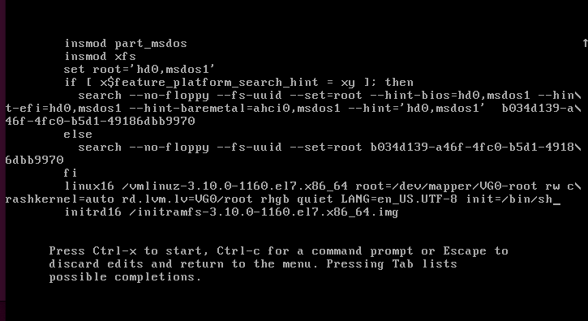

Меняем успешно пароль root

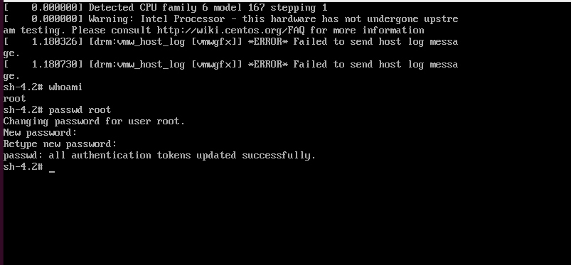

Устанавливает параметр rd.break в режиме **ro**

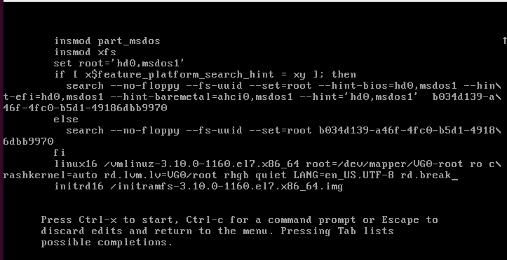

Перемонтируем файловую систему в режие **rw**

Меняем / командой chroot

Файл /.autorelabel  подтверждает легитимность внесения изменений в /etc/shadow

Меняем успешно пароль root

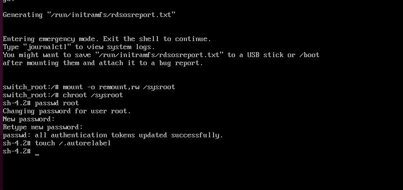

Устанавливаем параметр init=/sysroot/bin/sh, меняем режим на *rw*

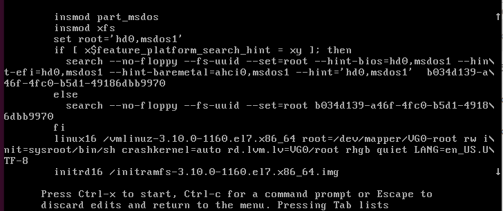

Меняем успешно пароль root

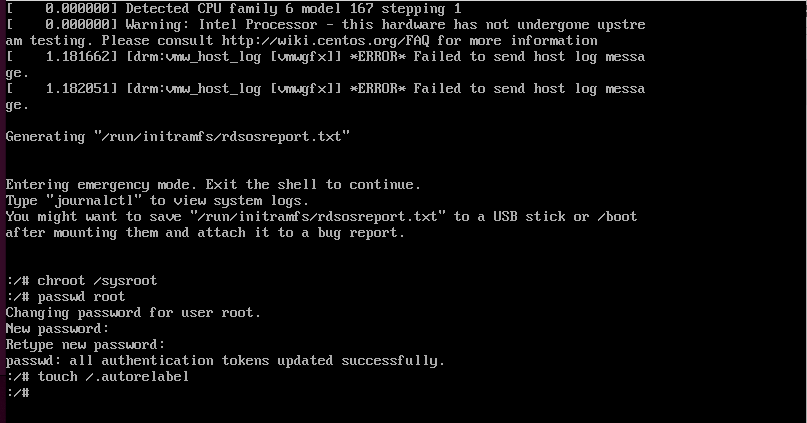


#### 2.Установить систему с LVM, после чего переименовать VG

Проверяем текущее состояние системы и выполняем переименование volume group в OtusRoot

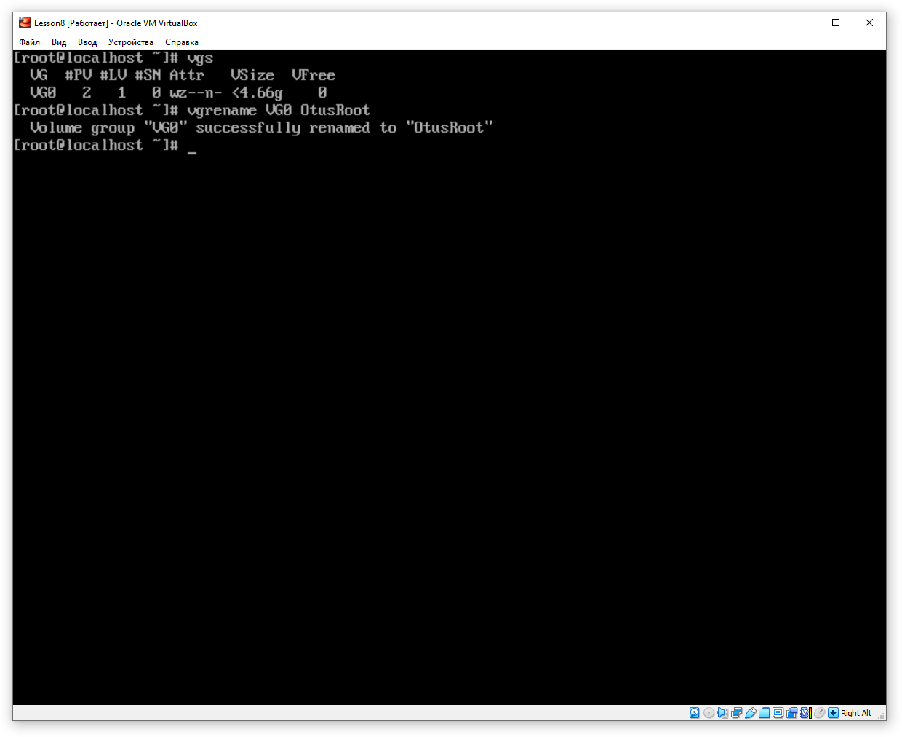

Выполняем корректировку название VG в файлах:

a) /etc/fstab

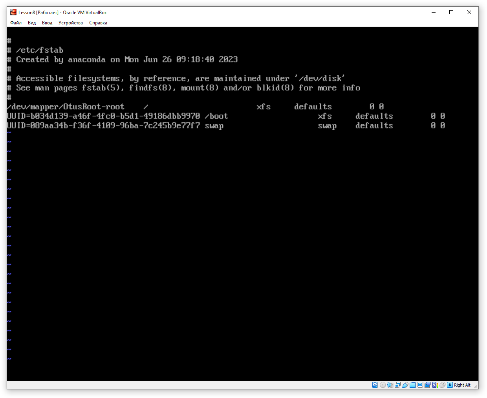

b) /etc/default/grub

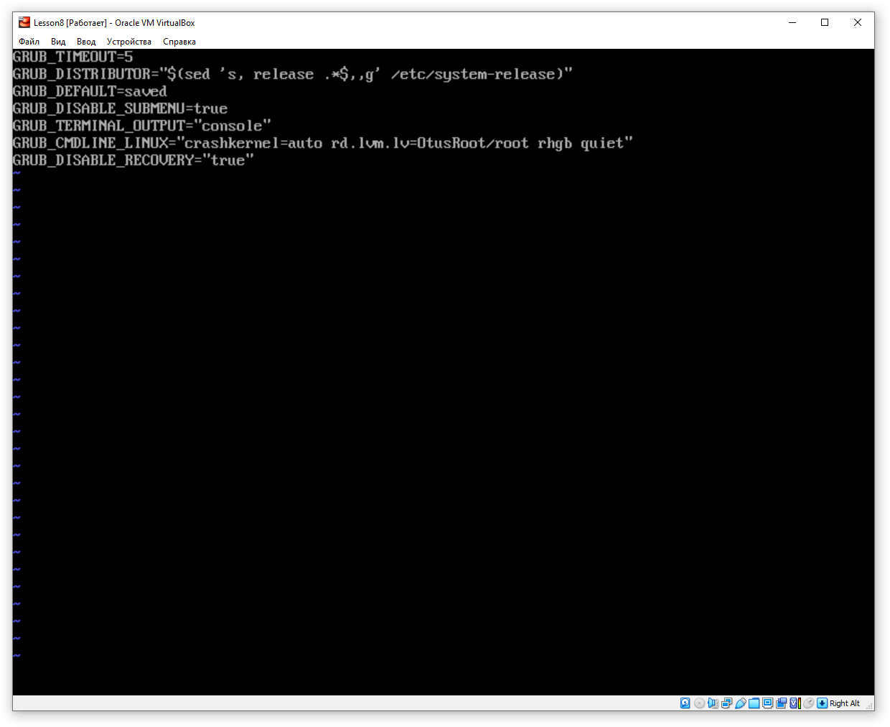

c) /boot/grub2/grub.cfg

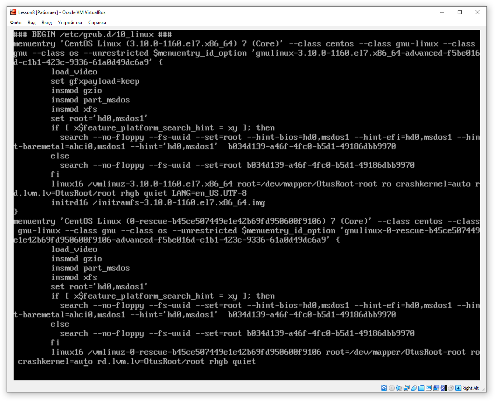

Пересоздаем initrd image

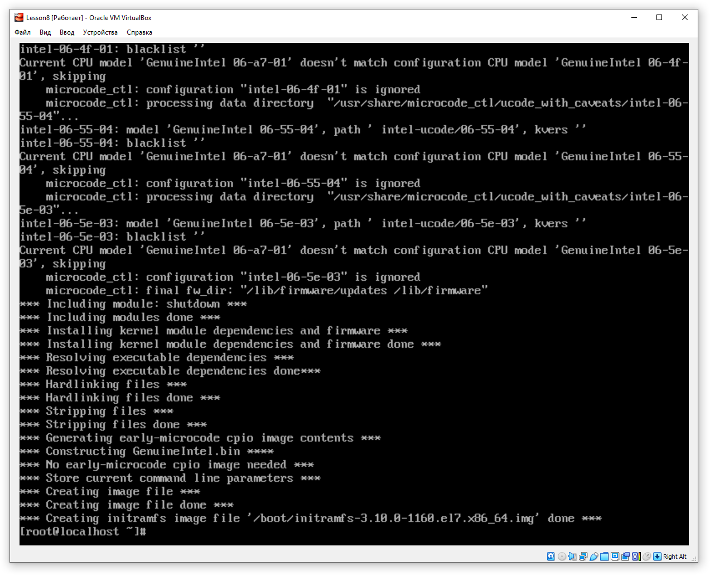

Далее перзагружаемся и проверяем, что у volume group новое имя

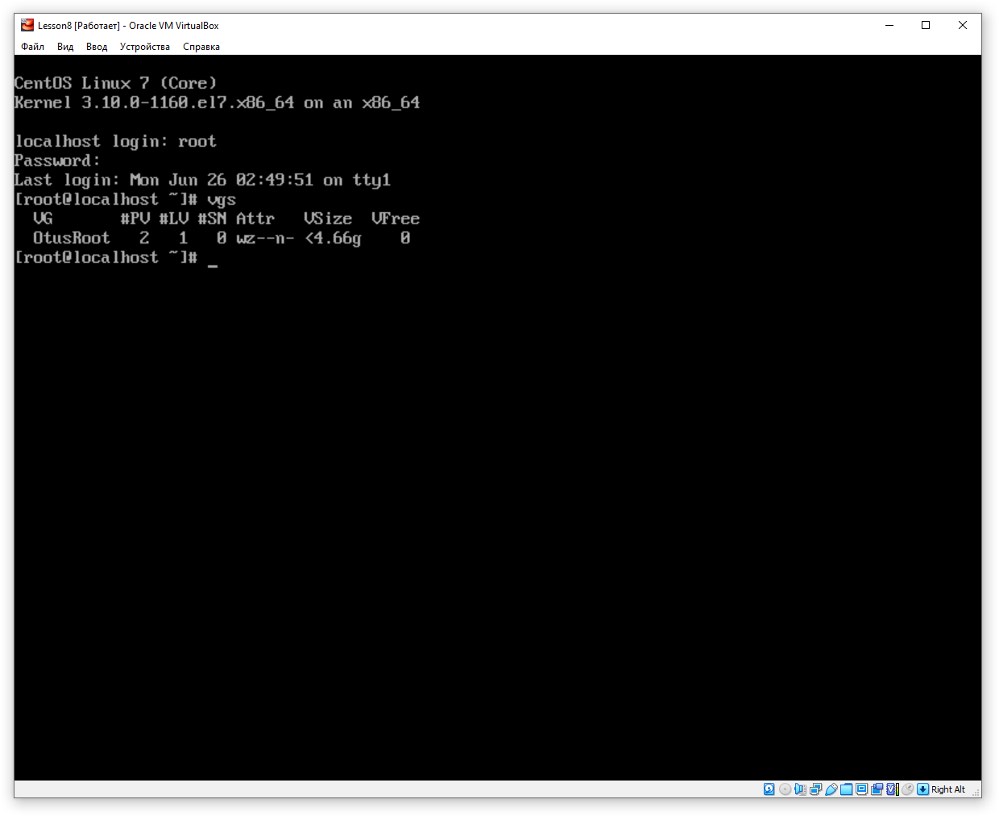


### 3. Добавить модуль в initrd 

#### Создаем директорию для модулей 

[root@192 ~]#  mkdir /usr/lib/dracut/modules.d/01test
[root@192 ~]#  cd /usr/lib/dracut/modules.d/01test

#### Формируем модуль "module-setup.sh"

[root@192 01test]# vi  module-setup.sh
[root@192 01test]# cat  module-setup.sh
#!/bin/bash

check() {
    return 0
}

depends() {
    return 0
}

install() {
    inst_hook cleanup 00 "${moddir}/test.sh"
}

#### Формируем модуль "test.sh"

[root@192 01test]# vi test.sh
[root@192 01test]# cat  test.sh
#!/bin/bash

exec 0<>/dev/console 1<>/dev/console 2<>/dev/console
cat <<'msgend'
Hello! You are in dracut module!
 ___________________
< I'm dracut module >
 -------------------
   \
    \
        .--.
       |o_o |
       |:_/ |
      //   \ \
     (|     | )
    /'\_   _/`\
    \___)=(___/
msgend
sleep 10
echo " continuing...."


#### Пересобираем образ initrd

Last login: Mon Jun 26 15:18:33 2023 from 192.168.0.17
[root@192 ~]# mkinitrd -f -v /boot/initramfs-$(uname -r).img $(uname -r)

Executing: /usr/sbin/dracut -f -v /boot/initramfs-3.10.0-1160.el7.x86_64.img 3.10.0-1160.el7.x86_64
dracut module 'busybox' will not be installed, because command 'busybox' could not be found!
dracut module 'dmsquash-live-ntfs' will not be installed, because command 'ntfs-3g' could not be found!
dracut module 'busybox' will not be installed, because command 'busybox' could not be found!
dracut module 'dmsquash-live-ntfs' will not be installed, because command 'ntfs-3g' could not be found!
*** Including module: bash ***
*** Including module: test ***
*** Including module: nss-softokn ***
*** Including module: i18n ***
*** Including module: network ***
*** Including module: ifcfg ***
*** Including module: drm ***
*** Including module: plymouth ***
*** Including module: dm ***
Skipping udev rule: 64-device-mapper.rules
Skipping udev rule: 60-persistent-storage-dm.rules
Skipping udev rule: 55-dm.rules
*** Including module: kernel-modules ***
*** Including module: lvm ***
Skipping udev rule: 64-device-mapper.rules
Skipping udev rule: 56-lvm.rules
Skipping udev rule: 60-persistent-storage-lvm.rules
*** Including module: qemu ***
*** Including module: resume ***
*** Including module: rootfs-block ***
*** Including module: terminfo ***
*** Including module: udev-rules ***
Skipping udev rule: 40-redhat-cpu-hotplug.rules
Skipping udev rule: 91-permissions.rules
*** Including module: biosdevname ***
*** Including module: systemd ***
*** Including module: usrmount ***
*** Including module: base ***
*** Including module: fs-lib ***
*** Including module: microcode_ctl-fw_dir_override ***
  microcode_ctl module: mangling fw_dir
    microcode_ctl: reset fw_dir to "/lib/firmware/updates /lib/firmware"
    microcode_ctl: processing data directory  "/usr/share/microcode_ctl/ucode_with_caveats/intel"...
intel: model '', path ' intel-ucode/*', kvers ''
intel: blacklist ''
No matching microcode files in ' intel-ucode/*' for CPU model 'GenuineIntel 06-a7-01', skipping
    microcode_ctl: configuration "intel" is ignored
    microcode_ctl: processing data directory  "/usr/share/microcode_ctl/ucode_with_caveats/intel-06-2d-07"...
intel-06-2d-07: model 'GenuineIntel 06-2d-07', path ' intel-ucode/06-2d-07', kvers ''
intel-06-2d-07: blacklist ''
Current CPU model 'GenuineIntel 06-a7-01' doesn't match configuration CPU model 'GenuineIntel 06-2d-07', skipping
    microcode_ctl: configuration "intel-06-2d-07" is ignored
    microcode_ctl: processing data directory  "/usr/share/microcode_ctl/ucode_with_caveats/intel-06-4e-03"...
intel-06-4e-03: model 'GenuineIntel 06-4e-03', path ' intel-ucode/06-4e-03', kvers ''
intel-06-4e-03: blacklist ''
Current CPU model 'GenuineIntel 06-a7-01' doesn't match configuration CPU model 'GenuineIntel 06-4e-03', skipping
    microcode_ctl: configuration "intel-06-4e-03" is ignored
    microcode_ctl: processing data directory  "/usr/share/microcode_ctl/ucode_with_caveats/intel-06-4f-01"...
intel-06-4f-01: model 'GenuineIntel 06-4f-01', path ' intel-ucode/06-4f-01', kvers ' 4.17.0 3.10.0-894 3.10.0-862.6.1 3.10.0-693.35.1 3.10.0-514.52.1 3.10.0-327.70.1 2.6.32-754.1.1 2.6.32-573.58.1 2.6.32-504.71.1 2.6.32-431.90.1 2.6.32-358.90.1'
intel-06-4f-01: blacklist ''
Current CPU model 'GenuineIntel 06-a7-01' doesn't match configuration CPU model 'GenuineIntel 06-4f-01', skipping
    microcode_ctl: configuration "intel-06-4f-01" is ignored
    microcode_ctl: processing data directory  "/usr/share/microcode_ctl/ucode_with_caveats/intel-06-55-04"...
intel-06-55-04: model 'GenuineIntel 06-55-04', path ' intel-ucode/06-55-04', kvers ''
intel-06-55-04: blacklist ''
Current CPU model 'GenuineIntel 06-a7-01' doesn't match configuration CPU model 'GenuineIntel 06-55-04', skipping
    microcode_ctl: configuration "intel-06-55-04" is ignored
    microcode_ctl: processing data directory  "/usr/share/microcode_ctl/ucode_with_caveats/intel-06-5e-03"...
intel-06-5e-03: model 'GenuineIntel 06-5e-03', path ' intel-ucode/06-5e-03', kvers ''
intel-06-5e-03: blacklist ''
Current CPU model 'GenuineIntel 06-a7-01' doesn't match configuration CPU model 'GenuineIntel 06-5e-03', skipping
    microcode_ctl: configuration "intel-06-5e-03" is ignored
    microcode_ctl: final fw_dir: "/lib/firmware/updates /lib/firmware"
*** Including module: shutdown ***
*** Including modules done ***
*** Installing kernel module dependencies and firmware ***
*** Installing kernel module dependencies and firmware done ***
*** Resolving executable dependencies ***
*** Resolving executable dependencies done***
*** Hardlinking files ***
*** Hardlinking files done ***
*** Stripping files ***
*** Stripping files done ***
*** Generating early-microcode cpio image contents ***
*** Constructing GenuineIntel.bin ****
*** No early-microcode cpio image needed ***
*** Store current command line parameters ***
*** Creating image file ***
*** Creating image file done ***
*** Creating initramfs image file '/boot/initramfs-3.10.0-1160.el7.x86_64.img' done ***

#### Проверяем, что наш модуль загружен в образ

[root@192 ~]#  lsinitrd -m /boot/initramfs-$(uname -r).img | grep test

test

#### Убираем из grub.cfg опции rghb и quiet

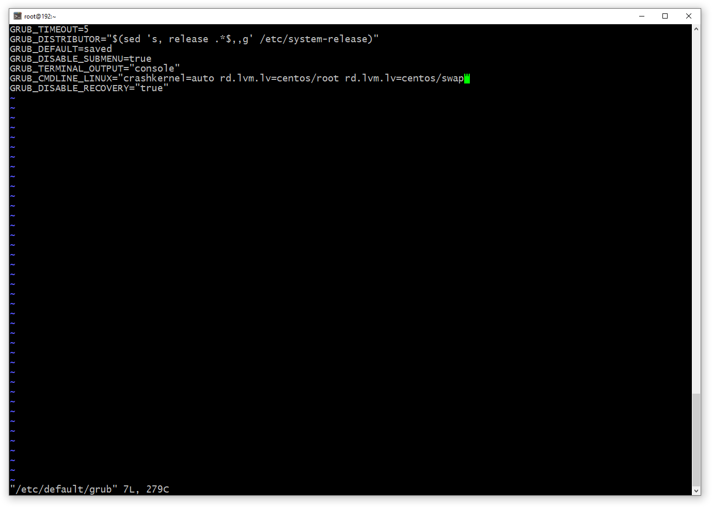

#### Перегружаемся и проверяем

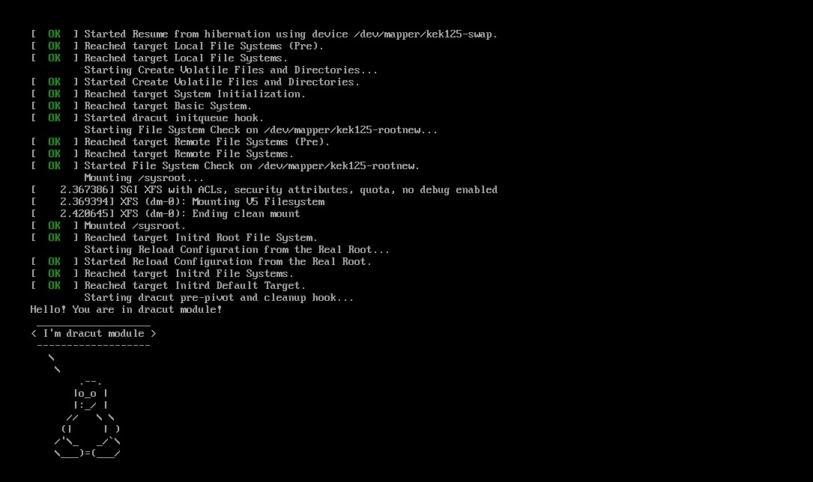


</details>


## Lesson9 - Инициализация системы. Systemd.

<details>

#### Задания:
1. Написать service, который будет раз в 30 секунд мониторить лог на предмет наличия ключевого слова (файл лога и ключевое слово должны задаваться в /etc/sysconfig).

2. Из репозитория epel установить spawn-fcgi и переписать init-скрипт на unit-файл (имя service должно называться так же: spawn-fcgi).

3. Дополнить unit-файл httpd (он же apache) возможностью запустить несколько инстансов сервера с разными конфигурационными файлами.

Выполнение:

1. Создан Vagrantfile для создания машины, также посредством varrant устанавливаются пакеты необходимые для выполнения 2-го задания
2. Создан сервис, который раз в 30 секунд мониторит лог на предмет наличия ключевого слова. (Ход выполнения с комменатариями находится в файле screen1.txt)
3. Из репозитория epel установлен spawn-fcgi и переписан init-скрипт на unit-файл. (Ход выполнения с комменатариями находится в файле screen2.txt)
4. Осуществлена возможность запустить несколько инстансов сервера httpd с разными конфигурационными файлами с помощью шаблонов. (Ход выполнения с комменатариями находится в файле screen3.txt)

Ход выполнения работ с коментариями находится в файлах screen1.txt-для 1-го задания, screen2.txt-для 2-го задания, screen3.txt-для 3-го задания.

Материалы размещены в папке lesson9:

Vagrantfile, 
screen1.txt,
screen2.txt,
screen3.txt.

</details>


## Lesson10 - BASH.

<details>

#### Задания:

Написать скрипт для CRON, который раз в час будет формировать письмо и отправлять на заданную почту.
Необходимая информация в письме:

Список IP адресов (с наибольшим кол-вом запросов) с указанием кол-ва запросов c момента последнего запуска скрипта;
Список запрашиваемых URL (с наибольшим кол-вом запросов) с указанием кол-ва запросов c момента последнего запуска скрипта;
Ошибки веб-сервера/приложения c момента последнего запуска;
Список всех кодов HTTP ответа с указанием их кол-ва с момента последнего запуска скрипта.
Скрипт должен предотвращать одновременный запуск нескольких копий, до его завершения.
В письме должен быть прописан обрабатываемый временной диапазон.

Ход работ:

a) Подготовка скрипта scr.sh c комментариями, который будет обрабатывать access.log 

b) Файл screen1.txt - вывод экрана с коментариями:

                  1. установки пакета  mailutil, 
                  
                  2. добавление строчки в crontab, которая с помощью утилиты flock обеспечивает защиту от мультизапуска,
                  
                  3. Выполнение скрипта scr.sh 
                  
                  4. Получения почты (содержимое почтового сообщения с результатом выполнения задания находиться в файле mail.txt).

Материалы размещены в папке Lesson10:

screen1.txt - отображение хода выполнения задания;

scr.sh - скрипт выполнения задания с комментариями; 

lnnumbers - служебный файл, содержащий текущий номер строки лога;

mail.txt - текст сообщения, отпраленного скриптом по завершению выполненеия задания;

accsess.log - файл журнала.

</details>

## Lesson12 - Управление процессами

<details>

#### Выбраное заданиe:
Написать свою реализацию ps ax используя анализ /proc

1. В отдельном окне создаем файл test коммандой "touch test"
2. Запускаем просмотр файла test командой "less test"

В другом окне находим PID процесса less

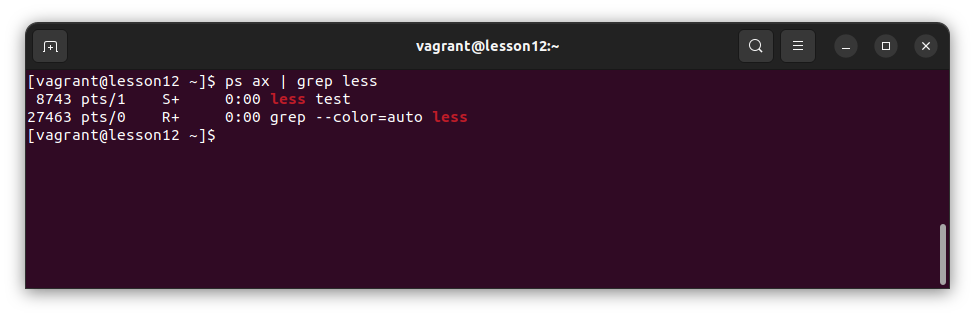

Используя команду: 
##### strace -e open ps ax
смотрим откуда берутся данные, частичный вывод приведен ниже.

Далее просмотриваем файл stat каталога нашего процесса командой:

#### cat /proc/8743/stat

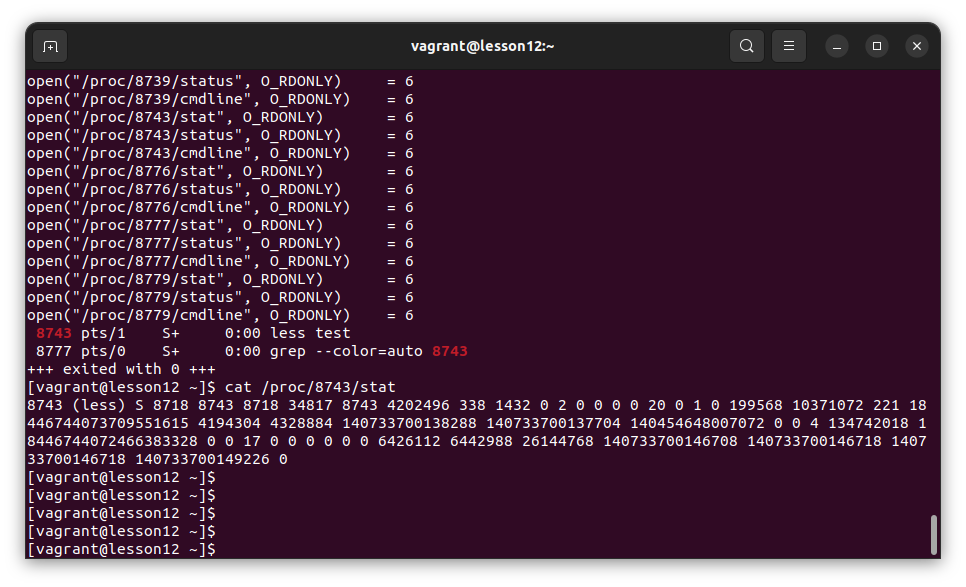

##### Используем документацию по proc (man 5 proc) для определения порядка расположения полей


##### Находим необходимые поля: это pid (поле 1), state (поле 3), tty_nr (поле 7), utime (поле 14), stime (поле 15)

На основе полученной информации подготавливаем скрипт, который обрабатывает информацию из /proc 
и выводит на экран список процессов аналогично команде 
ps ax

Материалы находятся в папке Lesson12:

1. Vagrantfile c подключенным скриптом, который выводит при старте vagrant список процессов.

2. proc_script.sh - скрипт выдачи списка процессов.

</details>


## Lesson15 - Ansible.

<details>

#### Задания:
1. Необходимо использовать модуль yum/apt;
   
2. Конфигурационные файлы должны быть взяты из шаблона jinja2 с перемененными;
   
3. После установки nginx должен быть в режиме enabled в systemd;

4. должен быть использован notify для старта nginx после установки;

5. Сайт должен слушать на нестандартном порту - 8080, для этого использовать переменные в Ansible.


Выполнение:

1. После установки ansible проводим предварительные настройки
   создаем файл hosts и ansible.cfg

root@ lesson15$ cat hosts
[web]
nginx ansible_host=127.0.0.1 ansible_port=2222 ansible_private_key_file=.vagrant/machines/nginx/virtualbox/private_key

root@ lesson15$ cat ansible.cfg 
[defaults]
#inventory = staging/hosts
inventory = hosts
remote_user = vagrant
host_key_checking = False
retry_files_enabled = False

2. Проверяем взаимодействие с управляемым хостом и просматриваем версию.

root@ lesson15$ ansible ngansible nginx -m ping
nginx | SUCCESS => {
    "ansible_facts": {
        "discovered_interpreter_python": "/usr/bin/python"
    },
    "changed": false,
    "ping": "pong"
}

root@ lesson15$ ansible nginx -m command -a "uname -r"
nginx | CHANGED | rc=0 >>
3.10.0-1127.el7.x86_64
root@ lesson15$ 

3. Создаем структуру для роли nginx

roles/nginx/
├── defaults

│   └── main.yml

├── files

├── handlers

│   └── main.yml

├── meta

│   └── main.yml

├── README.md

├── tasks

│   ├── main.yml

│   └── redhat.yml

├── templates

│   ├── index.html.j2

│   └── nginx.conf.j2

├── tests

│   ├── inventory

│   └── test.yml
└── vars
    └── main.yml

4. Создаём плейбук для роли web.yml

lesson15$ cat web.yml 

---
  - name: Install Nginx
    hosts: nginx
    become: yes

    roles:
     - nginx

5. Настраиваем переменную для порта nginx

root@ lesson15$ cat roles/nginx/vars/main.yml 

---
vars file for roles/nginx
nginx_listen_port: 8080


6. Задействуем переменную с помощью темплейтов

root@ templates$ cat index.html.j2 

Hi j2 is  Working ! {{ ansible_os_family }}
~                                            

root@ templates$ cat nginx.conf.j2 

events {
 
 worker_connections 1024;
}

http {

 server {
 
 listen {{ nginx_listen_port }} default_server;
 
 server_name default_server;
 
 root /usr/share/nginx/html;
 
 location / {
 }
 }
}

7. Активируем секцию ansible в Vagrantfile и разворачиваем управляюмую машину с нуля.


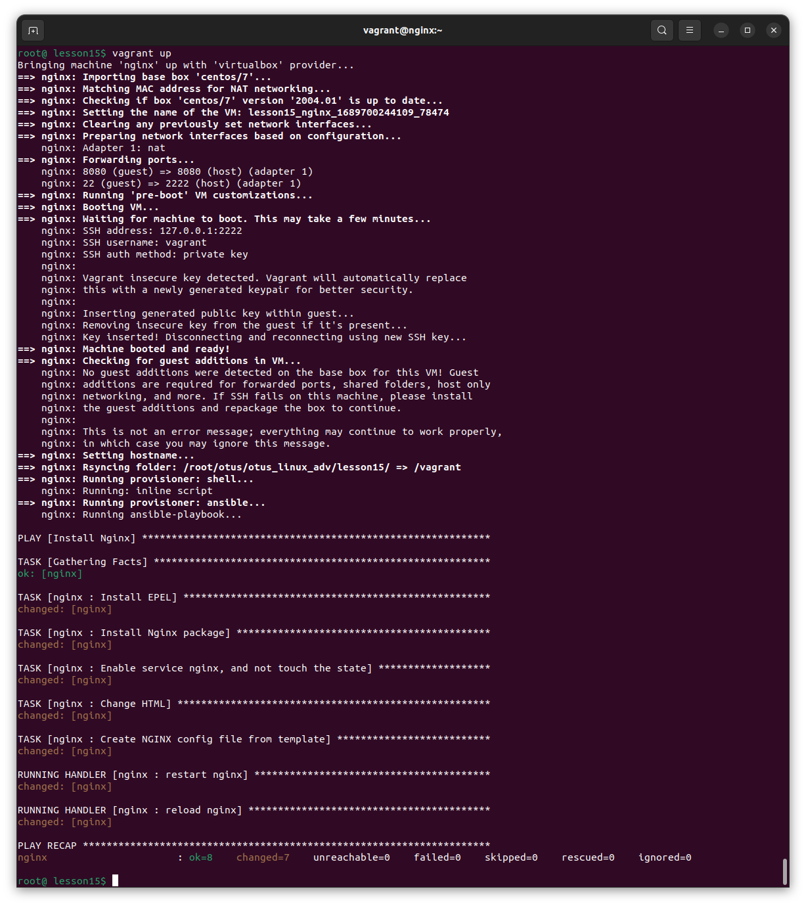


8. Проверяем работоспособность порта указаного в переменной


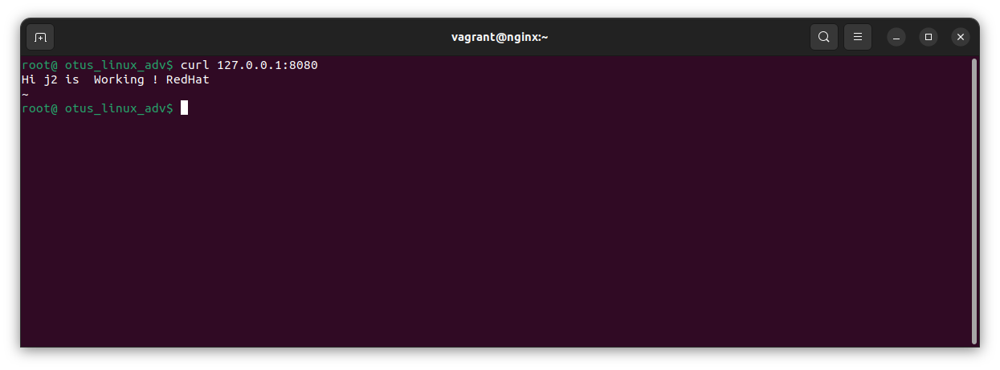


Материалы включая структуру роли и Vagrantfile размещены в папке lesson15


</details>


## Lesson17 - SELinux

<details>

Описание домашнего задания
1. Запустить nginx на нестандартном порту 3-мя разными способами:
переключатели setsebool;
добавление нестандартного порта в имеющийся тип;
формирование и установка модуля SELinux.

2. Обеспечить работоспособность приложения при включенном selinux.
развернуть приложенный стенд https://github.com/mbfx/otus-linux-adm/tree/master/selinux_dns_problems; 
выяснить причину неработоспособности механизма обновления зоны (см. README);
предложить решение (или решения) для данной проблемы;
выбрать одно из решений для реализации, предварительно обосновав выбор;
реализовать выбранное решение и продемонстрировать его работоспособность

Ход выполнения:


Во время развёртывания стенда попытка запустить nginx завершится с ошибкой:
```
selinux: ● nginx.service - The nginx HTTP and reverse proxy server

    selinux:    Loaded: loaded (/usr/lib/systemd/system/nginx.service; disabled; vendor preset: disabled)
    
    selinux:    Active: failed (Result: exit-code) since Wed 2023-07-26 11:52:21 UTC; 7ms ago
    
    selinux:   Process: 2982 ExecStartPre=/usr/sbin/nginx -t (code=exited, status=1/FAILURE)
    
    selinux:   Process: 2981 ExecStartPre=/usr/bin/rm -f /run/nginx.pid (code=exited, status=0/SUCCESS)
    selinux:
    
    selinux: Jul 26 11:52:21 selinux systemd[1]: Starting The nginx HTTP and reverse proxy server...
    
    selinux: Jul 26 11:52:21 selinux nginx[2982]: nginx: the configuration file /etc/nginx/nginx.conf syntax is ok
    
    selinux: Jul 26 11:52:21 selinux nginx[2982]: nginx: [emerg] bind() to 0.0.0.0:4881 failed (13: Permission denied)
    
    selinux: Jul 26 11:52:21 selinux nginx[2982]: nginx: configuration file /etc/nginx/nginx.conf test failed
    
    selinux: Jul 26 11:52:21 selinux systemd[1]: nginx.service: control process exited, code=exited status=1
    
    selinux: Jul 26 11:52:21 selinux systemd[1]: Failed to start The nginx HTTP and reverse proxy server.
    
    selinux: Jul 26 11:52:21 selinux systemd[1]: Unit nginx.service entered failed state.
    
    selinux: Jul 26 11:52:21 selinux systemd[1]: nginx.service failed.
```


#### 1. Запуск nginx на нестандартном порту 3-мя разными способами:

## Способ №1 - setsebool
Сначала проверяем запущен ли firewall
```
[vagrant@selinux ~]$ systemctl status firewalld
● firewalld.service - firewalld - dynamic firewall daemon
   Loaded: loaded (/usr/lib/systemd/system/firewalld.service; disabled; vendor preset: enabled)
   Active: inactive (dead)
     Docs: man:firewalld(1)
```

Также можно проверить, что конфигурация nginx настроена без ошибок: nginx -t
```
[root@selinux ~]# nginx -t
nginx: the configuration file /etc/nginx/nginx.conf syntax is ok
nginx: configuration file /etc/nginx/nginx.conf test is successful
```
Далее проверим режим работы SELinux: getenforce 
```
[root@selinux ~]# getenforce 

Enforcing
```
Разрешим в SELinux работу nginx на порту TCP 4881 c помощью переключателей setsebool

Запускаем audit2why и анализируем лог:
```
[root@selinux ~]# audit2why < /var/log/audit/audit.log

type=AVC msg=audit(1690372341.482:866): avc:  denied  { name_bind } for  pid=2982 comm="nginx" src=4881 scontext=system_u:system_r:httpd_t:s0 tcontext=system_u:object_r:unreserved_port_t:s0 

tclass=tcp_socket permissive=0

	Was caused by:
	The boolean nis_enabled was set incorrectly. 
	Description:
	Allow nis to enabled

	Allow access by executing:
	# setsebool -P nis_enabled 1
```
Выполняем setsebool:
```
[root@selinux ~]# setsebool -P nis_enabled 1

```
Проверяем запустился ли nginx:
```
[root@selinux ~]# systemctl start nginx
[root@selinux ~]# systemctl status nginx
● nginx.service - The nginx HTTP and reverse proxy server
   Loaded: loaded (/usr/lib/systemd/system/nginx.service; disabled; vendor preset: disabled)
   Active: active (running) since Wed 2023-07-26 13:01:49 UTC; 38s ago
  Process: 21998 ExecStart=/usr/sbin/nginx (code=exited, status=0/SUCCESS)
  Process: 21996 ExecStartPre=/usr/sbin/nginx -t (code=exited, status=0/SUCCESS)
  Process: 21995 ExecStartPre=/usr/bin/rm -f /run/nginx.pid (code=exited, status=0/SUCCESS)
 Main PID: 22000 (nginx)
   CGroup: /system.slice/nginx.service
           ├─22000 nginx: master process /usr/sbin/nginx
           └─22002 nginx: worker process

Jul 26 13:01:49 selinux systemd[1]: Starting The nginx HTTP and reverse proxy server...
Jul 26 13:01:49 selinux nginx[21996]: nginx: the configuration file /etc/nginx/nginx.conf syntax is ok
Jul 26 13:01:49 selinux nginx[21996]: nginx: configuration file /etc/nginx/nginx.conf test is successful
Jul 26 13:01:49 selinux systemd[1]: Started The nginx HTTP and reverse proxy server.
```

## Способ №2 - semanage port

Выводим командой список допустимых для http портов:
```
[root@selinux ~]# semanage port -l | grep http
http_cache_port_t              tcp      8080, 8118, 8123, 10001-10010
http_cache_port_t              udp      3130
http_port_t                    tcp      80, 81, 443, 488, 8008, 8009, 8443, 9000
pegasus_http_port_t            tcp      5988
pegasus_https_port_t           tcp      5989
```
Порт 4881 отсутствует в списке.
Добавляем порт в список разрешенных, перезапускаем сервис, проверяем что порт появился в разрешенных
```
[root@selinux ~]# semanage port -a -t http_port_t -p tcp 4881
[root@selinux ~]# systemctl restart nginx.service 
[root@selinux ~]# semanage port -l | grep http
http_cache_port_t              tcp      8080, 8118, 8123, 10001-10010
http_cache_port_t              udp      3130
http_port_t                    tcp      4881, 80, 81, 443, 488, 8008, 8009, 8443, 9000
pegasus_http_port_t            tcp      5988
pegasus_https_port_t           tcp      5989
```
Проверяем статус сервиса:
```
[root@selinux ~]# systemctl status nginx.service 
● nginx.service - The nginx HTTP and reverse proxy server
   Loaded: loaded (/usr/lib/systemd/system/nginx.service; disabled; vendor preset: disabled)
   Active: active (running) since Wed 2023-07-26 13:15:38 UTC; 55s ago
  Process: 22037 ExecStart=/usr/sbin/nginx (code=exited, status=0/SUCCESS)
  Process: 22035 ExecStartPre=/usr/sbin/nginx -t (code=exited, status=0/SUCCESS)
  Process: 22034 ExecStartPre=/usr/bin/rm -f /run/nginx.pid (code=exited, status=0/SUCCESS)
 Main PID: 22039 (nginx)
   CGroup: /system.slice/nginx.service
           ├─22039 nginx: master process /usr/sbin/nginx
           └─22041 nginx: worker process

Jul 26 13:15:38 selinux systemd[1]: Stopped The nginx HTTP and reverse proxy server.
Jul 26 13:15:38 selinux systemd[1]: Starting The nginx HTTP and reverse proxy server...
Jul 26 13:15:38 selinux nginx[22035]: nginx: the configuration file /etc/nginx/nginx.conf syntax is ok
Jul 26 13:15:38 selinux nginx[22035]: nginx: configuration file /etc/nginx/nginx.conf test is successful
Jul 26 13:15:38 selinux systemd[1]: Started The nginx HTTP and reverse proxy server.

```
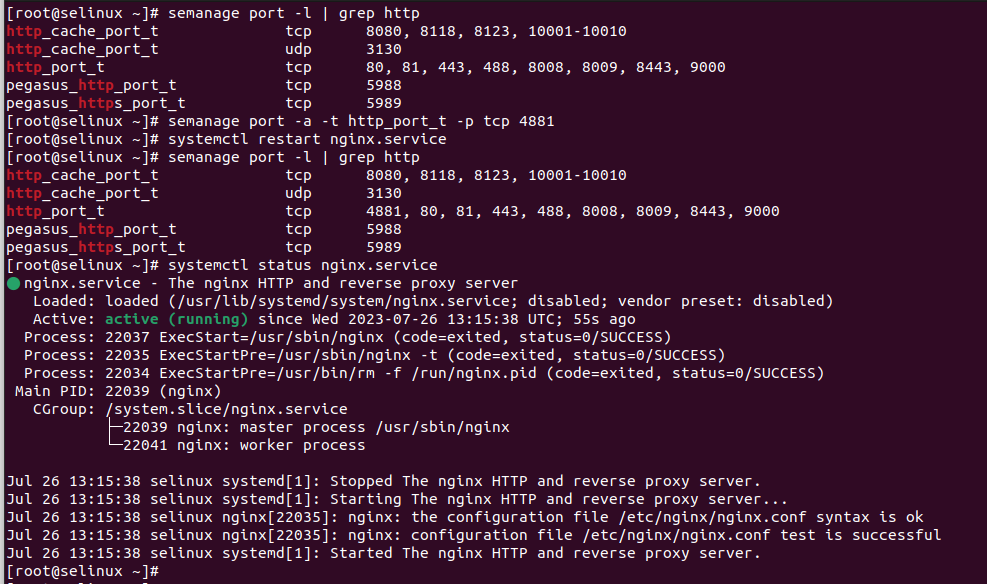


## Способ №3 - с помощью модуля SELinux

Вернемся к исходному состоянию и убедимся что nginx опять не запускается:
```
root@selinux ~]# semanage port -d -t http_port_t -p tcp 4881
[root@selinux ~]# semanage port -l | grep  http_port_t
http_port_t                    tcp      80, 81, 443, 488, 8008, 8009, 8443, 9000
pegasus_http_port_t            tcp      5988
[root@selinux ~]# systemctl restart nginx
Job for nginx.service failed because the control process exited with error code. See "systemctl status nginx.service" and "journalctl -xe" for details.
[root@selinux ~]# systemctl status nginx
● nginx.service - The nginx HTTP and reverse proxy server
   Loaded: loaded (/usr/lib/systemd/system/nginx.service; disabled; vendor preset: disabled)
   Active: failed (Result: exit-code) since Wed 2023-07-26 14:33:18 UTC; 26s ago
  Process: 22086 ExecStart=/usr/sbin/nginx (code=exited, status=0/SUCCESS)
  Process: 22107 ExecStartPre=/usr/sbin/nginx -t (code=exited, status=1/FAILURE)
  Process: 22106 ExecStartPre=/usr/bin/rm -f /run/nginx.pid (code=exited, status=0/SUCCESS)
 Main PID: 22088 (code=exited, status=0/SUCCESS)

Jul 26 14:33:18 selinux systemd[1]: Stopped The nginx HTTP and reverse proxy server.
Jul 26 14:33:18 selinux systemd[1]: Starting The nginx HTTP and reverse proxy server...
Jul 26 14:33:18 selinux nginx[22107]: nginx: the configuration file /etc/nginx/nginx.conf syntax is ok
Jul 26 14:33:18 selinux nginx[22107]: nginx: [emerg] bind() to 0.0.0.0:4881 failed (13: Permission denied)
Jul 26 14:33:18 selinux nginx[22107]: nginx: configuration file /etc/nginx/nginx.conf test failed
Jul 26 14:33:18 selinux systemd[1]: nginx.service: control process exited, code=exited status=1
Jul 26 14:33:18 selinux systemd[1]: Failed to start The nginx HTTP and reverse proxy server.
Jul 26 14:33:18 selinux systemd[1]: Unit nginx.service entered failed state.
Jul 26 14:33:18 selinux systemd[1]: nginx.service failed.
```
Подготавливаем модуль.

```
[root@selinux ~]# audit2allow -M httpd_add --debug < /var/log/audit/audit.log
******************** IMPORTANT ***********************
To make this policy package active, execute:

semodule -i httpd_add.pp
```
Устанавливаем модуль
```
[root@selinux ~]# semodule -i httpd_add.pp
[root@selinux ~]# semodule -l | grep http
httpd_add	1.0
```
Рестартуем nginx и проверяем статус
```
[root@selinux ~]# systemctl status nginx.service
● nginx.service - The nginx HTTP and reverse proxy server
   Loaded: loaded (/usr/lib/systemd/system/nginx.service; disabled; vendor preset: disabled)
   Active: active (running) since Wed 2023-07-26 14:42:11 UTC; 16s ago
  Process: 22143 ExecStart=/usr/sbin/nginx (code=exited, status=0/SUCCESS)
  Process: 22141 ExecStartPre=/usr/sbin/nginx -t (code=exited, status=0/SUCCESS)
  Process: 22140 ExecStartPre=/usr/bin/rm -f /run/nginx.pid (code=exited, status=0/SUCCESS)
 Main PID: 22145 (nginx)
   CGroup: /system.slice/nginx.service
           ├─22145 nginx: master process /usr/sbin/nginx
           └─22148 nginx: worker process

Jul 26 14:42:11 selinux systemd[1]: Starting The nginx HTTP and reverse proxy server...
Jul 26 14:42:11 selinux nginx[22141]: nginx: the configuration file /etc/nginx/nginx.conf syntax is ok
Jul 26 14:42:11 selinux nginx[22141]: nginx: configuration file /etc/nginx/nginx.conf test is successful
Jul 26 14:42:11 selinux systemd[1]: Started The nginx HTTP and reverse proxy server.
```
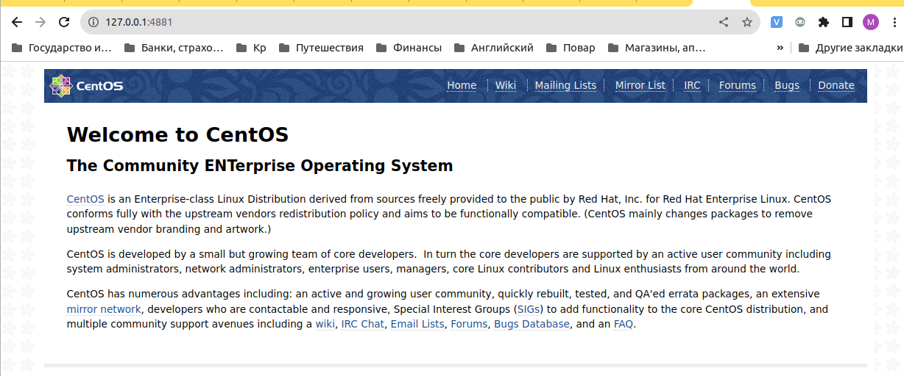


#### 2. Обеспечить работоспособность приложения при включенном selinux.
Подключаемся к машине клиент.
```
root@ selinux_dns_problems$ vagrant ssh client 
Last login: Wed Jul 26 15:32:43 2023 from 10.0.2.2
###############################
### Welcome to the DNS lab! ###
###############################

- Use this client to test the enviroment
- with dig or nslookup. Ex:
    dig @192.168.50.10 ns01.dns.lab

- nsupdate is available in the ddns.lab zone. Ex:
    nsupdate -k /etc/named.zonetransfer.key
    server 192.168.50.10
    zone ddns.lab 
    update add www.ddns.lab. 60 A 192.168.50.15
    send

- rndc is also available to manage the servers
    rndc -c ~/rndc.conf reload

###############################
### Enjoy! ####################
###############################
```
Пробуем сделать запись в зоне 
```
[root@client ~]# nsupdate -k /etc/named.zonetransfer.key
> server 192.168.50.10
> zone ddns.lab
> update add www.ddns.lab. 60 A 192.168.50.15
> sent
incorrect section name: sent
> send
update failed: SERVFAIL
> quit
```
В результате получаем ошибку.

Проверяем файл аудита на клиенте
```
[root@client ~]# cat /var/log/audit/audit.log | audit2why
[root@client ~]# 
```
Ошибки на клиенте отсутствуют.
Идем на сервер и проверяем лог selinux
```
root@ selinux_dns_problems$ vagrant ssh ns01
Last login: Wed Jul 26 15:30:50 2023 from 10.0.2.2
[vagrant@ns01 ~]$
[vagrant@ns01 ~]$ sudo -i
[root@ns01 ~]# cat /var/log/audit/audit.log | audit2why
type=AVC msg=audit(1690386368.052:1945): avc:  denied  { create } for  pid=5223 comm="isc-worker0000" name="named.ddns.lab.view1.jnl" scontext=system_u:system_r:named_t:s0 tcontext=system_u:object_r:etc_t:s0 tclass=file permissive=0

	Was caused by:
		Missing type enforcement (TE) allow rule.

		You can use audit2allow to generate a loadable module to allow this access.

```
В логах мы видим, что ошибка в контексте безопасности. Вместо типа named_t используется тип etc_t.
Проверим данную проблему в каталоге /etc/named:


Тут мы также видим, что контекст безопасности неправильный. Проблема заключается в том, что конфигурационные файлы лежат в другом каталоге. Посмотреть в каком каталоги должны лежать, файлы, чтобы на них распространялись правильные политики SELinux можно с помощью команды:

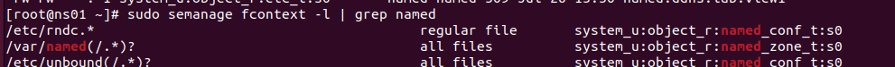


Изменим тип контекста безопасности для каталога /etc/named:
```
[root@ns01 ~]# chcon -R -t named_zone_t /etc/named
[root@ns01 ~]# ls -laZ /etc/named
drw-rwx---. root named system_u:object_r:named_zone_t:s0 .
drwxr-xr-x. root root  system_u:object_r:etc_t:s0       ..
drw-rwx---. root named unconfined_u:object_r:named_zone_t:s0 dynamic
-rw-rw----. root named system_u:object_r:named_zone_t:s0 named.50.168.192.rev
-rw-rw----. root named system_u:object_r:named_zone_t:s0 named.dns.lab
-rw-rw----. root named system_u:object_r:named_zone_t:s0 named.dns.lab.view1
-rw-rw----. root named system_u:object_r:named_zone_t:s0 named.newdns.lab
[root@ns01 ~]# 
```
Попробуем снова внести изменения с клиента: 
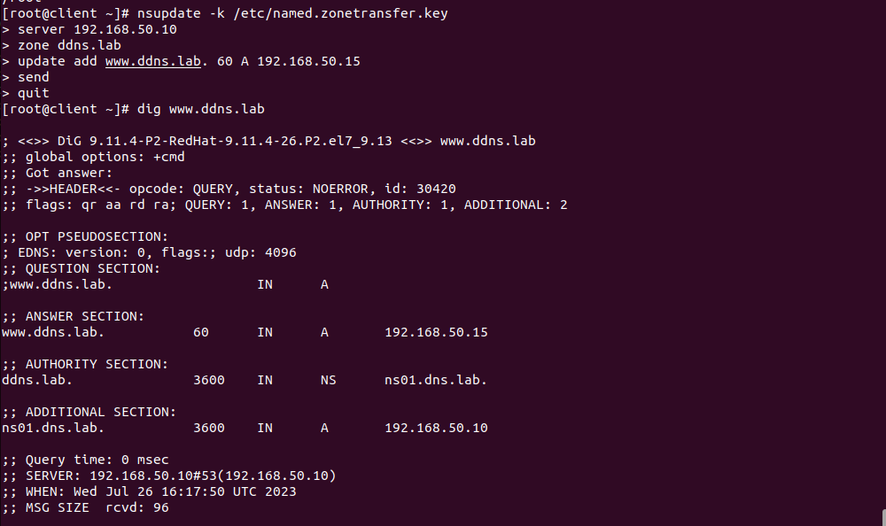

Видим, что изменения применились. Попробуем перезагрузить хосты и ещё раз сделать запрос с помощью dig: 
Перегружаем хосты и еще раз делаем запрос.
```
[root@client ~]# dig @192.168.50.10 www.ddns.lab

; <<>> DiG 9.11.4-P2-RedHat-9.11.4-26.P2.el7_9.13 <<>> @192.168.50.10 www.ddns.lab
; (1 server found)
;; global options: +cmd
;; Got answer:
;; ->>HEADER<<- opcode: QUERY, status: NOERROR, id: 55761
;; flags: qr aa rd ra; QUERY: 1, ANSWER: 1, AUTHORITY: 1, ADDITIONAL: 2

;; OPT PSEUDOSECTION:
; EDNS: version: 0, flags:; udp: 4096
;; QUESTION SECTION:
;www.ddns.lab.			IN	A

;; ANSWER SECTION:
www.ddns.lab.		60	IN	A	192.168.50.15

;; AUTHORITY SECTION:
ddns.lab.		3600	IN	NS	ns01.dns.lab.

;; ADDITIONAL SECTION:
ns01.dns.lab.		3600	IN	A	192.168.50.10

;; Query time: 0 msec
;; SERVER: 192.168.50.10#53(192.168.50.10)
;; WHEN: Wed Jul 26 16:20:14 UTC 2023
;; MSG SIZE  rcvd: 96

[root@client ~]# 
```
Изменения сохранились!

### Проблема с обновлением зоны была в том, что Selinux блокировал доступ к файлам динамического обновления для DNS сервера.


</details>

## Lesson18 - Docker

<details>
Задания:

1. Создайте свой кастомный образ nginx на базе alpine. После запуска nginx должен отдавать кастомную страницу (достаточно изменить дефолтную страницу nginx).

2. Определите разницу между контейнером и образом. Вывод опишите в домашнем задании.

3. Ответьте на вопрос: Можно ли в контейнере собрать ядро?

4. Собранный образ необходимо запушить в docker hub и дать ссылку на ваш
репозиторий.

Ход выполнения:

#### Выполнение 1-го задания

Создаем Dockerfile:
```
root@ lesson18$ cat Dockerfile 
FROM alpine:latest

RUN apk update && apk upgrade && apk add nginx && apk add bash

EXPOSE 80

COPY nginx_cfg/default.conf /etc/nginx/http.d/
COPY nginx_cfg/index.html /var/www/default/html/

CMD ["nginx", "-g", "daemon off;"]

```
Создаем файл конфигурации, который будет помещен в образ и файл index

```
root@ lesson18$ cat nginx_cfg/default.conf 
server {
   listen 80 default_server;

   root /var/www/default/html;
   index index.html index.htm;

   server_name otus;

   location / {
       try_files $uri $uri/ =404;
   }
}
root@ lesson18$ cat nginx_cfg/index.html 
Happy otus Docker!!!

```

Создаем Docker image

```
root@ lesson18$ docker build -t alpine_nginx .
Sending build context to Docker daemon  4.608kB
Step 1/6 : FROM alpine:latest
latest: Pulling from library/alpine
31e352740f53: Pull complete 
Digest: sha256:82d1e9d7ed48a7523bdebc18cf6290bdb97b82302a8a9c27d4fe885949ea94d1
Status: Downloaded newer image for alpine:latest
 ---> c1aabb73d233
Step 2/6 : RUN apk update && apk upgrade && apk add nginx && apk add bash
 ---> Running in 14d6ae5c632b
fetch https://dl-cdn.alpinelinux.org/alpine/v3.18/main/x86_64/APKINDEX.tar.gz
fetch https://dl-cdn.alpinelinux.org/alpine/v3.18/community/x86_64/APKINDEX.tar.gz
v3.18.2-549-g9d5cc4f162f [https://dl-cdn.alpinelinux.org/alpine/v3.18/main]
v3.18.2-550-g63ae2715564 [https://dl-cdn.alpinelinux.org/alpine/v3.18/community]
OK: 20070 distinct packages available
(1/7) Upgrading musl (1.2.4-r0 -> 1.2.4-r1)
(2/7) Upgrading busybox (1.36.1-r0 -> 1.36.1-r2)
Executing busybox-1.36.1-r2.post-upgrade
(3/7) Upgrading busybox-binsh (1.36.1-r0 -> 1.36.1-r2)
(4/7) Upgrading libcrypto3 (3.1.1-r1 -> 3.1.1-r3)
(5/7) Upgrading libssl3 (3.1.1-r1 -> 3.1.1-r3)
(6/7) Upgrading ssl_client (1.36.1-r0 -> 1.36.1-r2)
(7/7) Upgrading musl-utils (1.2.4-r0 -> 1.2.4-r1)
Executing busybox-1.36.1-r2.trigger
OK: 7 MiB in 15 packages
(1/2) Installing pcre (8.45-r3)
(2/2) Installing nginx (1.24.0-r6)
Executing nginx-1.24.0-r6.pre-install
Executing nginx-1.24.0-r6.post-install
Executing busybox-1.36.1-r2.trigger
OK: 9 MiB in 17 packages
(1/4) Installing ncurses-terminfo-base (6.4_p20230506-r0)
(2/4) Installing libncursesw (6.4_p20230506-r0)
(3/4) Installing readline (8.2.1-r1)
(4/4) Installing bash (5.2.15-r5)
Executing bash-5.2.15-r5.post-install
Executing busybox-1.36.1-r2.trigger
OK: 11 MiB in 21 packages
Removing intermediate container 14d6ae5c632b
 ---> 621daeb135d0
Step 3/6 : EXPOSE 80
 ---> Running in 1f393d66aa76
Removing intermediate container 1f393d66aa76
 ---> 4fcfc2aa9636
Step 4/6 : COPY nginx_cfg/default.conf /etc/nginx/http.d/
 ---> 16f521aa1a71
Step 5/6 : COPY nginx_cfg/index.html /var/www/default/html/
 ---> 1af5663777f8
Step 6/6 : CMD ["nginx", "-g", "daemon off;"]
 ---> Running in 1447b003af71
Removing intermediate container 1447b003af71
 ---> 5670ef54bdf0
Successfully built 5670ef54bdf0
Successfully tagged alpine_nginx:latest

```
Проверяем, как создался образ

```
root@ lesson18$ docker images
REPOSITORY     TAG       IMAGE ID       CREATED         SIZE
alpine_nginx   latest    5670ef54bdf0   7 minutes ago   19.3MB
alpine         latest    c1aabb73d233   6 weeks ago     7.33MB

```
Запускаем
```
root@ lesson18$ docker run -d --name nginx_container -p 8080:80 alpine_nginx
0021b3e308b9cd629ed2f8d1a0b182903c0bd4a1f91c8fd6273cc2e5b3eb7713
```
Проверяем, что контейнер работает

```
root@ lesson18$ docker ps
CONTAINER ID   IMAGE          COMMAND                  CREATED              STATUS              PORTS                                   NAMES
0021b3e308b9   alpine_nginx   "nginx -g 'daemon of…"   About a minute ago   Up About a minute   0.0.0.0:8080->80/tcp, :::8080->80/tcp   nginx_container

```
Тестируем отображение страницы:

```
root@ lesson18$ curl localhost:8080
Happy otus Docker!!!
```

#### ответ на 2-е задание (в чем разница между контейнером и образом)

Образ - это шаблон, который содержит слои файловой системы в режиме "только-чтение".

Контейнер - запущенный образ приложения, содержащий еще и слой работающий в режиме "чтение-запись"


#### ответ на 3-е задание (Можно ли в контейнере собрать ядро?)

Т.к контейнер использует ядро системы, то такой контейнер работать не будет, при этом собрать ядро возможно.

#### 4-е задание (размещение образа на dockerhub)
Загрузка образа на dockerhub
```
root@ lesson18$ docker push ms1969/alpine_nginx
Using default tag: latest
The push refers to repository [docker.io/ms1969/alpine_nginx]
678a0a013fa1: Pushed 
7d424dd3c294: Pushed 
b8a26a078ec9: Pushed 
78a822fe2a2d: Mounted from library/alpine 
latest: digest: sha256:f230b81b5ae478154f7b4d53e2ff5d2f65e4ade34fbbdc3954e01285e34701dd size: 1153

```
Ссылка на образ

https://hub.docker.com/layers/ms1969/alpine_nginx/latest/images/sha256-f230b81b5ae478154f7b4d53e2ff5d2f65e4ade34fbbdc3954e01285e34701dd?context=repo

#### Файлы Dockerfile, index.html, default.conf размещены в папке lesson18

</details>


## Lesson22 - Пользователи и группы. Авторизация, аутентификация

<details>

Задание:

#### Запретить всем пользователям, кроме группы admin, логин в выходные (суббота и воскресенье), без учета праздников

Ход выполнения:

Cоздание пользователей, групп, копирование скрипта login.sh, изменение прав доступа на скрипт выполняется при помощи команд на этапе provision при старте машины посредством Vagrantfile.

Vagrantfile находиться в папке lesson22.

Проверяем, что пользователи созданы, группы назначены, файл скрипта скопирован 

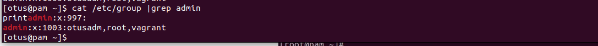

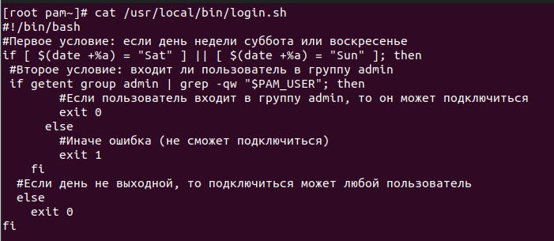

Проверим, что созданные пользователи могут зайти в систему

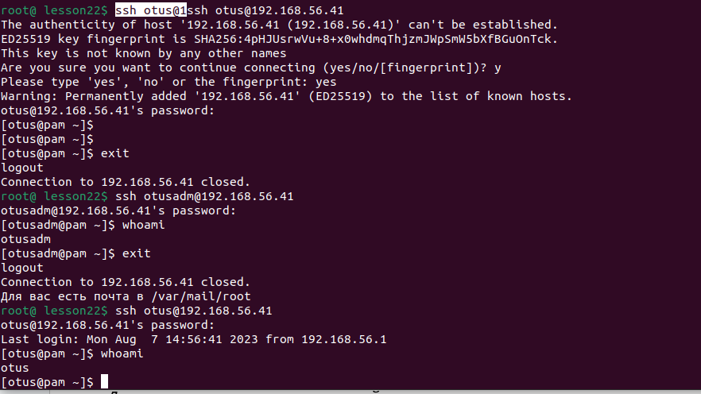

Проверяем, что в файл sshd включены настройки pam_exec


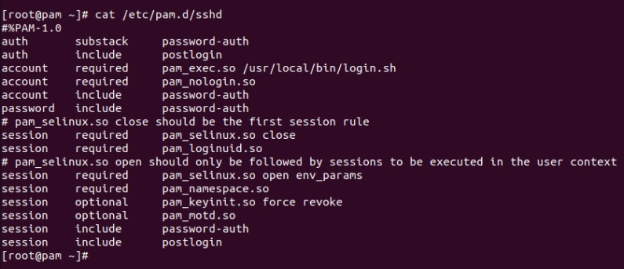

Меняем дату системы на дату в будущем, которая приходиться на субботу и проверяем вход под разными пользователями

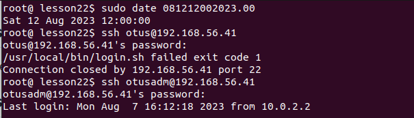

По результатам видим, что otus зайти не может, а otusadm заходит в систему.

</details>


## Lesson24 - Сбор и анализ логов

<details>

#### Задание:

1. В вагранте поднимаем 2 машины web и log

2. На web поднимаем nginx

3. На log настраиваем центральный лог сервер на любой системе на выбор journald, rsyslog, elk.

4. Настраиваем аудит, следящий за изменением конфигов нжинкса.
Все критичные логи с web должны собираться и локально и удаленно.
Все логи с nginx должны уходить на удаленный сервер (локально только критичные).
Логи аудита должны также уходить на удаленную систему.

#### Ход выполнения:

Создаем Vagrantfile

```
# -*- mode: ruby -*-
# vi: set ft=ruby :

Vagrant.configure(2) do |config|
  config.vm.box = "centos/7"

  config.vm.provider "virtualbox" do |v|
    v.memory = 2048
    v.cpus = 2
  end

  config.vm.define "web" do |web|
    web.vm.network "private_network", ip: "192.168.56.10"
    web.vm.hostname = "web"
    web.vm.provision "shell", path: "web.sh"
  end

  config.vm.define "log" do |log|
    log.vm.network "private_network", ip: "192.168.56.15"
    log.vm.hostname = "log"
    log.vm.provision "shell", path: "log.sh"
  end

end

```
web server nginx 192.168.56.10 
log server 192.168.56.15

В скриптах web.sh и log.sh производиться первоначальная настройка и установка серверов,
Копии файлов скриптов приведены в папке lesson24.

На машине log в файле /etc/rsyslog.conf убираем коментарии для открытия TCP и UDP порта 514

В конец файла /etc/rsyslog.conf добавляем правила приёма сообщений от хостов.

```
# The imjournal module bellow is now used as a message source instead of imuxsock.
$ModLoad imuxsock # provides support for local system logging (e.g. via logger command)
$ModLoad imjournal # provides access to the systemd journal
#$ModLoad imklog # reads kernel messages (the same are read from journald)
#$ModLoad immark  # provides --MARK-- message capability

# Provides UDP syslog reception
$ModLoad imudp
$UDPServerRun 514

# Provides TCP syslog reception
$ModLoad imtcp
$InputTCPServerRun 514
.................


$template RemoteLogs,"/var/log/rsyslog/%HOSTNAME%/%PROGRAMNAME%.log"
*.* ?RemoteLogs
& ~

```

Рестартуем syslog и проверяем, что порты 514 открыты:

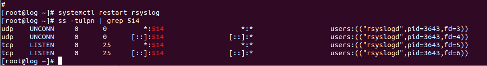


Проверяем версию nginx

```
[vagrant@web ~]$ rpm -qa | grep nginx
nginx-1.20.1-10.el7.x86_64
nginx-filesystem-1.20.1-10.el7.noarch
[vagrant@web ~]$ 

```

На машине web корректируем /etc/nginx/nginx.conf

error_log /var/log/nginx/error.log;
access_log  syslog:server=192.168.56.15:514,tag=nginx_access,severity=info combined;
access_log syslog:server=192.168.56.15:514,tag=nginx_access main;
error_log syslog:server=192.168.56.15:514,tag=nginx_error notice;

Проверяем правильность конфигурации:
```
[root@web ~]# nginx -t
nginx: the configuration file /etc/nginx/nginx.conf syntax is ok
nginx: configuration file /etc/nginx/nginx.conf test is successful
```
Перезппускаем сервис и проверяем его статус:

```
[root@web ~]# systemctl restart nginx
[root@web ~]# systemctl status nginx.service 
● nginx.service - The nginx HTTP and reverse proxy server
   Loaded: loaded (/usr/lib/systemd/system/nginx.service; enabled; vendor preset: disabled)
   Active: active (running) since Thu 2023-08-10 17:29:21 MSK; 17s ago
  Process: 24545 ExecStart=/usr/sbin/nginx (code=exited, status=0/SUCCESS)
  Process: 24541 ExecStartPre=/usr/sbin/nginx -t (code=exited, status=0/SUCCESS)
  Process: 24539 ExecStartPre=/usr/bin/rm -f /run/nginx.pid (code=exited, status=0/SUCCESS)
 Main PID: 24547 (nginx)
   CGroup: /system.slice/nginx.service
           ├─24547 nginx: master process /usr/sbin/nginx
           ├─24548 nginx: worker process
           └─24549 nginx: worker process
```

Чтобы проверить, что логи ошибок также улетают на удаленный сервер, можно удалить картинку, к которой будет обращаться nginx во время открытия веб-сраницы: 

```
[root@web ~]# rm /usr/share/nginx/html/img/header-background.png
rm: remove regular file '/usr/share/nginx/html/img/header-background.png'? y
```
Заходим несколько раз на http:/192.168.56.10, в том числе на ошибочные страницы:

Смотрим логи на машине log

```
cat /var/log/rsyslog/web/nginx_access.log 
```

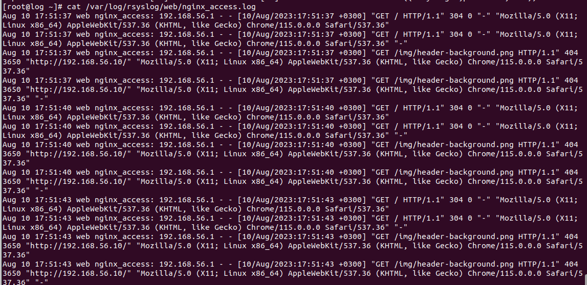

```
cat /var/log/rsyslog/web/nginx_error.log
```


Настраиваем аудит файла nginx.conf
```
root@web ~]# rpm -qa | grep audit
audit-2.8.5-4.el7.x86_64
audit-libs-2.8.5-4.el7.x86_64
```
Для контроля записи (w) и атрибутов (a) В файл /etc/audit/rules.d/audit.rules
добавляем строки:

-w /etc/nginx/nginx.conf -p wa -k web_config_changed
-w /etc/nginx/conf.d/ -p wa -k web_config_changed

```
[root@web ~]# cat /etc/audit/rules.d/audit.rules
## First rule - delete all
-D

## Increase the buffers to survive stress events.
## Make this bigger for busy systems
-b 8192

## Set failure mode to syslog
-f 1

-w /etc/nginx/nginx.conf -p wa -k web_config_changed
-w /etc/nginx/conf.d/ -p wa -k web_config_changed
```
Перезапускаем службу
```
[root@web ~]# service auditd restart
Stopping logging:                                          [  OK  ]
Redirecting start to /bin/systemctl start auditd.service
```
Вносим изменение в /etc/nginx/nginx.conf чтобы проверить

Проверяем
```
ausearch -f /etc/nginx/nginx.conf 
----
time->Thu Aug 10 18:13:00 2023
type=CONFIG_CHANGE msg=audit(1691680380.345:1148): auid=1000 ses=5 op=updated_rules path="/etc/nginx/nginx.conf" key="web_config_changed" list=4 res=1
----
time->Thu Aug 10 18:13:00 2023
type=PROCTITLE msg=audit(1691680380.345:1149): proctitle=76696D002F6574632F6E67696E782F6E67696E782E636F6E66
type=PATH msg=audit(1691680380.345:1149): item=3 name="/etc/nginx/nginx.conf~" inode=749061 dev=08:01 mode=0100644 ouid=0 ogid=0 rdev=00:00 obj=system_u:object_r:httpd_config_t:s0 objtype=CREATE cap_fp=0000000000000000 cap_fi=0000000000000000 cap_fe=0 cap_fver=0
type=PATH msg=audit(1691680380.345:1149): item=2 name="/etc/nginx/nginx.conf" inode=749061 dev=08:01 mode=0100644 ouid=0 ogid=0 rdev=00:00 obj=system_u:object_r:httpd_config_t:s0 objtype=DELETE cap_fp=0000000000000000 cap_fi=0000000000000000 cap_fe=0 cap_fver=0
type=PATH msg=audit(1691680380.345:1149): item=1 name="/etc/nginx/" inode=85 dev=08:01 mode=040755 ouid=0 ogid=0 rdev=00:00 obj=system_u:object_r:httpd_config_t:s0 objtype=PARENT cap_fp=0000000000000000 cap_fi=0000000000000000 cap_fe=0 cap_fver=0
type=PATH msg=audit(1691680380.345:1149): item=0 name="/etc/nginx/" inode=85 dev=08:01 mode=040755 ouid=0 ogid=0 rdev=00:00 obj=system_u:object_r:httpd_config_t:s0 objtype=PARENT cap_fp=0000000000000000 cap_fi=0000000000000000 cap_fe=0 cap_fver=0
type=CWD msg=audit(1691680380.345:1149):  cwd="/root"
type=SYSCALL msg=audit(1691680380.345:1149): arch=c000003e syscall=82 success=yes exit=0 a0=1dc3170 a1=1f92360 a2=fffffffffffffe80 a3=7ffd701ecfa0 items=4 ppid=3735 pid=24640 auid=1000 uid=0 gid=0 euid=0 suid=0 fsuid=0 egid=0 sgid=0 fsgid=0 tty=pts0 ses=5 comm="vim" exe="/usr/bin/vim" subj=unconfined_u:unconfined_r:unconfined_t:s0-s0:c0.c1023 key="web_config_changed"
----
time->Thu Aug 10 18:13:00 2023
type=CONFIG_CHANGE msg=audit(1691680380.345:1150): auid=1000 ses=5 op=updated_rules path="/etc/nginx/nginx.conf" key="web_config_changed" list=4 res=1
----
time->Thu Aug 10 18:13:00 2023
type=PROCTITLE msg=audit(1691680380.345:1151): proctitle=76696D002F6574632F6E67696E782F6E67696E782E636F6E66
type=PATH msg=audit(1691680380.345:1151): item=1 name="/etc/nginx/nginx.conf" inode=749076 dev=08:01 mode=0100644 ouid=0 ogid=0 rdev=00:00 obj=unconfined_u:object_r:httpd_config_t:s0 objtype=CREATE cap_fp=0000000000000000 cap_fi=0000000000000000 cap_fe=0 cap_fver=0
type=PATH msg=audit(1691680380.345:1151): item=0 name="/etc/nginx/" inode=85 dev=08:01 mode=040755 ouid=0 ogid=0 rdev=00:00 obj=system_u:object_r:httpd_config_t:s0 objtype=PARENT cap_fp=0000000000000000 cap_fi=0000000000000000 cap_fe=0 cap_fver=0
type=CWD msg=audit(1691680380.345:1151):  cwd="/root"
type=SYSCALL msg=audit(1691680380.345:1151): arch=c000003e syscall=2 success=yes exit=3 a0=1dc3170 a1=241 a2=1a4 a3=0 items=2 ppid=3735 pid=24640 auid=1000 uid=0 gid=0 euid=0 suid=0 fsuid=0 egid=0 sgid=0 fsgid=0 tty=pts0 ses=5 comm="vim" exe="/usr/bin/vim" subj=unconfined_u:unconfined_r:unconfined_t:s0-s0:c0.c1023 key="web_config_changed"
----
time->Thu Aug 10 18:13:00 2023
type=PROCTITLE msg=audit(1691680380.348:1152): proctitle=76696D002F6574632F6E67696E782F6E67696E782E636F6E66
type=PATH msg=audit(1691680380.348:1152): item=0 name="/etc/nginx/nginx.conf" inode=749076 dev=08:01 mode=0100644 ouid=0 ogid=0 rdev=00:00 obj=unconfined_u:object_r:httpd_config_t:s0 objtype=NORMAL cap_fp=0000000000000000 cap_fi=0000000000000000 cap_fe=0 cap_fver=0
type=CWD msg=audit(1691680380.348:1152):  cwd="/root"
type=SYSCALL msg=audit(1691680380.348:1152): arch=c000003e syscall=188 success=yes exit=0 a0=1dc3170 a1=7fa9ee7acf6a a2=1f92e10 a3=24 items=1 ppid=3735 pid=24640 auid=1000 uid=0 gid=0 euid=0 suid=0 fsuid=0 egid=0 sgid=0 fsgid=0 tty=pts0 ses=5 comm="vim" exe="/usr/bin/vim" subj=unconfined_u:unconfined_r:unconfined_t:s0-s0:c0.c1023 key="web_config_changed"
----
time->Thu Aug 10 18:13:00 2023
type=PROCTITLE msg=audit(1691680380.348:1153): proctitle=76696D002F6574632F6E67696E782F6E67696E782E636F6E66
type=PATH msg=audit(1691680380.348:1153): item=0 name="/etc/nginx/nginx.conf" inode=749076 dev=08:01 mode=0100644 ouid=0 ogid=0 rdev=00:00 obj=system_u:object_r:httpd_config_t:s0 objtype=NORMAL cap_fp=0000000000000000 cap_fi=0000000000000000 cap_fe=0 cap_fver=0
type=CWD msg=audit(1691680380.348:1153):  cwd="/root"
type=SYSCALL msg=audit(1691680380.348:1153): arch=c000003e syscall=90 success=yes exit=0 a0=1dc3170 a1=81a4 a2=7ffd701ee610 a3=24 items=1 ppid=3735 pid=24640 auid=1000 uid=0 gid=0 euid=0 suid=0 fsuid=0 egid=0 sgid=0 fsgid=0 tty=pts0 ses=5 comm="vim" exe="/usr/bin/vim" subj=unconfined_u:unconfined_r:unconfined_t:s0-s0:c0.c1023 key="web_config_changed"
----
time->Thu Aug 10 18:13:00 2023
type=PROCTITLE msg=audit(1691680380.348:1154): proctitle=76696D002F6574632F6E67696E782F6E67696E782E636F6E66
type=PATH msg=audit(1691680380.348:1154): item=0 name="/etc/nginx/nginx.conf" inode=749076 dev=08:01 mode=0100644 ouid=0 ogid=0 rdev=00:00 obj=system_u:object_r:httpd_config_t:s0 objtype=NORMAL cap_fp=0000000000000000 cap_fi=0000000000000000 cap_fe=0 cap_fver=0
type=CWD msg=audit(1691680380.348:1154):  cwd="/root"
type=SYSCALL msg=audit(1691680380.348:1154): arch=c000003e syscall=188 success=yes exit=0 a0=1dc3170 a1=7fa9ee362e2f a2=1f92300 a3=1c items=1 ppid=3735 pid=24640 auid=1000 uid=0 gid=0 euid=0 suid=0 fsuid=0 egid=0 sgid=0 fsgid=0 tty=pts0 ses=5 comm="vim" exe="/usr/bin/vim" subj=unconfined_u:unconfined_r:unconfined_t:s0-s0:c0.c1023 key="web_config_changed"

```

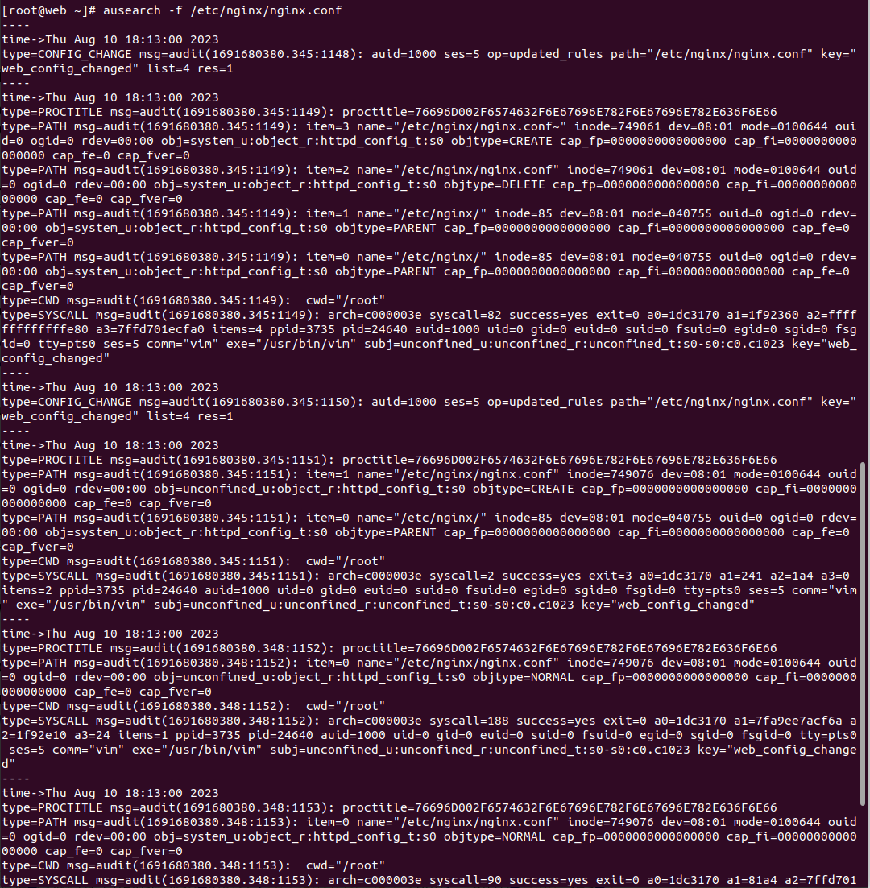


</details>


## Lesson26 - Резервное копирование

<details>

#### Задание:

- Настроить стенд Vagrant с двумя виртуальными машинами: backup_server и client

- Настроить удаленный бекап каталога /etc c сервера client при помощи borgbackup. Резервные копии должны соответствовать следующим критериям:

- Директория для резервных копий /var/backup. Это должна быть отдельная точка монтирования. В данном случае для демонстрации размер не принципиален, достаточно будет и 2GB.

- Репозиторий для резервных копий должен быть зашифрован ключом или паролем - на ваше усмотрение

- Имя бекапа должно содержать информацию о времени снятия бекапа

- Глубина бекапа должна быть год, хранить можно по последней копии на конец месяца, кроме последних трех. Последние три месяца должны содержать копии на каждый день. Т.е. должна быть правильно настроена политика удаления старых бэкапов

- Резервная копия снимается каждые 5 минут. Такой частый запуск в целях демонстрации.

- Написан скрипт для снятия резервных копий. Скрипт запускается из соответствующей Cron джобы, либо systemd timer-а - на ваше усмотрение.

- Настроено логирование процесса бекапа. Для упрощения можно весь вывод перенаправлять в logger с соответствующим тегом. Если настроите не в syslog, то обязательна ротация логов

Запустить стенд. Убедитесь что резервные копии снимаются. Остановить бэкап, удалить (или переместите) директорию /etc и восстановить ее из бекапа.  

#### Ход выполнения 


</details>


