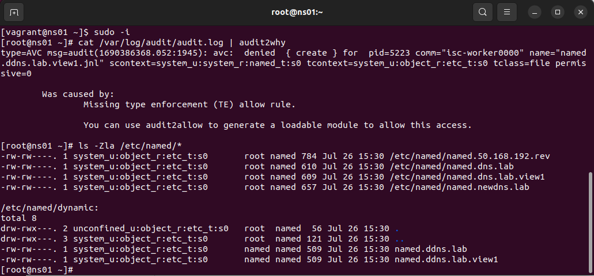
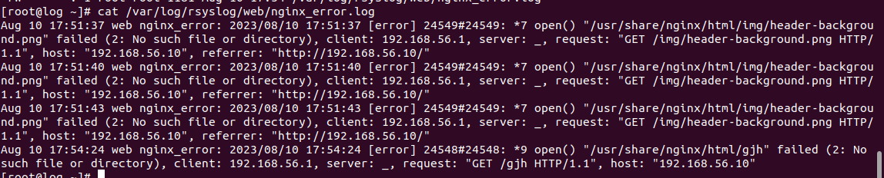
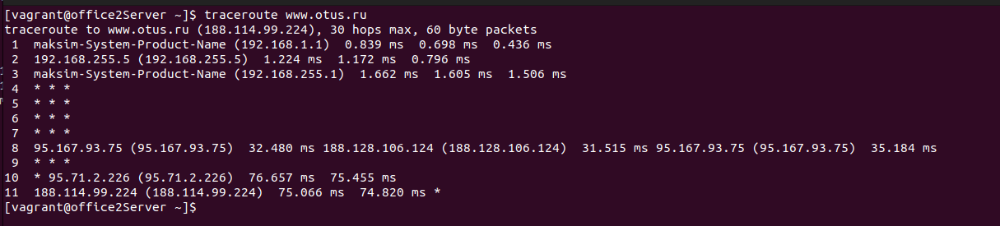
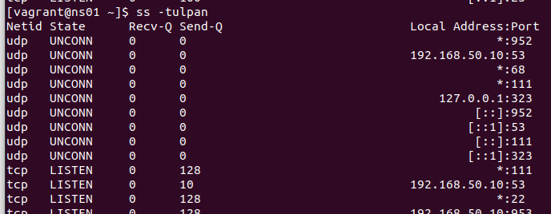

## Домашние задания OTUS Linux professional

## Lesson 2

<details>
Сделанные задания:

1. Изменен Vagrantfile. Файл находиться в папке lesson2.
2. Создан RAID10 и файл mdadm.conf. Ход выполнения отражен в файле lesson2/screen1.
3. Разрушен и восстановлен RAID. Создана и смонтирована файловая система. Изменен файл fstab. Ход работ в файле lesson2/screen2.
4. На RAID созданы разделы GPT. Ход работ в файле lesson2/screen3

приложения в папке lesson2: Vagrantfile, mdadm.conf, mdraid.sh, fstab
  
  </details>

## Lesson 3 & 4 (LVM)

<details>
Сделанные задания:

1. Уменьшен том под / до 8G
2. Выделен том под /var (/var - сделан в mirror). прописано монтирование в fstab
3. Выделен том под /home (прописано монтирование в fstab)
4. Для /home - сделан том для снэпшотов.
5. Работа со снапшотами: сгенерированы файлы в /home/, снят снэпшот, удалена часть файлов, выполненно востановление файлов со снэпшота

   Материалы с коментариями находятся в папке lesson3:
                                         Vagrantfile,
                                         part1.txt (Уменьшение тома до 8G),
                                         part2.txt, (Продолжение) 
                                         part3.txt, (Создание тома с зеркалом /var)
                                         part4.txt. (Работа с томом /home)
   </details>
   
## Lesson 5 (ZFS)

<details>

Задания:
  
1. Определить алгоритм с наилучшим сжатием

2. Определить настройки пула.

3. Работа со снапшотами.

4. Создание отдельного Bash-скрипт и добавить его в Vagrantfile для подготовки сервера ZFS.

  Материалы с комментариями находятся в папке lesson5:
  
        1. Ход выполнения первого задания (screen1.txt)
        
        2. Ход выполнения второго задания (screen2.txt)
        
        3. Ход выполнения третьего задания (screen3.txt)
        
        4. Для выполнения четвертого задания создан скрипт prepare.sh, 
               запуск скрипта осуществляется с помощью директивы Vagrantfile (файлы: prepare.sh, Vagrantfile прилагаются).

</details>

## Lesson 6 (NFS)

<details>

Задания:
- `vagrant up` должен поднимать 2 настроенных виртуальных машины
(сервер NFS и клиента) без дополнительных ручных действий;
- на сервере NFS должна быть подготовлена и экспортирована
директория;
- в экспортированной директории должна быть поддиректория
с именем __upload__ с правами на запись в неё;
- экспортированная директория должна автоматически монтироваться
на клиенте при старте;
- монтирование и работа NFS на клиенте должна быть организована
с использованием NFSv3 по протоколу UDP;
- firewall должен быть включен и настроен как на клиенте,
так и на сервере.

1. Создан Vagrantfile для создания машины сервера и клиента,
   к Vagrantfile подключены 2 скрипта (серверный - nfss_setup.sh и клиентский nfsc_setup.sh) для автоматизации выполнения задания.
2. Выполнена проверка выполнения требований задания до и после перезакгрузки клиента и сервера.
3. Ход выполнения работ с комментариями отражен в файлах экрана (server.txt - для сервера и client.txt - для клиента)

Материалы размещены в папке lesson6.


</details>

## Lesson 7 (RPM)

<details>

Задания:

1) Создать свой RPM пакет c дополнительными опциями (В нашем случае NGINX c openssl)
2) Создать свой репозиторий и разместить там ранее собранный RPM

Выполнение:
1. Создан Vagrantfile для создания машины.
2. При старте выполняется provision с использованием скрипта setup_script.sh для установки необходимых пакетов.
3. Создан свой пакет nginx с опцией openssl.
4. Создан собственный репозиторий otus-linux.
5. В репозиторий дополнительно к ngnix размещен пакет mysql.
6. Проведено тестирование работосаособности репозитория.

Ход выполнения работ с коментариями находится в terminal.txt
  
Материалы размещены в папке lesson7: 

Vagrantfile, 

setup_script.sh - скрипт первоначальной установки пакетов;

nginx.spec - файл конфигурирования пакета с добавленой опцией openssl;

terminal.txt - файл хода работ с коментариями и выводом консоли.

</details>

## Lesson8 - Загрузка системы

<details>

#### Задание:


1.Сбросить пароль пользователя root 3-мя способами 

2.Переименовть VG с корневым томом  

3.Добавить модуль в initrd  

#### 1.Сбросить пароль root 

При загрузке системы нажимаем **e**, для получения доступа к меню загрузчика, на скриншотах ниже приведены 3 различных варианта изменений в загрузчике.
Параметр **rw**монтирует раздел /root в режиме read-write.
Файл /**.autorelabel**  подтверждает легитимность внесения изменений в /etc/shadow для selinux.
**mount -o remount,ro / -** проводит перемонтирование в режиме read-only.

Первый способ: меняем параметр *ro* на *rw* указываем параметр init=/bin/sh


Меняем успешно пароль root


Устанавливает параметр rd.break в режиме **ro**


Перемонтируем файловую систему в режие **rw**

Меняем / командой chroot

Файл /.autorelabel  подтверждает легитимность внесения изменений в /etc/shadow

Меняем успешно пароль root


Устанавливаем параметр init=/sysroot/bin/sh, меняем режим на *rw*


Меняем успешно пароль root


#### 2.Установить систему с LVM, после чего переименовать VG

Проверяем текущее состояние системы и выполняем переименование volume group в OtusRoot


Выполняем корректировку название VG в файлах:

a) /etc/fstab


b) /etc/default/grub


c) /boot/grub2/grub.cfg


Пересоздаем initrd image


Далее перзагружаемся и проверяем, что у volume group новое имя


### 3. Добавить модуль в initrd 

#### Создаем директорию для модулей 

[root@192 ~]#  mkdir /usr/lib/dracut/modules.d/01test
[root@192 ~]#  cd /usr/lib/dracut/modules.d/01test

#### Формируем модуль "module-setup.sh"

[root@192 01test]# vi  module-setup.sh
[root@192 01test]# cat  module-setup.sh
#!/bin/bash

check() {
    return 0
}

depends() {
    return 0
}

install() {
    inst_hook cleanup 00 "${moddir}/test.sh"
}

#### Формируем модуль "test.sh"

[root@192 01test]# vi test.sh
[root@192 01test]# cat  test.sh
#!/bin/bash

exec 0<>/dev/console 1<>/dev/console 2<>/dev/console
cat <<'msgend'
Hello! You are in dracut module!
 ___________________
< I'm dracut module >
 -------------------
   \
    \
        .--.
       |o_o |
       |:_/ |
      //   \ \
     (|     | )
    /'\_   _/`\
    \___)=(___/
msgend
sleep 10
echo " continuing...."


#### Пересобираем образ initrd

Last login: Mon Jun 26 15:18:33 2023 from 192.168.0.17
[root@192 ~]# mkinitrd -f -v /boot/initramfs-$(uname -r).img $(uname -r)

Executing: /usr/sbin/dracut -f -v /boot/initramfs-3.10.0-1160.el7.x86_64.img 3.10.0-1160.el7.x86_64
dracut module 'busybox' will not be installed, because command 'busybox' could not be found!
dracut module 'dmsquash-live-ntfs' will not be installed, because command 'ntfs-3g' could not be found!
dracut module 'busybox' will not be installed, because command 'busybox' could not be found!
dracut module 'dmsquash-live-ntfs' will not be installed, because command 'ntfs-3g' could not be found!
*** Including module: bash ***
*** Including module: test ***
*** Including module: nss-softokn ***
*** Including module: i18n ***
*** Including module: network ***
*** Including module: ifcfg ***
*** Including module: drm ***
*** Including module: plymouth ***
*** Including module: dm ***
Skipping udev rule: 64-device-mapper.rules
Skipping udev rule: 60-persistent-storage-dm.rules
Skipping udev rule: 55-dm.rules
*** Including module: kernel-modules ***
*** Including module: lvm ***
Skipping udev rule: 64-device-mapper.rules
Skipping udev rule: 56-lvm.rules
Skipping udev rule: 60-persistent-storage-lvm.rules
*** Including module: qemu ***
*** Including module: resume ***
*** Including module: rootfs-block ***
*** Including module: terminfo ***
*** Including module: udev-rules ***
Skipping udev rule: 40-redhat-cpu-hotplug.rules
Skipping udev rule: 91-permissions.rules
*** Including module: biosdevname ***
*** Including module: systemd ***
*** Including module: usrmount ***
*** Including module: base ***
*** Including module: fs-lib ***
*** Including module: microcode_ctl-fw_dir_override ***
  microcode_ctl module: mangling fw_dir
    microcode_ctl: reset fw_dir to "/lib/firmware/updates /lib/firmware"
    microcode_ctl: processing data directory  "/usr/share/microcode_ctl/ucode_with_caveats/intel"...
intel: model '', path ' intel-ucode/*', kvers ''
intel: blacklist ''
No matching microcode files in ' intel-ucode/*' for CPU model 'GenuineIntel 06-a7-01', skipping
    microcode_ctl: configuration "intel" is ignored
    microcode_ctl: processing data directory  "/usr/share/microcode_ctl/ucode_with_caveats/intel-06-2d-07"...
intel-06-2d-07: model 'GenuineIntel 06-2d-07', path ' intel-ucode/06-2d-07', kvers ''
intel-06-2d-07: blacklist ''
Current CPU model 'GenuineIntel 06-a7-01' doesn't match configuration CPU model 'GenuineIntel 06-2d-07', skipping
    microcode_ctl: configuration "intel-06-2d-07" is ignored
    microcode_ctl: processing data directory  "/usr/share/microcode_ctl/ucode_with_caveats/intel-06-4e-03"...
intel-06-4e-03: model 'GenuineIntel 06-4e-03', path ' intel-ucode/06-4e-03', kvers ''
intel-06-4e-03: blacklist ''
Current CPU model 'GenuineIntel 06-a7-01' doesn't match configuration CPU model 'GenuineIntel 06-4e-03', skipping
    microcode_ctl: configuration "intel-06-4e-03" is ignored
    microcode_ctl: processing data directory  "/usr/share/microcode_ctl/ucode_with_caveats/intel-06-4f-01"...
intel-06-4f-01: model 'GenuineIntel 06-4f-01', path ' intel-ucode/06-4f-01', kvers ' 4.17.0 3.10.0-894 3.10.0-862.6.1 3.10.0-693.35.1 3.10.0-514.52.1 3.10.0-327.70.1 2.6.32-754.1.1 2.6.32-573.58.1 2.6.32-504.71.1 2.6.32-431.90.1 2.6.32-358.90.1'
intel-06-4f-01: blacklist ''
Current CPU model 'GenuineIntel 06-a7-01' doesn't match configuration CPU model 'GenuineIntel 06-4f-01', skipping
    microcode_ctl: configuration "intel-06-4f-01" is ignored
    microcode_ctl: processing data directory  "/usr/share/microcode_ctl/ucode_with_caveats/intel-06-55-04"...
intel-06-55-04: model 'GenuineIntel 06-55-04', path ' intel-ucode/06-55-04', kvers ''
intel-06-55-04: blacklist ''
Current CPU model 'GenuineIntel 06-a7-01' doesn't match configuration CPU model 'GenuineIntel 06-55-04', skipping
    microcode_ctl: configuration "intel-06-55-04" is ignored
    microcode_ctl: processing data directory  "/usr/share/microcode_ctl/ucode_with_caveats/intel-06-5e-03"...
intel-06-5e-03: model 'GenuineIntel 06-5e-03', path ' intel-ucode/06-5e-03', kvers ''
intel-06-5e-03: blacklist ''
Current CPU model 'GenuineIntel 06-a7-01' doesn't match configuration CPU model 'GenuineIntel 06-5e-03', skipping
    microcode_ctl: configuration "intel-06-5e-03" is ignored
    microcode_ctl: final fw_dir: "/lib/firmware/updates /lib/firmware"
*** Including module: shutdown ***
*** Including modules done ***
*** Installing kernel module dependencies and firmware ***
*** Installing kernel module dependencies and firmware done ***
*** Resolving executable dependencies ***
*** Resolving executable dependencies done***
*** Hardlinking files ***
*** Hardlinking files done ***
*** Stripping files ***
*** Stripping files done ***
*** Generating early-microcode cpio image contents ***
*** Constructing GenuineIntel.bin ****
*** No early-microcode cpio image needed ***
*** Store current command line parameters ***
*** Creating image file ***
*** Creating image file done ***
*** Creating initramfs image file '/boot/initramfs-3.10.0-1160.el7.x86_64.img' done ***

#### Проверяем, что наш модуль загружен в образ

[root@192 ~]#  lsinitrd -m /boot/initramfs-$(uname -r).img | grep test

test

#### Убираем из grub.cfg опции rghb и quiet


#### Перегружаемся и проверяем


</details>


## Lesson9 - Инициализация системы. Systemd.

<details>

#### Задания:
1. Написать service, который будет раз в 30 секунд мониторить лог на предмет наличия ключевого слова (файл лога и ключевое слово должны задаваться в /etc/sysconfig).

2. Из репозитория epel установить spawn-fcgi и переписать init-скрипт на unit-файл (имя service должно называться так же: spawn-fcgi).

3. Дополнить unit-файл httpd (он же apache) возможностью запустить несколько инстансов сервера с разными конфигурационными файлами.

Выполнение:

1. Создан Vagrantfile для создания машины, также посредством varrant устанавливаются пакеты необходимые для выполнения 2-го задания
2. Создан сервис, который раз в 30 секунд мониторит лог на предмет наличия ключевого слова. (Ход выполнения с комменатариями находится в файле screen1.txt)
3. Из репозитория epel установлен spawn-fcgi и переписан init-скрипт на unit-файл. (Ход выполнения с комменатариями находится в файле screen2.txt)
4. Осуществлена возможность запустить несколько инстансов сервера httpd с разными конфигурационными файлами с помощью шаблонов. (Ход выполнения с комменатариями находится в файле screen3.txt)

Ход выполнения работ с коментариями находится в файлах screen1.txt-для 1-го задания, screen2.txt-для 2-го задания, screen3.txt-для 3-го задания.

Материалы размещены в папке lesson9:

Vagrantfile, 
screen1.txt,
screen2.txt,
screen3.txt.

</details>


## Lesson10 - BASH.

<details>

#### Задания:

Написать скрипт для CRON, который раз в час будет формировать письмо и отправлять на заданную почту.
Необходимая информация в письме:

Список IP адресов (с наибольшим кол-вом запросов) с указанием кол-ва запросов c момента последнего запуска скрипта;
Список запрашиваемых URL (с наибольшим кол-вом запросов) с указанием кол-ва запросов c момента последнего запуска скрипта;
Ошибки веб-сервера/приложения c момента последнего запуска;
Список всех кодов HTTP ответа с указанием их кол-ва с момента последнего запуска скрипта.
Скрипт должен предотвращать одновременный запуск нескольких копий, до его завершения.
В письме должен быть прописан обрабатываемый временной диапазон.

Ход работ:

a) Подготовка скрипта scr.sh c комментариями, который будет обрабатывать access.log 

b) Файл screen1.txt - вывод экрана с коментариями:

                  1. установки пакета  mailutil, 
                  
                  2. добавление строчки в crontab, которая с помощью утилиты flock обеспечивает защиту от мультизапуска,
                  
                  3. Выполнение скрипта scr.sh 
                  
                  4. Получения почты (содержимое почтового сообщения с результатом выполнения задания находиться в файле mail.txt).

Материалы размещены в папке Lesson10:

screen1.txt - отображение хода выполнения задания;

scr.sh - скрипт выполнения задания с комментариями; 

lnnumbers - служебный файл, содержащий текущий номер строки лога;

mail.txt - текст сообщения, отпраленного скриптом по завершению выполненеия задания;

accsess.log - файл журнала.

</details>

## Lesson12 - Управление процессами

<details>

#### Выбраное заданиe:
Написать свою реализацию ps ax используя анализ /proc

1. В отдельном окне создаем файл test коммандой "touch test"
2. Запускаем просмотр файла test командой "less test"

В другом окне находим PID процесса less


Используя команду: 
##### strace -e open ps ax
смотрим откуда берутся данные, частичный вывод приведен ниже.

Далее просмотриваем файл stat каталога нашего процесса командой:

#### cat /proc/8743/stat


##### Используем документацию по proc (man 5 proc) для определения порядка расположения полей


##### Находим необходимые поля: это pid (поле 1), state (поле 3), tty_nr (поле 7), utime (поле 14), stime (поле 15)

На основе полученной информации подготавливаем скрипт, который обрабатывает информацию из /proc 
и выводит на экран список процессов аналогично команде 
ps ax

Материалы находятся в папке Lesson12:

1. Vagrantfile c подключенным скриптом, который выводит при старте vagrant список процессов.

2. proc_script.sh - скрипт выдачи списка процессов.

</details>


## Lesson15 - Ansible.

<details>

#### Задания:
1. Необходимо использовать модуль yum/apt;
   
2. Конфигурационные файлы должны быть взяты из шаблона jinja2 с перемененными;
   
3. После установки nginx должен быть в режиме enabled в systemd;

4. должен быть использован notify для старта nginx после установки;

5. Сайт должен слушать на нестандартном порту - 8080, для этого использовать переменные в Ansible.


Выполнение:

1. После установки ansible проводим предварительные настройки
   создаем файл hosts и ansible.cfg

root@ lesson15$ cat hosts
[web]
nginx ansible_host=127.0.0.1 ansible_port=2222 ansible_private_key_file=.vagrant/machines/nginx/virtualbox/private_key

root@ lesson15$ cat ansible.cfg 
[defaults]
#inventory = staging/hosts
inventory = hosts
remote_user = vagrant
host_key_checking = False
retry_files_enabled = False

2. Проверяем взаимодействие с управляемым хостом и просматриваем версию.

root@ lesson15$ ansible ngansible nginx -m ping
nginx | SUCCESS => {
    "ansible_facts": {
        "discovered_interpreter_python": "/usr/bin/python"
    },
    "changed": false,
    "ping": "pong"
}

root@ lesson15$ ansible nginx -m command -a "uname -r"
nginx | CHANGED | rc=0 >>
3.10.0-1127.el7.x86_64
root@ lesson15$ 

3. Создаем структуру для роли nginx

roles/nginx/
├── defaults

│   └── main.yml

├── files

├── handlers

│   └── main.yml

├── meta

│   └── main.yml

├── README.md

├── tasks

│   ├── main.yml

│   └── redhat.yml

├── templates

│   ├── index.html.j2

│   └── nginx.conf.j2

├── tests

│   ├── inventory

│   └── test.yml
└── vars
    └── main.yml

4. Создаём плейбук для роли web.yml

lesson15$ cat web.yml 

---
  - name: Install Nginx
    hosts: nginx
    become: yes

    roles:
     - nginx

5. Настраиваем переменную для порта nginx

root@ lesson15$ cat roles/nginx/vars/main.yml 

---
vars file for roles/nginx
nginx_listen_port: 8080


6. Задействуем переменную с помощью темплейтов

root@ templates$ cat index.html.j2 

Hi j2 is  Working ! {{ ansible_os_family }}
~                                            

root@ templates$ cat nginx.conf.j2 

events {
 
 worker_connections 1024;
}

http {

 server {
 
 listen {{ nginx_listen_port }} default_server;
 
 server_name default_server;
 
 root /usr/share/nginx/html;
 
 location / {
 }
 }
}

7. Активируем секцию ansible в Vagrantfile и разворачиваем управляюмую машину с нуля.


8. Проверяем работоспособность порта указаного в переменной


Материалы включая структуру роли и Vagrantfile размещены в папке lesson15


</details>


## Lesson17 - SELinux

<details>

Описание домашнего задания
1. Запустить nginx на нестандартном порту 3-мя разными способами:
переключатели setsebool;
добавление нестандартного порта в имеющийся тип;
формирование и установка модуля SELinux.

2. Обеспечить работоспособность приложения при включенном selinux.
развернуть приложенный стенд https://github.com/mbfx/otus-linux-adm/tree/master/selinux_dns_problems; 
выяснить причину неработоспособности механизма обновления зоны (см. README);
предложить решение (или решения) для данной проблемы;
выбрать одно из решений для реализации, предварительно обосновав выбор;
реализовать выбранное решение и продемонстрировать его работоспособность

Ход выполнения:


Во время развёртывания стенда попытка запустить nginx завершится с ошибкой:
```
selinux: ● nginx.service - The nginx HTTP and reverse proxy server

    selinux:    Loaded: loaded (/usr/lib/systemd/system/nginx.service; disabled; vendor preset: disabled)
    
    selinux:    Active: failed (Result: exit-code) since Wed 2023-07-26 11:52:21 UTC; 7ms ago
    
    selinux:   Process: 2982 ExecStartPre=/usr/sbin/nginx -t (code=exited, status=1/FAILURE)
    
    selinux:   Process: 2981 ExecStartPre=/usr/bin/rm -f /run/nginx.pid (code=exited, status=0/SUCCESS)
    selinux:
    
    selinux: Jul 26 11:52:21 selinux systemd[1]: Starting The nginx HTTP and reverse proxy server...
    
    selinux: Jul 26 11:52:21 selinux nginx[2982]: nginx: the configuration file /etc/nginx/nginx.conf syntax is ok
    
    selinux: Jul 26 11:52:21 selinux nginx[2982]: nginx: [emerg] bind() to 0.0.0.0:4881 failed (13: Permission denied)
    
    selinux: Jul 26 11:52:21 selinux nginx[2982]: nginx: configuration file /etc/nginx/nginx.conf test failed
    
    selinux: Jul 26 11:52:21 selinux systemd[1]: nginx.service: control process exited, code=exited status=1
    
    selinux: Jul 26 11:52:21 selinux systemd[1]: Failed to start The nginx HTTP and reverse proxy server.
    
    selinux: Jul 26 11:52:21 selinux systemd[1]: Unit nginx.service entered failed state.
    
    selinux: Jul 26 11:52:21 selinux systemd[1]: nginx.service failed.
```


#### 1. Запуск nginx на нестандартном порту 3-мя разными способами:

## Способ №1 - setsebool
Сначала проверяем запущен ли firewall
```
[vagrant@selinux ~]$ systemctl status firewalld
● firewalld.service - firewalld - dynamic firewall daemon
   Loaded: loaded (/usr/lib/systemd/system/firewalld.service; disabled; vendor preset: enabled)
   Active: inactive (dead)
     Docs: man:firewalld(1)
```

Также можно проверить, что конфигурация nginx настроена без ошибок: nginx -t
```
[root@selinux ~]# nginx -t
nginx: the configuration file /etc/nginx/nginx.conf syntax is ok
nginx: configuration file /etc/nginx/nginx.conf test is successful
```
Далее проверим режим работы SELinux: getenforce 
```
[root@selinux ~]# getenforce 

Enforcing
```
Разрешим в SELinux работу nginx на порту TCP 4881 c помощью переключателей setsebool

Запускаем audit2why и анализируем лог:
```
[root@selinux ~]# audit2why < /var/log/audit/audit.log

type=AVC msg=audit(1690372341.482:866): avc:  denied  { name_bind } for  pid=2982 comm="nginx" src=4881 scontext=system_u:system_r:httpd_t:s0 tcontext=system_u:object_r:unreserved_port_t:s0 

tclass=tcp_socket permissive=0

	Was caused by:
	The boolean nis_enabled was set incorrectly. 
	Description:
	Allow nis to enabled

	Allow access by executing:
	# setsebool -P nis_enabled 1
```
Выполняем setsebool:
```
[root@selinux ~]# setsebool -P nis_enabled 1

```
Проверяем запустился ли nginx:
```
[root@selinux ~]# systemctl start nginx
[root@selinux ~]# systemctl status nginx
● nginx.service - The nginx HTTP and reverse proxy server
   Loaded: loaded (/usr/lib/systemd/system/nginx.service; disabled; vendor preset: disabled)
   Active: active (running) since Wed 2023-07-26 13:01:49 UTC; 38s ago
  Process: 21998 ExecStart=/usr/sbin/nginx (code=exited, status=0/SUCCESS)
  Process: 21996 ExecStartPre=/usr/sbin/nginx -t (code=exited, status=0/SUCCESS)
  Process: 21995 ExecStartPre=/usr/bin/rm -f /run/nginx.pid (code=exited, status=0/SUCCESS)
 Main PID: 22000 (nginx)
   CGroup: /system.slice/nginx.service
           ├─22000 nginx: master process /usr/sbin/nginx
           └─22002 nginx: worker process

Jul 26 13:01:49 selinux systemd[1]: Starting The nginx HTTP and reverse proxy server...
Jul 26 13:01:49 selinux nginx[21996]: nginx: the configuration file /etc/nginx/nginx.conf syntax is ok
Jul 26 13:01:49 selinux nginx[21996]: nginx: configuration file /etc/nginx/nginx.conf test is successful
Jul 26 13:01:49 selinux systemd[1]: Started The nginx HTTP and reverse proxy server.
```

## Способ №2 - semanage port

Выводим командой список допустимых для http портов:
```
[root@selinux ~]# semanage port -l | grep http
http_cache_port_t              tcp      8080, 8118, 8123, 10001-10010
http_cache_port_t              udp      3130
http_port_t                    tcp      80, 81, 443, 488, 8008, 8009, 8443, 9000
pegasus_http_port_t            tcp      5988
pegasus_https_port_t           tcp      5989
```
Порт 4881 отсутствует в списке.
Добавляем порт в список разрешенных, перезапускаем сервис, проверяем что порт появился в разрешенных
```
[root@selinux ~]# semanage port -a -t http_port_t -p tcp 4881
[root@selinux ~]# systemctl restart nginx.service 
[root@selinux ~]# semanage port -l | grep http
http_cache_port_t              tcp      8080, 8118, 8123, 10001-10010
http_cache_port_t              udp      3130
http_port_t                    tcp      4881, 80, 81, 443, 488, 8008, 8009, 8443, 9000
pegasus_http_port_t            tcp      5988
pegasus_https_port_t           tcp      5989
```
Проверяем статус сервиса:
```
[root@selinux ~]# systemctl status nginx.service 
● nginx.service - The nginx HTTP and reverse proxy server
   Loaded: loaded (/usr/lib/systemd/system/nginx.service; disabled; vendor preset: disabled)
   Active: active (running) since Wed 2023-07-26 13:15:38 UTC; 55s ago
  Process: 22037 ExecStart=/usr/sbin/nginx (code=exited, status=0/SUCCESS)
  Process: 22035 ExecStartPre=/usr/sbin/nginx -t (code=exited, status=0/SUCCESS)
  Process: 22034 ExecStartPre=/usr/bin/rm -f /run/nginx.pid (code=exited, status=0/SUCCESS)
 Main PID: 22039 (nginx)
   CGroup: /system.slice/nginx.service
           ├─22039 nginx: master process /usr/sbin/nginx
           └─22041 nginx: worker process

Jul 26 13:15:38 selinux systemd[1]: Stopped The nginx HTTP and reverse proxy server.
Jul 26 13:15:38 selinux systemd[1]: Starting The nginx HTTP and reverse proxy server...
Jul 26 13:15:38 selinux nginx[22035]: nginx: the configuration file /etc/nginx/nginx.conf syntax is ok
Jul 26 13:15:38 selinux nginx[22035]: nginx: configuration file /etc/nginx/nginx.conf test is successful
Jul 26 13:15:38 selinux systemd[1]: Started The nginx HTTP and reverse proxy server.

```


## Способ №3 - с помощью модуля SELinux

Вернемся к исходному состоянию и убедимся что nginx опять не запускается:
```
root@selinux ~]# semanage port -d -t http_port_t -p tcp 4881
[root@selinux ~]# semanage port -l | grep  http_port_t
http_port_t                    tcp      80, 81, 443, 488, 8008, 8009, 8443, 9000
pegasus_http_port_t            tcp      5988
[root@selinux ~]# systemctl restart nginx
Job for nginx.service failed because the control process exited with error code. See "systemctl status nginx.service" and "journalctl -xe" for details.
[root@selinux ~]# systemctl status nginx
● nginx.service - The nginx HTTP and reverse proxy server
   Loaded: loaded (/usr/lib/systemd/system/nginx.service; disabled; vendor preset: disabled)
   Active: failed (Result: exit-code) since Wed 2023-07-26 14:33:18 UTC; 26s ago
  Process: 22086 ExecStart=/usr/sbin/nginx (code=exited, status=0/SUCCESS)
  Process: 22107 ExecStartPre=/usr/sbin/nginx -t (code=exited, status=1/FAILURE)
  Process: 22106 ExecStartPre=/usr/bin/rm -f /run/nginx.pid (code=exited, status=0/SUCCESS)
 Main PID: 22088 (code=exited, status=0/SUCCESS)

Jul 26 14:33:18 selinux systemd[1]: Stopped The nginx HTTP and reverse proxy server.
Jul 26 14:33:18 selinux systemd[1]: Starting The nginx HTTP and reverse proxy server...
Jul 26 14:33:18 selinux nginx[22107]: nginx: the configuration file /etc/nginx/nginx.conf syntax is ok
Jul 26 14:33:18 selinux nginx[22107]: nginx: [emerg] bind() to 0.0.0.0:4881 failed (13: Permission denied)
Jul 26 14:33:18 selinux nginx[22107]: nginx: configuration file /etc/nginx/nginx.conf test failed
Jul 26 14:33:18 selinux systemd[1]: nginx.service: control process exited, code=exited status=1
Jul 26 14:33:18 selinux systemd[1]: Failed to start The nginx HTTP and reverse proxy server.
Jul 26 14:33:18 selinux systemd[1]: Unit nginx.service entered failed state.
Jul 26 14:33:18 selinux systemd[1]: nginx.service failed.
```
Подготавливаем модуль.

```
[root@selinux ~]# audit2allow -M httpd_add --debug < /var/log/audit/audit.log
******************** IMPORTANT ***********************
To make this policy package active, execute:

semodule -i httpd_add.pp
```
Устанавливаем модуль
```
[root@selinux ~]# semodule -i httpd_add.pp
[root@selinux ~]# semodule -l | grep http
httpd_add	1.0
```
Рестартуем nginx и проверяем статус
```
[root@selinux ~]# systemctl status nginx.service
● nginx.service - The nginx HTTP and reverse proxy server
   Loaded: loaded (/usr/lib/systemd/system/nginx.service; disabled; vendor preset: disabled)
   Active: active (running) since Wed 2023-07-26 14:42:11 UTC; 16s ago
  Process: 22143 ExecStart=/usr/sbin/nginx (code=exited, status=0/SUCCESS)
  Process: 22141 ExecStartPre=/usr/sbin/nginx -t (code=exited, status=0/SUCCESS)
  Process: 22140 ExecStartPre=/usr/bin/rm -f /run/nginx.pid (code=exited, status=0/SUCCESS)
 Main PID: 22145 (nginx)
   CGroup: /system.slice/nginx.service
           ├─22145 nginx: master process /usr/sbin/nginx
           └─22148 nginx: worker process

Jul 26 14:42:11 selinux systemd[1]: Starting The nginx HTTP and reverse proxy server...
Jul 26 14:42:11 selinux nginx[22141]: nginx: the configuration file /etc/nginx/nginx.conf syntax is ok
Jul 26 14:42:11 selinux nginx[22141]: nginx: configuration file /etc/nginx/nginx.conf test is successful
Jul 26 14:42:11 selinux systemd[1]: Started The nginx HTTP and reverse proxy server.
```


#### 2. Обеспечить работоспособность приложения при включенном selinux.
Подключаемся к машине клиент.
```
root@ selinux_dns_problems$ vagrant ssh client 
Last login: Wed Jul 26 15:32:43 2023 from 10.0.2.2
###############################
### Welcome to the DNS lab! ###
###############################

- Use this client to test the enviroment
- with dig or nslookup. Ex:
    dig @192.168.50.10 ns01.dns.lab

- nsupdate is available in the ddns.lab zone. Ex:
    nsupdate -k /etc/named.zonetransfer.key
    server 192.168.50.10
    zone ddns.lab 
    update add www.ddns.lab. 60 A 192.168.50.15
    send

- rndc is also available to manage the servers
    rndc -c ~/rndc.conf reload

###############################
### Enjoy! ####################
###############################
```
Пробуем сделать запись в зоне 
```
[root@client ~]# nsupdate -k /etc/named.zonetransfer.key
> server 192.168.50.10
> zone ddns.lab
> update add www.ddns.lab. 60 A 192.168.50.15
> sent
incorrect section name: sent
> send
update failed: SERVFAIL
> quit
```
В результате получаем ошибку.

Проверяем файл аудита на клиенте
```
[root@client ~]# cat /var/log/audit/audit.log | audit2why
[root@client ~]# 
```
Ошибки на клиенте отсутствуют.
Идем на сервер и проверяем лог selinux
```
root@ selinux_dns_problems$ vagrant ssh ns01
Last login: Wed Jul 26 15:30:50 2023 from 10.0.2.2
[vagrant@ns01 ~]$
[vagrant@ns01 ~]$ sudo -i
[root@ns01 ~]# cat /var/log/audit/audit.log | audit2why
type=AVC msg=audit(1690386368.052:1945): avc:  denied  { create } for  pid=5223 comm="isc-worker0000" name="named.ddns.lab.view1.jnl" scontext=system_u:system_r:named_t:s0 tcontext=system_u:object_r:etc_t:s0 tclass=file permissive=0

	Was caused by:
		Missing type enforcement (TE) allow rule.

		You can use audit2allow to generate a loadable module to allow this access.

```
В логах мы видим, что ошибка в контексте безопасности. Вместо типа named_t используется тип etc_t.
Проверим данную проблему в каталоге /etc/named:




Тут мы также видим, что контекст безопасности неправильный. Проблема заключается в том, что конфигурационные файлы лежат в другом каталоге. Посмотреть в каком каталоги должны лежать, файлы, чтобы на них распространялись правильные политики SELinux можно с помощью команды:


Изменим тип контекста безопасности для каталога /etc/named:
```
[root@ns01 ~]# chcon -R -t named_zone_t /etc/named
[root@ns01 ~]# ls -laZ /etc/named
drw-rwx---. root named system_u:object_r:named_zone_t:s0 .
drwxr-xr-x. root root  system_u:object_r:etc_t:s0       ..
drw-rwx---. root named unconfined_u:object_r:named_zone_t:s0 dynamic
-rw-rw----. root named system_u:object_r:named_zone_t:s0 named.50.168.192.rev
-rw-rw----. root named system_u:object_r:named_zone_t:s0 named.dns.lab
-rw-rw----. root named system_u:object_r:named_zone_t:s0 named.dns.lab.view1
-rw-rw----. root named system_u:object_r:named_zone_t:s0 named.newdns.lab
[root@ns01 ~]# 
```
Попробуем снова внести изменения с клиента: 


Видим, что изменения применились. Попробуем перезагрузить хосты и ещё раз сделать запрос с помощью dig: 
Перегружаем хосты и еще раз делаем запрос.
```
[root@client ~]# dig @192.168.50.10 www.ddns.lab

; <<>> DiG 9.11.4-P2-RedHat-9.11.4-26.P2.el7_9.13 <<>> @192.168.50.10 www.ddns.lab
; (1 server found)
;; global options: +cmd
;; Got answer:
;; ->>HEADER<<- opcode: QUERY, status: NOERROR, id: 55761
;; flags: qr aa rd ra; QUERY: 1, ANSWER: 1, AUTHORITY: 1, ADDITIONAL: 2

;; OPT PSEUDOSECTION:
; EDNS: version: 0, flags:; udp: 4096
;; QUESTION SECTION:
;www.ddns.lab.			IN	A

;; ANSWER SECTION:
www.ddns.lab.		60	IN	A	192.168.50.15

;; AUTHORITY SECTION:
ddns.lab.		3600	IN	NS	ns01.dns.lab.

;; ADDITIONAL SECTION:
ns01.dns.lab.		3600	IN	A	192.168.50.10

;; Query time: 0 msec
;; SERVER: 192.168.50.10#53(192.168.50.10)
;; WHEN: Wed Jul 26 16:20:14 UTC 2023
;; MSG SIZE  rcvd: 96

[root@client ~]# 
```
Изменения сохранились!

### Проблема с обновлением зоны была в том, что Selinux блокировал доступ к файлам динамического обновления для DNS сервера.


</details>

## Lesson18 - Docker

<details>
Задания:

1. Создайте свой кастомный образ nginx на базе alpine. После запуска nginx должен отдавать кастомную страницу (достаточно изменить дефолтную страницу nginx).

2. Определите разницу между контейнером и образом. Вывод опишите в домашнем задании.

3. Ответьте на вопрос: Можно ли в контейнере собрать ядро?

4. Собранный образ необходимо запушить в docker hub и дать ссылку на ваш
репозиторий.

Ход выполнения:

#### Выполнение 1-го задания

Создаем Dockerfile:
```
root@ lesson18$ cat Dockerfile 
FROM alpine:latest

RUN apk update && apk upgrade && apk add nginx && apk add bash

EXPOSE 80

COPY nginx_cfg/default.conf /etc/nginx/http.d/
COPY nginx_cfg/index.html /var/www/default/html/

CMD ["nginx", "-g", "daemon off;"]

```
Создаем файл конфигурации, который будет помещен в образ и файл index

```
root@ lesson18$ cat nginx_cfg/default.conf 
server {
   listen 80 default_server;

   root /var/www/default/html;
   index index.html index.htm;

   server_name otus;

   location / {
       try_files $uri $uri/ =404;
   }
}
root@ lesson18$ cat nginx_cfg/index.html 
Happy otus Docker!!!

```

Создаем Docker image

```
root@ lesson18$ docker build -t alpine_nginx .
Sending build context to Docker daemon  4.608kB
Step 1/6 : FROM alpine:latest
latest: Pulling from library/alpine
31e352740f53: Pull complete 
Digest: sha256:82d1e9d7ed48a7523bdebc18cf6290bdb97b82302a8a9c27d4fe885949ea94d1
Status: Downloaded newer image for alpine:latest
 ---> c1aabb73d233
Step 2/6 : RUN apk update && apk upgrade && apk add nginx && apk add bash
 ---> Running in 14d6ae5c632b
fetch https://dl-cdn.alpinelinux.org/alpine/v3.18/main/x86_64/APKINDEX.tar.gz
fetch https://dl-cdn.alpinelinux.org/alpine/v3.18/community/x86_64/APKINDEX.tar.gz
v3.18.2-549-g9d5cc4f162f [https://dl-cdn.alpinelinux.org/alpine/v3.18/main]
v3.18.2-550-g63ae2715564 [https://dl-cdn.alpinelinux.org/alpine/v3.18/community]
OK: 20070 distinct packages available
(1/7) Upgrading musl (1.2.4-r0 -> 1.2.4-r1)
(2/7) Upgrading busybox (1.36.1-r0 -> 1.36.1-r2)
Executing busybox-1.36.1-r2.post-upgrade
(3/7) Upgrading busybox-binsh (1.36.1-r0 -> 1.36.1-r2)
(4/7) Upgrading libcrypto3 (3.1.1-r1 -> 3.1.1-r3)
(5/7) Upgrading libssl3 (3.1.1-r1 -> 3.1.1-r3)
(6/7) Upgrading ssl_client (1.36.1-r0 -> 1.36.1-r2)
(7/7) Upgrading musl-utils (1.2.4-r0 -> 1.2.4-r1)
Executing busybox-1.36.1-r2.trigger
OK: 7 MiB in 15 packages
(1/2) Installing pcre (8.45-r3)
(2/2) Installing nginx (1.24.0-r6)
Executing nginx-1.24.0-r6.pre-install
Executing nginx-1.24.0-r6.post-install
Executing busybox-1.36.1-r2.trigger
OK: 9 MiB in 17 packages
(1/4) Installing ncurses-terminfo-base (6.4_p20230506-r0)
(2/4) Installing libncursesw (6.4_p20230506-r0)
(3/4) Installing readline (8.2.1-r1)
(4/4) Installing bash (5.2.15-r5)
Executing bash-5.2.15-r5.post-install
Executing busybox-1.36.1-r2.trigger
OK: 11 MiB in 21 packages
Removing intermediate container 14d6ae5c632b
 ---> 621daeb135d0
Step 3/6 : EXPOSE 80
 ---> Running in 1f393d66aa76
Removing intermediate container 1f393d66aa76
 ---> 4fcfc2aa9636
Step 4/6 : COPY nginx_cfg/default.conf /etc/nginx/http.d/
 ---> 16f521aa1a71
Step 5/6 : COPY nginx_cfg/index.html /var/www/default/html/
 ---> 1af5663777f8
Step 6/6 : CMD ["nginx", "-g", "daemon off;"]
 ---> Running in 1447b003af71
Removing intermediate container 1447b003af71
 ---> 5670ef54bdf0
Successfully built 5670ef54bdf0
Successfully tagged alpine_nginx:latest

```
Проверяем, как создался образ

```
root@ lesson18$ docker images
REPOSITORY     TAG       IMAGE ID       CREATED         SIZE
alpine_nginx   latest    5670ef54bdf0   7 minutes ago   19.3MB
alpine         latest    c1aabb73d233   6 weeks ago     7.33MB

```
Запускаем
```
root@ lesson18$ docker run -d --name nginx_container -p 8080:80 alpine_nginx
0021b3e308b9cd629ed2f8d1a0b182903c0bd4a1f91c8fd6273cc2e5b3eb7713
```
Проверяем, что контейнер работает

```
root@ lesson18$ docker ps
CONTAINER ID   IMAGE          COMMAND                  CREATED              STATUS              PORTS                                   NAMES
0021b3e308b9   alpine_nginx   "nginx -g 'daemon of…"   About a minute ago   Up About a minute   0.0.0.0:8080->80/tcp, :::8080->80/tcp   nginx_container

```
Тестируем отображение страницы:

```
root@ lesson18$ curl localhost:8080
Happy otus Docker!!!
```

#### ответ на 2-е задание (в чем разница между контейнером и образом)

Образ - это шаблон, который содержит слои файловой системы в режиме "только-чтение".

Контейнер - запущенный образ приложения, содержащий еще и слой работающий в режиме "чтение-запись"


#### ответ на 3-е задание (Можно ли в контейнере собрать ядро?)

Т.к контейнер использует ядро системы, то такой контейнер работать не будет, при этом собрать ядро возможно.

#### 4-е задание (размещение образа на dockerhub)
Загрузка образа на dockerhub
```
root@ lesson18$ docker push ms1969/alpine_nginx
Using default tag: latest
The push refers to repository [docker.io/ms1969/alpine_nginx]
678a0a013fa1: Pushed 
7d424dd3c294: Pushed 
b8a26a078ec9: Pushed 
78a822fe2a2d: Mounted from library/alpine 
latest: digest: sha256:f230b81b5ae478154f7b4d53e2ff5d2f65e4ade34fbbdc3954e01285e34701dd size: 1153

```
Ссылка на образ

https://hub.docker.com/layers/ms1969/alpine_nginx/latest/images/sha256-f230b81b5ae478154f7b4d53e2ff5d2f65e4ade34fbbdc3954e01285e34701dd?context=repo

#### Файлы Dockerfile, index.html, default.conf размещены в папке lesson18

</details>


## Lesson22 - Пользователи и группы. Авторизация, аутентификация

<details>

Задание:

#### Запретить всем пользователям, кроме группы admin, логин в выходные (суббота и воскресенье), без учета праздников

Ход выполнения:

Cоздание пользователей, групп, копирование скрипта login.sh, изменение прав доступа на скрипт выполняется при помощи команд на этапе provision при старте машины посредством Vagrantfile.

Vagrantfile находиться в папке lesson22.

Проверяем, что пользователи созданы, группы назначены, файл скрипта скопирован 


Проверим, что созданные пользователи могут зайти в систему


Проверяем, что в файл sshd включены настройки pam_exec


Меняем дату системы на дату в будущем, которая приходиться на субботу и проверяем вход под разными пользователями


По результатам видим, что otus зайти не может, а otusadm заходит в систему.

</details>


## Lesson24 - Сбор и анализ логов

<details>

#### Задание:

1. В вагранте поднимаем 2 машины web и log

2. На web поднимаем nginx

3. На log настраиваем центральный лог сервер на любой системе на выбор journald, rsyslog, elk.

4. Настраиваем аудит, следящий за изменением конфигов нжинкса.
Все критичные логи с web должны собираться и локально и удаленно.
Все логи с nginx должны уходить на удаленный сервер (локально только критичные).
Логи аудита должны также уходить на удаленную систему.

#### Ход выполнения:

Создаем Vagrantfile

```
# -*- mode: ruby -*-
# vi: set ft=ruby :

Vagrant.configure(2) do |config|
  config.vm.box = "centos/7"

  config.vm.provider "virtualbox" do |v|
    v.memory = 2048
    v.cpus = 2
  end

  config.vm.define "web" do |web|
    web.vm.network "private_network", ip: "192.168.56.10"
    web.vm.hostname = "web"
    web.vm.provision "shell", path: "web.sh"
  end

  config.vm.define "log" do |log|
    log.vm.network "private_network", ip: "192.168.56.15"
    log.vm.hostname = "log"
    log.vm.provision "shell", path: "log.sh"
  end

end

```
web server nginx 192.168.56.10 
log server 192.168.56.15

В скриптах web.sh и log.sh производиться первоначальная настройка и установка серверов,
Копии файлов скриптов приведены в папке lesson24.

На машине log в файле /etc/rsyslog.conf убираем коментарии для открытия TCP и UDP порта 514

В конец файла /etc/rsyslog.conf добавляем правила приёма сообщений от хостов.

```
# The imjournal module bellow is now used as a message source instead of imuxsock.
$ModLoad imuxsock # provides support for local system logging (e.g. via logger command)
$ModLoad imjournal # provides access to the systemd journal
#$ModLoad imklog # reads kernel messages (the same are read from journald)
#$ModLoad immark  # provides --MARK-- message capability

# Provides UDP syslog reception
$ModLoad imudp
$UDPServerRun 514

# Provides TCP syslog reception
$ModLoad imtcp
$InputTCPServerRun 514
.................


$template RemoteLogs,"/var/log/rsyslog/%HOSTNAME%/%PROGRAMNAME%.log"
*.* ?RemoteLogs
& ~

```

Рестартуем syslog и проверяем, что порты 514 открыты:


Проверяем версию nginx

```
[vagrant@web ~]$ rpm -qa | grep nginx
nginx-1.20.1-10.el7.x86_64
nginx-filesystem-1.20.1-10.el7.noarch
[vagrant@web ~]$ 

```

На машине web корректируем /etc/nginx/nginx.conf

error_log /var/log/nginx/error.log;
access_log  syslog:server=192.168.56.15:514,tag=nginx_access,severity=info combined;
access_log syslog:server=192.168.56.15:514,tag=nginx_access main;
error_log syslog:server=192.168.56.15:514,tag=nginx_error notice;

Проверяем правильность конфигурации:
```
[root@web ~]# nginx -t
nginx: the configuration file /etc/nginx/nginx.conf syntax is ok
nginx: configuration file /etc/nginx/nginx.conf test is successful
```
Перезппускаем сервис и проверяем его статус:

```
[root@web ~]# systemctl restart nginx
[root@web ~]# systemctl status nginx.service 
● nginx.service - The nginx HTTP and reverse proxy server
   Loaded: loaded (/usr/lib/systemd/system/nginx.service; enabled; vendor preset: disabled)
   Active: active (running) since Thu 2023-08-10 17:29:21 MSK; 17s ago
  Process: 24545 ExecStart=/usr/sbin/nginx (code=exited, status=0/SUCCESS)
  Process: 24541 ExecStartPre=/usr/sbin/nginx -t (code=exited, status=0/SUCCESS)
  Process: 24539 ExecStartPre=/usr/bin/rm -f /run/nginx.pid (code=exited, status=0/SUCCESS)
 Main PID: 24547 (nginx)
   CGroup: /system.slice/nginx.service
           ├─24547 nginx: master process /usr/sbin/nginx
           ├─24548 nginx: worker process
           └─24549 nginx: worker process
```

Чтобы проверить, что логи ошибок также улетают на удаленный сервер, можно удалить картинку, к которой будет обращаться nginx во время открытия веб-сраницы: 

```
[root@web ~]# rm /usr/share/nginx/html/img/header-background.png
rm: remove regular file '/usr/share/nginx/html/img/header-background.png'? y
```
Заходим несколько раз на http:/192.168.56.10, в том числе на ошибочные страницы:

Смотрим логи на машине log

```
cat /var/log/rsyslog/web/nginx_access.log 
```


```
cat /var/log/rsyslog/web/nginx_error.log
```



Настраиваем аудит файла nginx.conf
```
root@web ~]# rpm -qa | grep audit
audit-2.8.5-4.el7.x86_64
audit-libs-2.8.5-4.el7.x86_64
```
Для контроля записи (w) и атрибутов (a) В файл /etc/audit/rules.d/audit.rules
добавляем строки:

-w /etc/nginx/nginx.conf -p wa -k web_config_changed
-w /etc/nginx/conf.d/ -p wa -k web_config_changed

```
[root@web ~]# cat /etc/audit/rules.d/audit.rules
## First rule - delete all
-D

## Increase the buffers to survive stress events.
## Make this bigger for busy systems
-b 8192

## Set failure mode to syslog
-f 1

-w /etc/nginx/nginx.conf -p wa -k web_config_changed
-w /etc/nginx/conf.d/ -p wa -k web_config_changed
```
Перезапускаем службу
```
[root@web ~]# service auditd restart
Stopping logging:                                          [  OK  ]
Redirecting start to /bin/systemctl start auditd.service
```
Вносим изменение в /etc/nginx/nginx.conf чтобы проверить

Проверяем
```
ausearch -f /etc/nginx/nginx.conf 
----
time->Thu Aug 10 18:13:00 2023
type=CONFIG_CHANGE msg=audit(1691680380.345:1148): auid=1000 ses=5 op=updated_rules path="/etc/nginx/nginx.conf" key="web_config_changed" list=4 res=1
----
time->Thu Aug 10 18:13:00 2023
type=PROCTITLE msg=audit(1691680380.345:1149): proctitle=76696D002F6574632F6E67696E782F6E67696E782E636F6E66
type=PATH msg=audit(1691680380.345:1149): item=3 name="/etc/nginx/nginx.conf~" inode=749061 dev=08:01 mode=0100644 ouid=0 ogid=0 rdev=00:00 obj=system_u:object_r:httpd_config_t:s0 objtype=CREATE cap_fp=0000000000000000 cap_fi=0000000000000000 cap_fe=0 cap_fver=0
type=PATH msg=audit(1691680380.345:1149): item=2 name="/etc/nginx/nginx.conf" inode=749061 dev=08:01 mode=0100644 ouid=0 ogid=0 rdev=00:00 obj=system_u:object_r:httpd_config_t:s0 objtype=DELETE cap_fp=0000000000000000 cap_fi=0000000000000000 cap_fe=0 cap_fver=0
type=PATH msg=audit(1691680380.345:1149): item=1 name="/etc/nginx/" inode=85 dev=08:01 mode=040755 ouid=0 ogid=0 rdev=00:00 obj=system_u:object_r:httpd_config_t:s0 objtype=PARENT cap_fp=0000000000000000 cap_fi=0000000000000000 cap_fe=0 cap_fver=0
type=PATH msg=audit(1691680380.345:1149): item=0 name="/etc/nginx/" inode=85 dev=08:01 mode=040755 ouid=0 ogid=0 rdev=00:00 obj=system_u:object_r:httpd_config_t:s0 objtype=PARENT cap_fp=0000000000000000 cap_fi=0000000000000000 cap_fe=0 cap_fver=0
type=CWD msg=audit(1691680380.345:1149):  cwd="/root"
type=SYSCALL msg=audit(1691680380.345:1149): arch=c000003e syscall=82 success=yes exit=0 a0=1dc3170 a1=1f92360 a2=fffffffffffffe80 a3=7ffd701ecfa0 items=4 ppid=3735 pid=24640 auid=1000 uid=0 gid=0 euid=0 suid=0 fsuid=0 egid=0 sgid=0 fsgid=0 tty=pts0 ses=5 comm="vim" exe="/usr/bin/vim" subj=unconfined_u:unconfined_r:unconfined_t:s0-s0:c0.c1023 key="web_config_changed"
----
time->Thu Aug 10 18:13:00 2023
type=CONFIG_CHANGE msg=audit(1691680380.345:1150): auid=1000 ses=5 op=updated_rules path="/etc/nginx/nginx.conf" key="web_config_changed" list=4 res=1
----
time->Thu Aug 10 18:13:00 2023
type=PROCTITLE msg=audit(1691680380.345:1151): proctitle=76696D002F6574632F6E67696E782F6E67696E782E636F6E66
type=PATH msg=audit(1691680380.345:1151): item=1 name="/etc/nginx/nginx.conf" inode=749076 dev=08:01 mode=0100644 ouid=0 ogid=0 rdev=00:00 obj=unconfined_u:object_r:httpd_config_t:s0 objtype=CREATE cap_fp=0000000000000000 cap_fi=0000000000000000 cap_fe=0 cap_fver=0
type=PATH msg=audit(1691680380.345:1151): item=0 name="/etc/nginx/" inode=85 dev=08:01 mode=040755 ouid=0 ogid=0 rdev=00:00 obj=system_u:object_r:httpd_config_t:s0 objtype=PARENT cap_fp=0000000000000000 cap_fi=0000000000000000 cap_fe=0 cap_fver=0
type=CWD msg=audit(1691680380.345:1151):  cwd="/root"
type=SYSCALL msg=audit(1691680380.345:1151): arch=c000003e syscall=2 success=yes exit=3 a0=1dc3170 a1=241 a2=1a4 a3=0 items=2 ppid=3735 pid=24640 auid=1000 uid=0 gid=0 euid=0 suid=0 fsuid=0 egid=0 sgid=0 fsgid=0 tty=pts0 ses=5 comm="vim" exe="/usr/bin/vim" subj=unconfined_u:unconfined_r:unconfined_t:s0-s0:c0.c1023 key="web_config_changed"
----
time->Thu Aug 10 18:13:00 2023
type=PROCTITLE msg=audit(1691680380.348:1152): proctitle=76696D002F6574632F6E67696E782F6E67696E782E636F6E66
type=PATH msg=audit(1691680380.348:1152): item=0 name="/etc/nginx/nginx.conf" inode=749076 dev=08:01 mode=0100644 ouid=0 ogid=0 rdev=00:00 obj=unconfined_u:object_r:httpd_config_t:s0 objtype=NORMAL cap_fp=0000000000000000 cap_fi=0000000000000000 cap_fe=0 cap_fver=0
type=CWD msg=audit(1691680380.348:1152):  cwd="/root"
type=SYSCALL msg=audit(1691680380.348:1152): arch=c000003e syscall=188 success=yes exit=0 a0=1dc3170 a1=7fa9ee7acf6a a2=1f92e10 a3=24 items=1 ppid=3735 pid=24640 auid=1000 uid=0 gid=0 euid=0 suid=0 fsuid=0 egid=0 sgid=0 fsgid=0 tty=pts0 ses=5 comm="vim" exe="/usr/bin/vim" subj=unconfined_u:unconfined_r:unconfined_t:s0-s0:c0.c1023 key="web_config_changed"
----
time->Thu Aug 10 18:13:00 2023
type=PROCTITLE msg=audit(1691680380.348:1153): proctitle=76696D002F6574632F6E67696E782F6E67696E782E636F6E66
type=PATH msg=audit(1691680380.348:1153): item=0 name="/etc/nginx/nginx.conf" inode=749076 dev=08:01 mode=0100644 ouid=0 ogid=0 rdev=00:00 obj=system_u:object_r:httpd_config_t:s0 objtype=NORMAL cap_fp=0000000000000000 cap_fi=0000000000000000 cap_fe=0 cap_fver=0
type=CWD msg=audit(1691680380.348:1153):  cwd="/root"
type=SYSCALL msg=audit(1691680380.348:1153): arch=c000003e syscall=90 success=yes exit=0 a0=1dc3170 a1=81a4 a2=7ffd701ee610 a3=24 items=1 ppid=3735 pid=24640 auid=1000 uid=0 gid=0 euid=0 suid=0 fsuid=0 egid=0 sgid=0 fsgid=0 tty=pts0 ses=5 comm="vim" exe="/usr/bin/vim" subj=unconfined_u:unconfined_r:unconfined_t:s0-s0:c0.c1023 key="web_config_changed"
----
time->Thu Aug 10 18:13:00 2023
type=PROCTITLE msg=audit(1691680380.348:1154): proctitle=76696D002F6574632F6E67696E782F6E67696E782E636F6E66
type=PATH msg=audit(1691680380.348:1154): item=0 name="/etc/nginx/nginx.conf" inode=749076 dev=08:01 mode=0100644 ouid=0 ogid=0 rdev=00:00 obj=system_u:object_r:httpd_config_t:s0 objtype=NORMAL cap_fp=0000000000000000 cap_fi=0000000000000000 cap_fe=0 cap_fver=0
type=CWD msg=audit(1691680380.348:1154):  cwd="/root"
type=SYSCALL msg=audit(1691680380.348:1154): arch=c000003e syscall=188 success=yes exit=0 a0=1dc3170 a1=7fa9ee362e2f a2=1f92300 a3=1c items=1 ppid=3735 pid=24640 auid=1000 uid=0 gid=0 euid=0 suid=0 fsuid=0 egid=0 sgid=0 fsgid=0 tty=pts0 ses=5 comm="vim" exe="/usr/bin/vim" subj=unconfined_u:unconfined_r:unconfined_t:s0-s0:c0.c1023 key="web_config_changed"

```


</details>


## Lesson26 - Резервное копирование

<details>

#### Задание:

- Настроить стенд Vagrant с двумя виртуальными машинами: backup_server и client

- Настроить удаленный бекап каталога /etc c сервера client при помощи borgbackup. Резервные копии должны соответствовать следующим критериям:

- Директория для резервных копий /var/backup. Это должна быть отдельная точка монтирования. В данном случае для демонстрации размер не принципиален, достаточно будет и 2GB.

- Репозиторий для резервных копий должен быть зашифрован ключом или паролем - на ваше усмотрение

- Имя бекапа должно содержать информацию о времени снятия бекапа

- Глубина бекапа должна быть год, хранить можно по последней копии на конец месяца, кроме последних трех. Последние три месяца должны содержать копии на каждый день. Т.е. должна быть правильно настроена политика удаления старых бэкапов

- Резервная копия снимается каждые 5 минут. Такой частый запуск в целях демонстрации.

- Написан скрипт для снятия резервных копий. Скрипт запускается из соответствующей Cron джобы, либо systemd timer-а - на ваше усмотрение.

- Настроено логирование процесса бекапа. Для упрощения можно весь вывод перенаправлять в logger с соответствующим тегом. Если настроите не в syslog, то обязательна ротация логов

Запустить стенд. Убедитесь что резервные копии снимаются. Остановить бэкап, удалить (или переместите) директорию /etc и восстановить ее из бекапа.  

#### Ход выполнения 

С помощью Vagrant (листинг Vagrantfile ниже по тексту) создаем 2 машины (server, client).

- На SERVER

  Используя секцию SHELL устанавливаем borgbackup, создаем пользователя borg и меняем ему пароль, 
включаем опцию PasswordAuthentication в /etc/ssh/sshd_config, размечаем и монтируем второй диск в каталог /var/backup/

- На Client

  Используя секцию SHELL устанавливаем borgbackup, генерируем ключи ssh, добавляем публичный ключ на сервер,
  Инициализируем репозиторий, копируем файл скрита "backup.sh"и даем ему права на запуск.

   
```
# frozen_string_literal: true

# -*- mode: ruby -*-
# vim: set ft=ruby :
home = ENV['HOME']
ENV['LC_ALL'] = 'en_US.UTF-8'

MACHINES = {
  server: {
    box_name: 'centos/7',
    ip_addr: '192.168.56.160',
  },
  client: {
    box_name: 'centos/7',
    ip_addr: '192.168.56.150',
  }
}.freeze

Vagrant.configure('2') do |config|
#  config.vbguest.no_install = true
  MACHINES.each do |boxname, boxconfig|
    config.vm.define boxname do |box|
      box.vm.box = boxconfig[:box_name]
      box.vm.host_name = boxname.to_s
      box.vm.network 'private_network', ip: boxconfig[:ip_addr]

      box.vm.provider :virtualbox do |vb|
        vb.customize ['modifyvm', :id, '--memory', '1024']
      end

      box.vm.provision 'shell', inline: <<-SHELL
        yum install -y epel-release
        yum install -y borgbackup nano sshpass
      SHELL
    end
  end
  config.vm.define 'server' do |server|
  server.vm.provider :virtualbox do |vb|
    filename='./.vagrant/machines/server/virtualbox/sata24.vdi'
    unless File.exist?(filename)
      vb.customize ['createhd', '--filename', filename, '--variant', 'Fixed', '--size', 2048]
      needsController =  true
    end

    if needsController == true
      vb.customize ["storagectl", :id, "--name", "SATA", "--add", "sata" ]
      vb.customize ['storageattach', :id,  '--storagectl', 'SATA', '--port', 1, '--device', 0, '--type', 'hdd', '--medium', filename]
    end
  end

    server.vm.provision 'shell', inline: <<-SERVERSHELL
        yum -y install borgbackup
        useradd -m borg
        echo password | passwd borg --stdin
        sed -i 's/PasswordAuthentication no/PasswordAuthentication yes/g' /etc/ssh/sshd_config
        systemctl restart sshd
        lsblk
        mkdir /var/backup
        yes | mkfs -t ext4 /dev/sdb
        mount /dev/sdb /var/backup/
        chown -R borg:borg /var/backup
    SERVERSHELL
  end
  config.vm.define 'client' do |client|
    client.vm.provision 'shell', inline: <<-CLIENTSHELL
        sudo su
        yum -y install borgbackup
        ssh-keygen -b 2048 -t rsa -q -N '' -f ~/.ssh/id_rsa
        sshpass -ppassword ssh-copy-id -o StrictHostKeyChecking=no borg@192.168.56.160
        borg init -e repokey borg@192.168.56.160:/var/backup/repo
        cp /vagrant/backup.sh /root/
        chmod +x /root/backup.sh
    CLIENTSHELL
  end
end
```

После завершения создания машин. Проверяем, что на сервере смонтирован диск и инициализирован репозиторий.


Выполняем начальный бэкап для проверки:  

```
[root@client ~] borg create ssh://borg@192.168.56.160:/var/backup/repo::"FirstBackup-{now:%Y-%m-%d_%H:%M:%S}" /etc  
```

Добавляем опцию ротации в файл /etc/logrotate.d/borg_backup.conf

```
[root@client ~] cat /etc/logrotate.d/borg_backup.conf  

/var/log/borg_backup.log {
  rotate 5
  missingok
  notifempty
  compress
  size 1M
  daily
  create 0644 root root
  postrotate
     service rsyslog restart > /dev/null
  endscript
}
```

Проверяем скрипт для автоматического создания резервных копий backup.sh и запускаем его


Дабавляем наш task в файл /etc/crontab


Проверяем, что скрипт срабатывает раз в 5 минут: 


#### Восстановливаемся из бэкапа  

Создаем каталог для восстановления:
```
[root@client ~] mkdir borg_restore  
[root@client ~] cd borg_restore  
```

Выясняем имя последнего архива:  
```
[root@client ~] borg list ssh://borg@192.168.56.160/var/backup/repo   
```

Восстановаем весь последний архив архив:  
```
[root@client ~] borg extract ssh://borg@192.168.56.160/var/backup/repo::2023-08-16_17:20:01
```

#### Материалы к домашнему заданию находятся в папке Lesson26 репозитория.

</details>

## Lesson27 - Архитектура сетей

<details>

#### Задание:
1. Скачать и развернуть Vagrant-стенд ()https://github.com/erlong15/otus-linux/tree/network

2. Построить следующую сетевую архитектуру:
Сеть office1
- 192.168.2.0/26      - dev
- 192.168.2.64/26     - test servers
- 192.168.2.128/26    - managers
- 192.168.2.192/26    - office hardware

Сеть office2
- 192.168.1.0/25      - dev
- 192.168.1.128/26    - test servers
- 192.168.1.192/26    - office hardware

Сеть central
- 192.168.0.0/28     - directors
- 192.168.0.32/28    - office hardware
- 192.168.0.64/26    - wifi


Итого должны получиться следующие сервера:
- inetRouter
- centralRouter
- office1Router
- office2Router
- centralServer
- office1Server
- office2Server

Задание состоит из 2-х частей: теоретической и практической

В теоретической части требуется: 
Найти свободные подсети

Посчитать количество узлов в каждой подсети, включая свободные

Указать Broadcast-адрес для каждой подсети

Проверить, нет ли ошибок при разбиении

В практической части требуется: 

Соединить офисы в сеть согласно логической схеме и настроить роутинг

Интернет-трафик со всех серверов должен ходить через inetRouter

Все сервера должны видеть друг друга (должен проходить ping)

У всех новых серверов отключить дефолт на NAT (eth0), который vagrant поднимает для связи

Добавить дополнительные сетевые интерфейсы, если потребуется

#### Решение


После создания таблицы топологии, мы можем заметить, что ошибок в задании нет, также мы сразу видим следующие свободные сети: 

- 192.168.0.16/28 
- 192.168.0.48/28
- 192.168.0.128/25
- 192.168.255.64/26
- 192.168.255.32/27
- 192.168.255.16/28
- 192.168.255.8/29  
- 192.168.255.4/30 

Теперь можем приступать к выполнению практической части.

На основе таблицы стром полную схему: 


#### C учетом топологии готовим Vagrantfile.
#### В связи с пересечением адресов провайдера в домашней сети с адресами в задании 
#### префикс сети 192.168.0.x был заменен на 192.168.100.x
```
# -*- mode: ruby -*-
# vim: set ft=ruby :
# -*- mode: ruby -*-
# vim: set ft=ruby :

MACHINES = {
:inetRouter => {
        :box_name => "centos/7",
        #:public => {:ip => '10.10.10.1', :adapter => 1},
        :net => [
                   {ip: '192.168.255.1', adapter: 2, netmask: "255.255.255.252", virtualbox__intnet: "router-net"},
                ]
  },
  :centralRouter => {
        :box_name => "centos/7",
        :net => [
                   {ip: '192.168.255.2', adapter: 2, netmask: "255.255.255.252", virtualbox__intnet: "router-net"},
                   {ip: '192.168.100.1', adapter: 3, netmask: "255.255.255.240", virtualbox__intnet: "dir-net"},
                   {ip: '192.168.100.33', adapter: 4, netmask: "255.255.255.240", virtualbox__intnet: "hw-net"},
                   {ip: '192.168.100.65', adapter: 5, netmask: "255.255.255.192", virtualbox__intnet: "mgt-net"},
                   {ip: '192.168.255.5', adapter: 6, netmask: "255.255.255.252", virtualbox__intnet: "link-office2"},
                   {ip: '192.168.255.9', adapter: 7, netmask: "255.255.255.252", virtualbox__intnet: "link-office1"},
                ]
  },
  
  :centralServer => {
        :box_name => "centos/7",
        :net => [
                   {ip: '192.168.100.2', adapter: 2, netmask: "255.255.255.240", virtualbox__intnet: "dir-net"}
                ]
  },
  
  :office1Router => {
    :box_name => "centos/7",
    :net => [
               {ip: '192.168.255.10', adapter: 2, netmask: "255.255.255.252", virtualbox__intnet: "router-net"},
               {ip: '192.168.2.1', adapter: 3, netmask: "255.255.255.192", virtualbox__intnet: "dev-office1-net"},
               {ip: '192.168.2.65', adapter: 4, netmask: "255.255.255.192", virtualbox__intnet: "testservers-office1-net"},
               {ip: '192.168.2.129', adapter: 5, netmask: "255.255.255.192", virtualbox__intnet: "managers-net"},
               {ip: '192.168.2.193', adapter: 6, netmask: "255.255.255.192", virtualbox__intnet: "hardware-office1-net"},
            ]
  },

  :office1Server => {
    :box_name => "centos/7",
    :net => [
               {ip: '192.168.2.130', adapter: 2, netmask: "255.255.255.192", virtualbox__intnet: "dev-office1-net"}
            ]
  },

  :office2Router => {
    :box_name => "centos/7",
    :net => [
              {ip: '192.168.255.6', adapter: 2, netmask: "255.255.255.252", virtualbox__intnet: "router-net"},
              {ip: '192.168.1.1', adapter: 3, netmask: "255.255.255.128", virtualbox__intnet: "dev-office2-net"},
              {ip: '192.168.1.129', adapter: 4, netmask: "255.255.255.192", virtualbox__intnet: "testservers-office2-net"},
              {ip: '192.168.1.193', adapter: 5, netmask: "255.255.255.192", virtualbox__intnet: "hardware-office2-net"},
            ]
  }, 
  
  :office2Server => {
    :box_name => "centos/7",
    :net => [
               {ip: '192.168.1.2', adapter: 2, netmask: "255.255.255.128", virtualbox__intnet: "dev-office2-net"}
            ]
  }
}

Vagrant.configure("2") do |config|

  MACHINES.each do |boxname, boxconfig|

    config.vm.define boxname do |box|

        box.vm.box = boxconfig[:box_name]
        box.vm.host_name = boxname.to_s

        boxconfig[:net].each do |ipconf|
          box.vm.network "private_network", ip: ipconf[:ip]
        end
        
        if boxconfig.key?(:public)
          box.vm.network "public_network", boxconfig[:public]
        end

        box.vm.provision "shell", inline: <<-SHELL
          mkdir -p ~root/.ssh
                cp ~vagrant/.ssh/auth* ~root/.ssh
        SHELL
        
        case boxname.to_s
        when "inetRouter"
          box.vm.provision "shell", run: "always", inline: <<-SHELL
            sudo bash -c 'echo "net.ipv4.conf.all.forwarding=1" >> /etc/sysctl.conf'; sudo sysctl -p
            sudo yum install -y iptables-services; sudo systemctl enable iptables && sudo systemctl start iptables;
            #сброс всех цепочек с последующим удалением всех правил
            sudo iptables -F; sudo iptables -t nat -A POSTROUTING ! -d 192.168.0.0/16 -o eth0 -j MASQUERADE; sudo service iptables save
            #добавляем запись в цепочку POSTROUTING, настраиваем NAT
            sudo bash -c 'echo "192.168.0.0/16 via 192.168.255.2 dev eth1" > /etc/sysconfig/network-scripts/route-eth1'; sudo systemctl restart network
            sudo yum install -y traceroute
            sudo reboot
            SHELL
        when "centralRouter"
          box.vm.provision "shell", run: "always", inline: <<-SHELL
            sudo bash -c 'echo "net.ipv4.conf.all.forwarding=1" >> /etc/sysctl.conf'; sudo sysctl -p
            # отключаем дефолт на нат (eth0)
            echo "DEFROUTE=no" >> /etc/sysconfig/network-scripts/ifcfg-eth0 
            sudo nmcli connection modify "System eth1" +ipv4.addresses "192.168.255.9/30"; sudo nmcli connection modify "System eth1" +ipv4.addresses "192.168.255.5/30"
            sudo bash -c 'echo "192.168.2.0/24 via 192.168.255.10 dev eth1" > /etc/sysconfig/network-scripts/route-eth1'
            sudo bash -c 'echo "192.168.1.0/24 via 192.168.255.6 dev eth1" >> /etc/sysconfig/network-scripts/route-eth1'
            echo "GATEWAY=192.168.255.1" >> /etc/sysconfig/network-scripts/ifcfg-eth1
            # на центральном роутере добавляем маршруты до офисных роутеров
            echo "192.168.1.0/24 via 192.168.255.6 dev eth1" >> route-eth5
            echo "192.168.2.0/24 via 192.168.255.10 dev eth1" >> route-eth6
            sudo systemctl restart network
            sudo yum install -y traceroute
            sudo reboot
            SHELL
        when "centralServer"
          box.vm.provision "shell", run: "always", inline: <<-SHELL
            echo "DEFROUTE=no" >> /etc/sysconfig/network-scripts/ifcfg-eth0 
            echo "GATEWAY=192.168.100.1" >> /etc/sysconfig/network-scripts/ifcfg-eth1
            sudo systemctl restart network
            sudo yum install -y traceroute
            sudo reboot
            SHELL
        when "office1Router"
          box.vm.provision "shell", run: "always", inline: <<-SHELL
            sudo bash -c 'echo "net.ipv4.conf.all.forwarding=1" >> /etc/sysctl.conf'; sudo sysctl -p
            echo "DEFROUTE=no" >> /etc/sysconfig/network-scripts/ifcfg-eth0 
            echo "GATEWAY=192.168.255.9" >> /etc/sysconfig/network-scripts/ifcfg-eth1
            sudo systemctl restart network
            sudo yum install -y traceroute
            sudo reboot
            SHELL
        when "office1Server"
          box.vm.provision "shell", run: "always", inline: <<-SHELL
            echo "DEFROUTE=no" >> /etc/sysconfig/network-scripts/ifcfg-eth0 
            echo "GATEWAY=192.168.2.129" >> /etc/sysconfig/network-scripts/ifcfg-eth1
            sudo systemctl restart network
            sudo yum install -y traceroute
            sudo reboot
            SHELL
        when "office2Router"
          box.vm.provision "shell", run: "always", inline: <<-SHELL
            sudo bash -c 'echo "net.ipv4.conf.all.forwarding=1" >> /etc/sysctl.conf'; sudo sysctl -p
            echo "DEFROUTE=no" >> /etc/sysconfig/network-scripts/ifcfg-eth0 
            echo "GATEWAY=192.168.255.5" >> /etc/sysconfig/network-scripts/ifcfg-eth1
            sudo systemctl restart network
            sudo yum install -y traceroute
            sudo reboot
            SHELL
         when "office2Server"
           box.vm.provision "shell", run: "always", inline: <<-SHELL
             echo "DEFROUTE=no" >> /etc/sysconfig/network-scripts/ifcfg-eth0 
             echo "GATEWAY=192.168.1.1" >> /etc/sysconfig/network-scripts/ifcfg-eth1
             sudo systemctl restart network
             sudo yum install -y traceroute
             sudo reboot
             SHELL
        end
      end
  end
end

```

#### Проверяем взамодействие всех сервером между собой.

Центральный сервер с другими серверами


Сервер 1-го офиса с другими серверами


Сервер 2-го офиса с другими серверами


#### Теперь командой "traceroute" проверяем взамодействие всех устройств с интернетом и при этом убеждаемся что взаимодействие идет через inetRouter (192.168.255.1).

С центрального роутера


C роутера 1-го офиса


C роутера 2-го офиса


С центрального сервера


С сервера 1-го офиса


С сервера 1-го офиса




Задание завершено! Заранее благодарен за проверку.

Материалы находятся в папке lesson27.


</details>

## Lesson28 - DHCP, PXE-boot

<details>

#### Задание:

Отработать навыки установки и настройки DHCP, TFTP, PXE загрузчика.

1. Установить и настроить загрузку по сети для дистрибутива CentOS8.
2. Поменять установку из репозитория NFS на установку из репозитория HTTP.
3. Настройка PXE сервера для автоматической установки

#### Описание стенда
Стенд состоит из хостовой машины под управлением `Ubuntu 22.04` c утановленными `VitualBox 6.1` и развернутым `Vagrant`.
C помощью Vagrant разворачиваются две виртуальные машины `pxeserver` с установленной на него `bento/centos-8.4` и `pxeclient` без установленой ОС.
После настройки pxeserver на 'pxeclient' с помощью технологии PXE будет установлена операционная система.

Краткое описание необходимого взаимодействия для осуществления установки `pxeclient` посредством PXE:
1. Клиент во время загрузки обращается к DHCP серверу.
2. DHCP сервер выдает клиенту IP адрес, в качестве опции сообщает адрес TFTP сервера и имя файла, который нужно запустить с TFTP сервера (в нашем случае `pxelinux.0`).
3. `pxeclient` запускает `pxelinux.0` с `pxeserver` и отображает меню, описанное в файле `/var/lib/tftpboot/pxelinux.cfg/default` для выбора варианта установки.
4. После выбора варианта установки посредством меню, осуществляеся установка ОС с web сервера.

В нашем варианте стенда все сервисы (DHCP, TFTP, Web) запускаются на одной виртуальной машине `pxeserver`. 
 


#### Ход выполнения 

1. С помощью Vagrantfile создаем pxeserver и pxeclient. Выполняем provision после установки (коментарии с описанием в тексте Vagrantfile) 
   
```
root@ lesson28$ cat Vagrantfile 
# -*- mode: ruby -*-
# vi: set ft=ruby :
# export VAGRANT_EXPERIMENTAL="disks"

Vagrant.configure("2") do |config|

#Создаем сервер с именем pxeserver

config.vm.define "pxeserver" do |server|
  server.vm.box = 'bento/centos-8.4'

# Увеличиваем размер диска, чтобы была возможность комфортно работать с образом ОС  

  server.vm.disk :disk, size: "15GB", name: "extra_storage1"

  server.vm.host_name = 'pxeserver'
  server.vm.network :private_network, 
                     ip: "10.0.0.20", 
                     virtualbox__intnet: 'pxenet'

 # Пробрасываем порт 8081 локальной операционной систем  на порт 80 сервера, чтобы была возможность подключаться к Apache 
  server.vm.network "forwarded_port", guest: 80, host: 8081
  server.vm.network :private_network, ip: "192.168.50.10", adapter: 3

  server.vm.provider "virtualbox" do |vb|
    vb.memory = "1024"
    vb.customize ["modifyvm", :id, "--natdnshostresolver1", "on"]
  end

  server.vm.provision "shell", run: "always", inline: <<-SHELL

  # Так как у CentOS 8 закончилась поддержка, для установки пакетов меняем репозиторий репозиторий

  sudo sed -i 's/mirrorlist/#mirrorlist/g' /etc/yum.repos.d/CentOS-Linux-*  
  sudo sed -i 's|#baseurl=http://mirror.centos.org|baseurl=http://vault.centos.org|g' /etc/yum.repos.d/CentOS-Linux-*

  # Устанавливем сервисы, которые нам портебуются (Apache-сервер, DHCP-сервер, TFT-сервер) 
  sudo yum -y install httpd
  sudo yum -y install dhcp-server
  sudo yum -y install tftp
  SHELL
  end

#Создаем машину клиента (pxeclient), на которой будет выполянться автоматическая установка ОС

# config used from this
# https://github.com/eoli3n/vagrant-pxe/blob/master/client/Vagrantfile
  config.vm.define "pxeclient" do |pxeclient|
    pxeclient.vm.box = 'bento/centos-8.4'
    pxeclient.vm.host_name = 'pxeclient'
    pxeclient.vm.network :private_network, ip: "10.0.0.21"
    pxeclient.vm.provider :virtualbox do |vb|
      vb.memory = "2048"
      vb.customize ["modifyvm", :id, "--natdnshostresolver1", "on"]
      vb.customize [
          'modifyvm', :id,
          '--nic1', 'intnet',
          '--intnet1', 'pxenet',
          '--nic2', 'nat',
          '--boot1', 'net',
          '--boot2', 'none',
          '--boot3', 'none',
          '--boot4', 'none'
        ]
    vb.customize ["modifyvm", :id, "--natdnshostresolver1", "on"]
    end
      # ENABLE to fix memory issues
#     end
  end

end

```
2. Сначала подготавливаем, ранее установленный web сервер, с которого будет выполняться установка ОС.
  
2.1 Скачиваем iso образ операционной системы из Интеренета, используем другую ссылку для скачивания образа, т.к. ссылка указанная в методичке недоступна. 


2.2 - Монтируем образ 
    
    - Создаем каталог /iso 
    
    - Копируем в него файлы ОС
    
    - Меняем на каталог права для обеспечения возможности подключения 'pxeclient'


2.3 Настраиваем web сервер, чтобы он отображал структуру каталогов, папки, где расположен образ

    Для этого изменяеи файл `/etc/httpd/conf.d/pxeboot.conf`

   

2.4 Перезапускаем httpd, проверяем его статус и устанавливаем `enable` для его загрузке при старте ОС

   


   

2.5 Проверяем, что web сервер работает

   

2.6 Проверяем, что нужный нам для установки каталог доступен через `http`

   


3. Настройка TFTP сервера

3.1 Выполняем  распаковку `syslinux-tftpboot-6.04-5.el8.noarch.rpm`:

`rpm2cpio /iso/BaseOS/Packages/syslinux-tftpboot-6.04-5.el8.noarch.rpm | cpio -dimv`

 


3.2  Оконочательная подготовка TFTP сервера к работе 

     - Файлы необходимые для первоначальной загрузки копируем их в `/var/lib/tftpboot` 
 
     - Перезпускаем tftp сервер
     
     - Включаем сервис tftp в загрузку при старте

   
 
3.3 Проверяем статус TFTP

  

4. Настройка ранее устрановленного DHCP сервера

Для настройки в файле `/etc/dhcp/dhcpd.conf` указываем диапазон адресов для выдачи клиентам, имя TFTP сервера и имя файла, который нужно запустить с TFTP сервера. 

```
[vagrant@pxeserver ~]$ sudo cat  /etc/dhcp/dhcpd.conf
#
# DHCP Server Configuration file.
#   see /usr/share/doc/dhcp-server/dhcpd.conf.example
#   see dhcpd.conf(5) man page
#
option space pxelinux;
option pxelinux.magic code 208 = string;
option pxelinux.configfile code 209 = text;
option pxelinux.pathprefix code 210 = text;
option pxelinux.reboottime code 211 = unsigned integer 32;
option architecture-type code 93 = unsigned integer 16;

#Указываем сеть и маску подсети, в которой будет работать DHCP-сервер

subnet 10.0.0.0 netmask 255.255.255.0 {

#Указываем диапазон адресов
        range 10.0.0.100 10.0.0.120;

        class "pxeclients" {
          match if substring (option vendor-class-identifier, 0, 9) = "PXEClient";
#Указываем адрес TFTP-сервера
          next-server 10.0.0.20;
#Указываем имя файла, который надо запустить с TFTP-сервера
          filename "pxelinux.0";
        }
}


```


6. Настраиваем экран в virtual Box для PXE клиента (увеличиваем видио память до 20МБ и меняем тип графического контроллера)


6. Выполняем загрузку клиента поcредством PXE


7. Указываем в качестве источника сетевой адрес.


Работа завершена. Рабочие материалы находятся в папке lesson28.


</details>

## Lesson29 - Фильтрация трафика - Firewalld, iptables

<details>

#### Задание:
	
1. Реализовать knocking port (centralRouter может попасть на ssh inetRouter через knock скрипт)
	
2. Добавить inetRouter2, который виден (маршрутизируется (host-only тип сети для виртуалки)) с хоста или форвардится порт через локалхост.

3. Запустить nginx на centralServer.

4. Пробросить 80-й порт centralServer на порт 8080 inetRouter2.

5. Дефолт в Интернет оставить через inetRouter.


#### Описание стенда

Стенд состоит из хостовой машины под управлением Ubuntu 22.04 c установленными VitualBox 6.1 и развернутым Vagrant. C помощью Vagrant разворачиваются виртуальные машины c уcтановленным centos7: `centralServer`, 'centalRouter`, `inetRouter`, `inetRouter2`. 
Дальнейшие настройки производяться запуском из Vagrant с использованием ansible плейбука (playbook.yml).


Для реализации Port Knocking ивпользовалась ссылка из материалов курсв
https://wiki.archlinux.org/title/Port_knocking

#### Ход работ:


1. Подготавливаем файд port_knocking-rules для загрузки в iptables inetRouter

```
*nat
:PREROUTING ACCEPT [1:44]
:INPUT ACCEPT [1:44]
:OUTPUT ACCEPT [111:8672]
:POSTROUTING ACCEPT [0:0]
-A POSTROUTING ! -d 192.168.100.0/16 -o eth0 -j MASQUERADE
COMMIT

*filter
:INPUT DROP [0:0]
:FORWARD ACCEPT [0:0]
:OUTPUT ACCEPT [0:0]
:TRAFFIC - [0:0]
:SSH-INPUT - [0:0]
:SSH-INPUTTWO - [0:0]

-A INPUT -p icmp --icmp-type 3 -j ACCEPT
-A INPUT -p icmp --icmp-type 8 -j ACCEPT
-A INPUT -p icmp --icmp-type 12 -j ACCEPT
-A OUTPUT -p icmp --icmp-type 0 -j ACCEPT
-A OUTPUT -p icmp --icmp-type 3 -j ACCEPT
-A OUTPUT -p icmp --icmp-type 4 -j ACCEPT
-A OUTPUT -p icmp --icmp-type 11 -j ACCEPT
-A OUTPUT -p icmp --icmp-type 12 -j ACCEPT

# TRAFFIC chain for Port Knocking. The correct port sequence in this example is  8881 -> 7777 -> 9991; any other sequence will drop the traffic
-A INPUT -j TRAFFIC
-A TRAFFIC -p icmp --icmp-type any -j ACCEPT
-A TRAFFIC -m state --state ESTABLISHED,RELATED -j ACCEPT
-A TRAFFIC -m state --state NEW -m tcp -p tcp --dport 22 -m recent --rcheck --seconds 15 --name SSH2 -j ACCEPT
-A TRAFFIC -m state --state NEW -m tcp -p tcp -m recent --name SSH2 --remove -j DROP
-A TRAFFIC -m state --state NEW -m tcp -p tcp --dport 9991 -m recent --rcheck --name SSH1 -j SSH-INPUTTWO
-A TRAFFIC -m state --state NEW -m tcp -p tcp -m recent --name SSH1 --remove -j DROP
-A TRAFFIC -m state --state NEW -m tcp -p tcp --dport 7777 -m recent --rcheck --name SSH0 -j SSH-INPUT
-A TRAFFIC -m state --state NEW -m tcp -p tcp -m recent --name SSH0 --remove -j DROP
-A TRAFFIC -m state --state NEW -m tcp -p tcp --dport 8881 -m recent --name SSH0 --set -j DROP
-A SSH-INPUT -m recent --name SSH1 --set -j DROP
-A SSH-INPUTTWO -m recent --name SSH2 --set -j DROP
-A TRAFFIC -j DROP
COMMIT
# END or further rules

```
   
2. Подготавливаем файл c правилами iptables msk-rules для inetRouter2, который будем загружать с помощью ansible в iptables.  

```
*filter
:INPUT ACCEPT [222:17823]
:FORWARD ACCEPT [4:509]
:OUTPUT ACCEPT [160:14623]
-A FORWARD -d 192.168.100.2/32 -p tcp -m tcp --dport 80 -m state --state NEW,RELATED,ESTABLISHED -j ACCEPT
COMMIT

*nat
:PREROUTING ACCEPT [3:472]
:INPUT ACCEPT [3:472]
:OUTPUT ACCEPT [80:6306]
:POSTROUTING ACCEPT [1:60]
-A PREROUTING -i eth2 -p tcp -m tcp --dport 8080 -j DNAT --to-destination 192.168.100.2:80
-A POSTROUTING ! -d 192.168.100.0/16 -o eth0 -j MASQUERADE
COMMIT
```


3. После создания витруальных машин в рамках выполнения Vagrantfile, с помощью Ansible Playbook.yml выполняем настройку сервера и проутеров.

   Playbook.yml с коментрариями

```
---

# Насторойка inetRouter

- name: ConfigInetRouter

# Имя настраиваемого хоста

  hosts: inetRouter  

# Выполнение от имени root 
  become: true

# Установка необходимых сервисов на inetRouter


  tasks:
    - name: install Services
      yum:
        name:
        - vim  
        - iptables
        - tcpdump
        - net-tools  
        - iptables-services
        - traceroute
        - nmap  
        state: present
        update_cache: true

# Включение маршрутизации на роутере

    - name: Set ip forwarding = '1'
      sysctl:
        name: net.ipv4.conf.all.forwarding
        value: 1
        sysctl_set: yes
        state: present
        reload: yes

# Загрузка правил (конфигурации) iptables для реализации технологии port knocking

    - name: iptables config copy
      copy:
        src: port_knocking-rules
        dest: /etc/iptables_inetrouter.rules
        owner: root
        group: root
        mode: 0644


# Насторойка inetRouter2

- name: ConfigInetRouter2
  hosts: inetRouter2
  become: true


# Установка необходимых сервисов на inetRouter2

  tasks:
    - name: install Services
      yum:
        name:
        - vim
        - iptables
        - tcpdump
        - net-tools
        - iptables-services
        - traceroute
        - nmap  
        state: present
        update_cache: true

# Включение маршрутизации

    - name: Set ip forwarding = '1'
      sysctl:
        name: net.ipv4.conf.all.forwarding
        value: 1
        sysctl_set: yes
        state: present
        reload: yes

# Загрузка правил в iptables

    - name: iptables config copy
      copy:
        src: msk-rules
        dest: /etc/iptables_inetrouter.rules
        owner: root
        group: root
        mode: 0644

# Отключение маршрута по умолчанию 

    - name: disable default route
      ansible.builtin.lineinfile:
        path: /etc/sysconfig/network-scripts/ifcfg-eth0
        line: DEFROUTE=no

# Установка маршрута по умолчанию на inetRouter

    - name: default route
      ansible.builtin.shell: |
        echo "GATEWAY=192.168.255.1" >> /etc/sysconfig/network-scripts/ifcfg-eth1         


# Настройка центрального маршрутизатора

- name: ConfigcentralRouter
  hosts: centralRouter
  become: true

  tasks:
    - name: install Services
      yum:
        name:
        - vim
        - iptables
        - tcpdump
        - net-tools
        - iptables-services
        - traceroute
        - nmap  
        state: present
        update_cache: true

# Включение маршрутизации

    - name: Set ip forwarding = '1'
      sysctl:
        name: net.ipv4.conf.all.forwarding
        value: 1
        sysctl_set: yes
        state: present
        reload: yes


# Настройка центрального сервера

- name: ConfigcentralServer
  hosts: centralServer
  become: true


  tasks:
    - name: Enable EPEL Repository on CentOS 7
      yum:
        name: epel-release
        state: latest

    - name: install Services
      yum:
        name:
        - vim
        - iptables
        - tcpdump
        - net-tools
        - iptables-services
        - traceroute
        - nmap
        - nginx  
        state: present
        update_cache: true

# Добавление строчки в index.html для будущей проверки работы проброса порта и ngnix

    - name: change config
      ansible.builtin.lineinfile:
        path: /usr/share/nginx/html/index.html
        line: 'Test  mapping inetRouter2:8080 to centralServer:80 Okey'

# Запуск и установка в автостаро nginx
          
    - name: start nginx
      service: 
        name: nginx
        state: started
        enabled: yes

# Изменение defaul gateway

    - name: disable default route
      ansible.builtin.lineinfile:
        path: /etc/sysconfig/network-scripts/ifcfg-eth0
        line: DEFROUTE=no

    - name: default route
      ansible.builtin.shell: |
        echo "GATEWAY=192.168.100.1" >> /etc/sysconfig/network-scripts/ifcfg-eth1

 ```

4. После выполнения playbook, убеждаемся в отсутствии ошибок

```
  inetRouter: Running ansible-playbook...

PLAY [ConfigInetRouter] ********************************************************

TASK [Gathering Facts] *********************************************************
ok: [inetRouter]

TASK [install Services] ********************************************************
changed: [inetRouter]

TASK [Set ip forwarding = '1'] *************************************************
changed: [inetRouter]

TASK [iptables config copy] ****************************************************
changed: [inetRouter]

PLAY [ConfigInetRouter2] *******************************************************

TASK [Gathering Facts] *********************************************************
ok: [inetRouter2]

TASK [install Services] ********************************************************
ok: [inetRouter2]

TASK [Set ip forwarding = '1'] *************************************************
ok: [inetRouter2]

TASK [iptables config copy] ****************************************************
ok: [inetRouter2]

TASK [disable default route] ***************************************************
ok: [inetRouter2]

TASK [default route] ***********************************************************
changed: [inetRouter2]

PLAY [ConfigcentralRouter] *****************************************************

TASK [Gathering Facts] *********************************************************
ok: [centralRouter]

TASK [install Services] ********************************************************
ok: [centralRouter]

TASK [Set ip forwarding = '1'] *************************************************
ok: [centralRouter]

PLAY [ConfigcentralServer] *****************************************************

TASK [Gathering Facts] *********************************************************
ok: [centralServer]

TASK [Enable EPEL Repository on CentOS 7] **************************************
changed: [centralServer]

TASK [install Services] ********************************************************
ok: [centralServer]

TASK [change config] ***********************************************************
ok: [centralServer]

TASK [start nginx] *************************************************************
ok: [centralServer]

TASK [disable default route] ***************************************************
ok: [centralServer]

TASK [default route] ***********************************************************
changed: [centralServer]

PLAY RECAP *********************************************************************
centralRouter              : ok=3    changed=0    unreachable=0    failed=0    skipped=0    rescued=0    ignored=0   
centralServer              : ok=7    changed=2    unreachable=0    failed=0    skipped=0    rescued=0    ignored=0   
inetRouter                 : ok=4    changed=3    unreachable=0    failed=0    skipped=0    rescued=0    ignored=0   
inetRouter2                : ok=6    changed=1    unreachable=0    failed=0    skipped=0    rescued=0    ignored=0   

```

4. Создаем knock_src.sh для проверки port knocking

```
#!/bin/bash
HOST=$1
shift
for ARG in "$@"
do
        sudo nmap -Pn --max-retries 0 -p $ARG $HOST
done

```

5. Проверяем port knocking

```
[vagrant@centralRouter ~]$ /vagrant/knock_scr.sh 192.168.255.1 8881 7777 9991

Starting Nmap 6.40 ( http://nmap.org ) at 2023-09-03 15:01 UTC
Warning: 192.168.255.1 giving up on port because retransmission cap hit (0).
Nmap scan report for maksim-System-Product-Name (192.168.255.1)
Host is up (0.00022s latency).
PORT     STATE    SERVICE
8881/tcp filtered unknown
MAC Address: 0A:00:27:00:00:01 (Unknown)

Nmap done: 1 IP address (1 host up) scanned in 0.57 seconds

Starting Nmap 6.40 ( http://nmap.org ) at 2023-09-03 15:01 UTC
Warning: 192.168.255.1 giving up on port because retransmission cap hit (0).
Nmap scan report for maksim-System-Product-Name (192.168.255.1)
Host is up (0.00015s latency).
PORT     STATE    SERVICE
7777/tcp filtered cbt
MAC Address: 0A:00:27:00:00:01 (Unknown)

Nmap done: 1 IP address (1 host up) scanned in 0.56 seconds

Starting Nmap 6.40 ( http://nmap.org ) at 2023-09-03 15:01 UTC
Warning: 192.168.255.1 giving up on port because retransmission cap hit (0).
Nmap scan report for maksim-System-Product-Name (192.168.255.1)
Host is up (0.00020s latency).
PORT     STATE    SERVICE
9991/tcp filtered issa
MAC Address: 0A:00:27:00:00:01 (Unknown)

Nmap done: 1 IP address (1 host up) scanned in 0.57 seconds

```

6. Проверяем проброс порта до nginx

```
root@ lesson29$ curl 192.168.11.121:8080 

Test  mapping inetRouter2:8080 to centralServer:80 Okey

```

7. Проверяем выполняется ли требование задания о прохождении трафика через default inetRouter
```
[vagrant@centralServer ~]$ traceroute www.otus.ru
traceroute to www.otus.ru (104.26.5.108), 30 hops max, 60 byte packets
 1  gateway (192.168.100.1)  0.417 ms  0.404 ms  0.333 ms
 2  192.168.255.1 (192.168.255.1)  189.796 ms  189.498 ms  189.417 ms
 3  * * *
 4  * * *
 5   vlan109.as04.thg1.nl.m247.com (146.70.106.113)  189.349 ms  188.919 ms  188.825 ms
 6  irb-0.agg2.thg1.nl.m247.com (83.97.21.50)  188.524 ms  188.386 ms  188.200 ms
 7  217.138.223.238 (217.138.223.238)  188.032 ms  187.637 ms *
 8  217.138.223.232 (217.138.223.232)  187.290 ms 37.120.220.105 (37.120.220.105)  201.549 ms  201.456 ms
 9  vlan900.bb2.mil1.it.m247.com (77.243.185.139)  201.144 ms *  203.227 ms
10  37.120.220.105 (37.120.220.105)  203.126 ms  202.909 ms  202.842 ms
11  * * *
12  * * *
13  * * *
14  104.26.5.108 (104.26.5.108)  120.245 ms  120.090 ms  119.823 ms

```
   

Материалы, включая Vagrantfile, размещены в папке lesson29.
</details>


## Lesson32 - Статическая и динамическая маршрутизация, OSPF.

<details>

#### Задание:

Описание домашнего задания

1. Развернуть 3 виртуальные машины
2. Объединить их разными vlan
- настроить OSPF между машинами на базе Quagga;
- изобразить ассиметричный роутинг;
- сделать один из линков "дорогим", но что бы при этом роутинг был симметричным.

#### Описание стенда:

1. Стенд состоит из 3-х виртуальных машин под управлением `ubuntu/focal64`, выполняющих роль маршрутизаторов.
2. Каждый маршрутизатор связан с другим ликом с использованием отделного VLAN.
3. Также каждый маршрутизатор имеет интерефейс в частную сеть.

Схема сети:

  

#### Ход работ

##### 1. Cоздаем 3 файла конфигурации OSPF для каждого маршрутизатора 'frr.conf', 'frr2.conf','frr3.conf'

Файл конфигурации первого маршрутизатора `frr.conf`, файлы конфигурации для других маршрутизаторов расположены в папке `lesson32/ansible`
```
root@ ansible$ cat frr.conf
!Указание версии FRR
frr version 8.1
frr defaults traditional
!Указываем имя машины
hostname router1
log syslog informational
no ipv6 forwarding
service integrated-vtysh-config
!
!Добавляем информацию об интерфейсе enp0s8
interface enp0s8
 !Указываем имя интерфейса
 description r1-r2
 !Указываем ip-aдрес и маску (эту информацию мы получили в прошлом шаге)
 ip address 10.0.10.1/30
 !Указываем параметр игнорирования MTU
 ip ospf mtu-ignore
 !Если потребуется, можно указать «стоимость» интерфейса
 !ip ospf cost 1000
 !Указываем параметры hello-интервала для OSPF пакетов
 ip ospf hello-interval 10
 !Указываем параметры dead-интервала для OSPF пакетов
 !Должно быть кратно предыдущему значению
 ip ospf dead-interval 30
!
interface enp0s9
 description r1-r3
 ip address 10.0.12.1/30
 ip ospf mtu-ignore
 !ip ospf cost 45
 ip ospf hello-interval 10
 ip ospf dead-interval 30

interface enp0s10
 description net_router1
 ip address 192.168.10.1/24
 ip ospf mtu-ignore
 !ip ospf cost 45
 ip ospf hello-interval 10
 ip ospf dead-interval 30 
!
!Начало настройки OSPF
router ospf
 !Указываем router-id 
 router-id 1.1.1.1
 !Указываем сети, которые хотим анонсировать соседним роутерам
 network 10.0.10.0/30 area 0
 network 10.0.12.0/30 area 0
 network 192.168.10.0/24 area 0 
 !Указываем адреса соседних роутеров
 neighbor 10.0.10.2
 neighbor 10.0.12.2

!Указываем адрес log-файла
log file /var/log/frr/frr.log
default-information originate always

```


##### 2. Далее создаем три маршрутизатора c помощью Vagrant используя ansible playbook `provision.yml` применяем файлы конфигурации OSPF и делаем другие настройки, в том числе для возможности ассимитричного роуминга.

    


###### 3. Проверям взамодействие между маршрутизаторами

Взаимодействие:  R1-->R3,R1-->R2
```
root@ lesson32$ vagrant ssh router1
Welcome to Ubuntu 20.04.6 LTS (GNU/Linux 5.4.0-156-generic x86_64)

 * Documentation:  https://help.ubuntu.com
 * Management:     https://landscape.canonical.com
 * Support:        https://ubuntu.com/advantage

  System information as of Thu Sep  7 13:15:16 UTC 2023

  System load:     0.0               IPv4 address for enp0s10: 192.168.10.1
  Usage of /:      4.8% of 38.70GB   IPv4 address for enp0s16: 192.168.50.10
  Memory usage:    31%               IPv4 address for enp0s3:  10.0.2.15
  Swap usage:      0%                IPv4 address for enp0s8:  10.0.10.1
  Processes:       121               IPv4 address for enp0s9:  10.0.12.1
  Users logged in: 0

 * Strictly confined Kubernetes makes edge and IoT secure. Learn how MicroK8s
   just raised the bar for easy, resilient and secure K8s cluster deployment.

   https://ubuntu.com/engage/secure-kubernetes-at-the-edge

Expanded Security Maintenance for Applications is not enabled.

0 updates can be applied immediately.

Enable ESM Apps to receive additional future security updates.
See https://ubuntu.com/esm or run: sudo pro status

New release '22.04.3 LTS' available.
Run 'do-release-upgrade' to upgrade to it.


*** System restart required ***
Last login: Wed Sep  6 15:29:06 2023 from 10.0.2.2
vagrant@router1:~$ ping 192.168.30.1
PING 192.168.30.1 (192.168.30.1) 56(84) bytes of data.
64 bytes from 192.168.30.1: icmp_seq=1 ttl=64 time=1.05 ms
64 bytes from 192.168.30.1: icmp_seq=2 ttl=64 time=1.01 ms
64 bytes from 192.168.30.1: icmp_seq=3 ttl=64 time=1.02 ms
^C
--- 192.168.30.1 ping statistics ---
3 packets transmitted, 3 received, 0% packet loss, time 2003ms
rtt min/avg/max/mdev = 1.012/1.026/1.050/0.017 ms
vagrant@router1:~$ ping 192.168.20.1
PING 192.168.20.1 (192.168.20.1) 56(84) bytes of data.
64 bytes from 192.168.20.1: icmp_seq=1 ttl=64 time=0.838 ms
64 bytes from 192.168.20.1: icmp_seq=2 ttl=64 time=1.05 ms
64 bytes from 192.168.20.1: icmp_seq=3 ttl=64 time=0.946 ms
64 bytes from 192.168.20.1: icmp_seq=4 ttl=64 time=0.931 ms
^C
--- 192.168.20.1 ping statistics ---
4 packets transmitted, 4 received, 0% packet loss, time 3004ms
rtt min/avg/max/mdev = 0.838/0.942/1.054/0.076 ms
```

Взаимодействие:  R2-->R3,R2-->R1

```
root@ lesson32$ vagrant ssh router2
Welcome to Ubuntu 20.04.6 LTS (GNU/Linux 5.4.0-156-generic x86_64)

 * Documentation:  https://help.ubuntu.com
 * Management:     https://landscape.canonical.com
 * Support:        https://ubuntu.com/advantage

  System information as of Thu Sep  7 13:19:45 UTC 2023

  System load:     0.0               IPv4 address for enp0s10: 192.168.20.1
  Usage of /:      4.8% of 38.70GB   IPv4 address for enp0s16: 192.168.50.11
  Memory usage:    27%               IPv4 address for enp0s3:  10.0.2.15
  Swap usage:      0%                IPv4 address for enp0s8:  10.0.10.2
  Processes:       122               IPv4 address for enp0s9:  10.0.11.2
  Users logged in: 0


Expanded Security Maintenance for Applications is not enabled.

0 updates can be applied immediately.

Enable ESM Apps to receive additional future security updates.
See https://ubuntu.com/esm or run: sudo pro status

New release '22.04.3 LTS' available.
Run 'do-release-upgrade' to upgrade to it.


*** System restart required ***
Last login: Wed Sep  6 15:37:59 2023 from 10.0.2.2
vagrant@router2:~$ ping 192.168.30.1
PING 192.168.30.1 (192.168.30.1) 56(84) bytes of data.
64 bytes from 192.168.30.1: icmp_seq=1 ttl=64 time=0.767 ms
64 bytes from 192.168.30.1: icmp_seq=2 ttl=64 time=0.981 ms
64 bytes from 192.168.30.1: icmp_seq=3 ttl=64 time=0.337 ms
64 bytes from 192.168.30.1: icmp_seq=4 ttl=64 time=1.05 ms
^C
--- 192.168.30.1 ping statistics ---
4 packets transmitted, 4 received, 0% packet loss, time 3027ms
rtt min/avg/max/mdev = 0.337/0.784/1.053/0.278 ms
vagrant@router2:~$ ping 192.168.10.1
PING 192.168.10.1 (192.168.10.1) 56(84) bytes of data.
64 bytes from 192.168.10.1: icmp_seq=1 ttl=64 time=0.841 ms
64 bytes from 192.168.10.1: icmp_seq=2 ttl=64 time=1.00 ms
64 bytes from 192.168.10.1: icmp_seq=3 ttl=64 time=0.909 ms
64 bytes from 192.168.10.1: icmp_seq=4 ttl=64 time=0.957 ms
^C
--- 192.168.10.1 ping statistics ---
4 packets transmitted, 4 received, 0% packet loss, time 3015ms
rtt min/avg/max/mdev = 0.841/0.926/1.000/0.059 ms
vagrant@router2:~$ 

```
Взаимодействие:  R3-->R2,R3-->R1:

```
oot@ lesson32$ vagrant ssh router3
Welcome to Ubuntu 20.04.6 LTS (GNU/Linux 5.4.0-156-generic x86_64)

 * Documentation:  https://help.ubuntu.com
 * Management:     https://landscape.canonical.com
 * Support:        https://ubuntu.com/advantage

  System information as of Thu Sep  7 13:22:25 UTC 2023

  System load:     0.0               IPv4 address for enp0s10: 192.168.30.1
  Usage of /:      4.8% of 38.70GB   IPv4 address for enp0s16: 192.168.50.12
  Memory usage:    27%               IPv4 address for enp0s3:  10.0.2.15
  Swap usage:      0%                IPv4 address for enp0s8:  10.0.11.1
  Processes:       121               IPv4 address for enp0s9:  10.0.12.2
  Users logged in: 0


Expanded Security Maintenance for Applications is not enabled.

0 updates can be applied immediately.

Enable ESM Apps to receive additional future security updates.
See https://ubuntu.com/esm or run: sudo pro status

Failed to connect to https://changelogs.ubuntu.com/meta-release-lts. Check your Internet connection or proxy settings


*** System restart required ***
Last login: Wed Sep  6 15:28:05 2023 from 10.0.2.2
vagrant@router3:~$ ping 192.168.20.1
PING 192.168.20.1 (192.168.20.1) 56(84) bytes of data.
64 bytes from 192.168.20.1: icmp_seq=1 ttl=64 time=0.411 ms
64 bytes from 192.168.20.1: icmp_seq=2 ttl=64 time=0.873 ms
64 bytes from 192.168.20.1: icmp_seq=3 ttl=64 time=0.966 ms
64 bytes from 192.168.20.1: icmp_seq=4 ttl=64 time=1.05 ms
^C
--- 192.168.20.1 ping statistics ---
4 packets transmitted, 4 received, 0% packet loss, time 3036ms
rtt min/avg/max/mdev = 0.411/0.823/1.045/0.245 ms
vagrant@router3:~$ ping 192.168.10.1
PING 192.168.10.1 (192.168.10.1) 56(84) bytes of data.
64 bytes from 192.168.10.1: icmp_seq=1 ttl=64 time=0.968 ms
64 bytes from 192.168.10.1: icmp_seq=2 ttl=64 time=1.01 ms
64 bytes from 192.168.10.1: icmp_seq=3 ttl=64 time=0.975 ms
64 bytes from 192.168.10.1: icmp_seq=4 ttl=64 time=0.981 ms
^C
--- 192.168.10.1 ping statistics ---
4 packets transmitted, 4 received, 0% packet loss, time 3117ms
rtt min/avg/max/mdev = 0.968/0.984/1.013/0.017 ms

```


##### 4. После проверки настраиваем асимметричный роутинг.

Для этого на `router1` увеличиваем до `1000` стоимость доставки пакетов через интерфейс `enp0s8`


После настройки на этом же `router1` запускаем ping от интерфейса  `enp0s8` с source адресом `192.168.10.1`
```
root@router1:~# ping -I 192.168.10.1 192.168.20.1
PING 192.168.20.1 (192.168.20.1) from 192.168.10.1 : 56(84) bytes of data.
64 bytes from 192.168.20.1: icmp_seq=1 ttl=64 time=0.924 ms
64 bytes from 192.168.20.1: icmp_seq=2 ttl=64 time=1.48 ms
64 bytes from 192.168.20.1: icmp_seq=3 ttl=64 time=1.49 ms

```
Далее заходим на второй маршрутизатор и запускаем `tcpdump`, который будет смотреть трафик только на порту enp0s9:


 
После изменения цены на интерфейсе `enp0s8` `router1` мы видим, что маршрут до сети 192.168.20.0/30  идёт через router2, но обратный трафик от router2 идёт по другому пути.
Об этом свидетельствует наличие на порту только пакетов icmp (echo-request) и отсутствие пакетов icmp (echo-reply), при этом по ping на router1 мы видим, что пакеты возвращаются.


##### 5. Настройка симметричного роутинга

Так как у нас уже есть один «дорогой» интерфейс, нам потребуется добавить ещё один дорогой интерфейс, чтобы у нас перестала работать ассиметричная маршрутизация. 

Так как в прошлом задании мы заметили что router2 отправляет обратно трафик через порт enp0s8, мы также должны сделать его дорогим и далее проверить, что теперь используется симметричная маршрутизация:

Поменяем стоимость интерфейса enp0s8 на router2:


После внесения данных настроек, мы видим, что маршрут до сети 192.168.10.0/30  пойдёт через router2.

Для проерки на `router2` запускаем `tcpdump`, который будет смотреть трафик только на порту `enp0s9`:


Теперь мы видим, что через порт идут не только пакеты icmp(echo-request), но и пакеты icmp(echo-reply), что говорит нам о симметричности трафика.


##### Материалы работы, включая Vagrantfile, находяться в папке `lesson32` проекта.  


</details>

## Lesson34 - Мосты, туннели и VPN.

<details>

#### Задание:

Описание домашнего задания

1. Между двумя виртуалками поднять vpn в режимах:
- tun
- tap
Описать в чём разница, замерить скорость между виртуальными машинами в туннелях, сделать вывод об отличающихся показателях скорости.

2. Поднять RAS на базе OpenVPN с клиентскими сертификатами, подключиться с локальной машины на виртуалку.


#### Описание стенда:

1. Для 1-го задания стенд состоит из 2-х виртуальных машин под управлением `centos/7`, находящихся в одном VLAN.
2. Для 2-го задания стенд состоит из 1-й виртуальной машины под управлением `centos/7` и хостовой машины под управлением `ubuntu 22.04`
Хостовая машина для этого задания выполняет роль клиента, виртуальная машина роль RAS сервера.

#### Ход работ

##### 1. tun,tap туннели 

На хостовой машине генерируем ключ, который будет использоваться для создания туннеля.


Для организации туннелей по технологии 'tun' и 'tap' будем использовать один 'Vagrantfile'. 

Формирование разных стендов с разными туннелями будет достигаться применением разных скриптов ansible. В `Vagrantfile` будет меняться только имя скрипта.

Для организации `tun` тунеля будем использовать `conf.yml` 

Для организации `tap` тунеля `conf.yml` в `Vagrantfile` заменим на `conf-tap.yml`. 


Также формируем две пары файлов конфигурации openvpn:

`server.conf` - tun конфигурация для сервер

`client.conf` - tun конфигурация для клиента

`server-tap.conf` - tap конфигурация для сервера

`client-tap.conf` - tun конфигурация для клиента


Вывод конфигурации сервера `server.conf` с `tun` туннелем, другие *.conf файлы расположены в директории lesson34/task1_tun проекта. 
```
[root@server ~]# cat /etc/openvpn/server.conf
dev tun
ifconfig 10.10.10.1 255.255.255.0
topology subnet
secret /etc/openvpn/static.key
comp-lzo
status /var/log/openvpn-status.log
log /var/log/openvpn.log
verb 3
[root@server ~]# 
```

Для организации работы openvpn подготавливаем файл конфигурации сервиса:

```
[Unit]
Description=OpenVPN Tunneling Application On %I
After=network.target

[Service]
Type=notify
PrivateTmp=true
ExecStart=/usr/sbin/openvpn --cd /etc/openvpn/ --config %i.conf

[Install]
WantedBy=multi-user.target

```

Сначала в Vagrantfile указываем conf.yml и создаем стенд с tun VPN.
При выполнении сценариев Vagrant + ansible также установливаются необходмые для работы пакеты.

После выполнения сценариев, проверяем удачное завершение.


На клиенте и сервере запускаем `openvpn` сервис и активируем его при загрузке


Убедившись, что сервиc работает, запускаем утилиту `iperf3` для диагностики работы VPN.


После успешной диагностики работы `tun` туннеля, меняем вызов скрипта ansible в `Vagrantfile` на `conf-tap.yml` для организации стенда с `tap` тунелем.


После изменения запускаем команду `vagrant provision` и убеждаемся, что изменение конфигурации стенда прошло успешно.


```
root@ task1_tun$ vagrant provision 
==> server: Running provisioner: ansible...
    server: Running ansible-playbook...

PLAY [ConfigAll] ***************************************************************

TASK [Gathering Facts] *********************************************************
ok: [server]

TASK [Epel Install] ************************************************************
changed: [server]

TASK [install Services] ********************************************************
ok: [server]

TASK [Disable SELinux] *********************************************************
ok: [server]

TASK [reboot] ******************************************************************
changed: [server]

PLAY [ConfigServer] ************************************************************

TASK [Gathering Facts] *********************************************************
ok: [server]

TASK [copy key] ****************************************************************
changed: [server]

TASK [copy config] *************************************************************
ok: [server]

TASK [copy servive file] *******************************************************
ok: [server]

PLAY [ConfigClient] ************************************************************
skipping: no hosts matched

PLAY RECAP *********************************************************************
server                     : ok=9    changed=3    unreachable=0    failed=0    skipped=0    rescued=0    ignored=0   

==> client: Running provisioner: ansible...
    client: Running ansible-playbook...

PLAY [ConfigAll] ***************************************************************

TASK [Gathering Facts] *********************************************************
ok: [client]

TASK [Epel Install] ************************************************************
changed: [client]

TASK [install Services] ********************************************************
ok: [client]

TASK [Disable SELinux] *********************************************************
ok: [client]

TASK [reboot] ******************************************************************
changed: [client]

PLAY [ConfigServer] ************************************************************
skipping: no hosts matched

PLAY [ConfigClient] ************************************************************

TASK [Gathering Facts] *********************************************************
ok: [client]

TASK [copy key] ****************************************************************
changed: [client]

TASK [copy config] *************************************************************
ok: [client]

TASK [copy servive file] *******************************************************
ok: [client]

PLAY RECAP *********************************************************************
client                     : ok=9    changed=3    unreachable=0    failed=0    skipped=0    rescued=0    ignored=0   

```

Запускаем сервис `openvpn` и добавляем в запуск при старте на 2-х виртуальных машинах.

Снова запускаем утилиту диагностики `iperf3`, теперь уже для `tap` тунеля.


Проанализировав вывод утилиты `iperf3` для `tun` и `tap` режимов работы туннеля можно отметить, 
что в обоих случиях достигается примерно одинакова пропускная способность канала. При этом в варианте `tap` туннеля мы наблюдаем большее кол-во ретрансмитов.
В случае `tap` туннель фактически является бриджом между 2-мя сетями, который объединяет их в один broadcast домен. 
Через туннель в варианте `tap` идут инкапсулированные в IP ethernet фреймы, размер которых больше инкапсулированных IP пакетов в варианте `tun` туннеля, предположительно из-за этого в варинте использования 
`tap` туннеля возникает больше ретрансмитов.
##### Материалы к 1-му задания размещены в папке `lesson34/task1_tun` проекта.


##### 2. RAS

Подготавливаем файл конфигурации сервера `server.conf`
```
[root@server ~]# cat /etc/openvpn/server.conf
port 1207
proto udp
dev tun
ca /etc/openvpn/pki/ca.crt
cert /etc/openvpn/pki/issued/server.crt
key /etc/openvpn/pki/private/server.key
dh /etc/openvpn/pki/dh.pem
server 10.10.10.0 255.255.255.0
ifconfig-pool-persist ipp.txt
client-to-client
client-config-dir /etc/openvpn/client
keepalive 10 120
comp-lzo
persist-key
persist-tun
status /var/log/openvpn-status.log
log /var/log/openvpn.log
verb 3
```
Подготавливаем файл `openvpn@.service` для сервиса `openvpn`

```
[root@server ~]# cat /etc/systemd/system/openvpn@.service
[Unit]
Description=OpenVPN Tunneling Application On %I
After=network.target

[Service]
Type=notify
PrivateTmp=true
ExecStart=/usr/sbin/openvpn --cd /etc/openvpn/ --config %i.conf

[Install]
WantedBy=multi-user.target
```
Формируем стенд с помощью Vagrant + ansible.

В процессе исполнения сценариев Vagrantfile и conf.yml доустанавливаются необходимые пакеты,
отключается SELinux, файлы openvpn@.service и server.conf копируются в целевые директории.

Проверяем, что установка стенда завершилась успешно:


После установки стенда генерируем необходимые сертификаты и ключи:

для сервера
```
● echo 'rasvpn' | /usr/share/easy-rsa/3.0.8/easyrsa build-ca nopass
● echo 'rasvpn' | /usr/share/easy-rsa/3.0.8/easyrsa gen-req server nopass
● echo 'yes' | /usr/share/easy-rsa/3.0.8/easyrsa sign-req server server
● /usr/share/easy-rsa/3.0.8/easyrsa gen-dh
● openvpn --genkey --secret ca.key
```
для клиента
```
● echo 'client' | /usr/share/easy-rsa/3/easyrsa gen-req client nopass
● echo 'yes' | /usr/share/easy-rsa/3/easyrsa sign-req client client
```

Скопируем следующие файлы сертификатов и ключ для клиента на хост-
машину.
```
/etc/openvpn/pki/ca.crt
/etc/openvpn/pki/issued/client.crt
/etc/openvpn/pki/private/client.key
```
На хостовой машине (клиенте) подготавливаем конфигурацию клиента:
```
root@ client$ cat client.conf 
dev tun
proto udp
remote 192.168.56.10 1207
client
resolv-retry infinite
remote-cert-tls server
ca ./ca.crt
cert ./client.crt
key ./client.key
route 10.10.10.0 255.255.255.0
persist-key
persist-tun
comp-lzo
verb 3
```
После подготовки конфигурации, на сервере запускаем `openvpn@server`, добавляем его в автозапуск и проверяем статус


После успешного запуска сервера, устанавливаем подключение с клиента
используя команду:

`openvpn --config client.conf`


После инициализации соединения проверяем работу тунеля командой `ping`


Также на хостовой машине (клиенте) проверяем, что сеть туннеля импортирована в таблицу маршрутизации.


##### Материалы ко 2-му заданию размещены в паке `lesson34/task2_ras` проекта

</details>

## Lesson35 - Настройка Split-DNS.

<details>

#### Задание:

1. Взять стенд https://github.com/erlong15/vagrant-bind

2. Добавить еще один сервер `client2`, аналогичную `client`

3. Завести в зоне dns.lab следующие имена:

   ● web1 - смотрит на клиент

   ● web2 - смотрит на клиент2.

4. Завести еще одну зону newdns.lab, завести в зоне newdns.lab запись

   ● www - смотрит на обоих клиентов

5. Настроить split-dns

   ● client  - видит обе зоны, но в зоне dns.lab только web1

   ● client2 - видит только dns.lab

##### Ход выполнения работы

##### 1 и 2. Описание стенда

Cтенд после добавления в Vagrantfile секции для сервера `client2` состоит из 4 виртуальных машин:

● ns01 - Master DNS Server;

● ns02 - Slave DNS Server;

● client - 1-й сервер клиент

● client2 - 2-й сервер клиент

Все виртуальные машины находятся в подной сети 192.168.50.0/24

После добавлеления секции для client2 в Vagrantfile, запускаем Vgrant + Ansible

После старта стенда проверяем работоспособность ns01


Сервис работает, теперь проверяем, что 53 порт прослушивается



##### 3. Заводим в зоне dns.lab web1 и web2

```
[root@ns01 ~]# cat /etc/named/named.dns.lab 
$TTL 3600
$ORIGIN dns.lab.
@               IN      SOA     ns01.dns.lab. root.dns.lab. (
                            2711201407 ; serial
                            3600       ; refresh (1 hour)
                            600        ; retry (10 minutes)
                            86400      ; expire (1 day)
                            600        ; minimum (10 minutes)
                        )

                IN      NS      ns01.dns.lab.
                IN      NS      ns02.dns.lab.

; DNS Servers
ns01            IN      A       192.168.50.10
ns02            IN      A       192.168.50.11

;Web
web1            IN      A       192.168.50.15
web2            IN      A       192.168.50.16

```

Проверяем имена в зоне `dns.lab` с помощью утилиты `dig`


По результатам проверки видим, что серверы и зона `dns.lab` работоспособны.


##### 4. Заводим зону `newdns.lab` и создаем запись `www` для обоих клиентов.


Сначала готовим файл зоны 
```
[root@ns01 ~]# cat /etc/named/named.newdns.lab 
$TTL 3600
$ORIGIN newdns.lab.
@               IN      SOA     ns01.dns.lab. root.dns.lab. (
                            2711201008 ; serial
                            3600       ; refresh (1 hour)
                            600        ; retry (10 minutes)
                            86400      ; expire (1 day)
                            600        ; minimum (10 minutes)
                        )

                IN      NS      ns01.dns.lab.
                IN      NS      ns02.dns.lab.

; DNS Servers
ns01            IN      A       192.168.50.10
ns02            IN      A       192.168.50.11

;WWW
www             IN      A       192.168.50.15
www             IN      A       192.168.50.16

```
Добавляем секцию зоны в конец файла named.conf

```
    // newdns.lab zone
    zone "newdns.lab" {
        type master;
        allow-transfer { key "zonetransfer.key"; };
        file "/etc/named/named.newdns.lab";
    };

```


##### 5. Настраиваем split-dns

На сервере ns01 создаем 2 ключа для клиентов


Настраиваем листы доступа acl и настраиваем view

```
[root@ns01 ~]# cat /etc/named.conf 
options {

    // На каком порту и IP-адресе будет работать служба 
	listen-on port 53 { 192.168.50.10; };
	listen-on-v6 port 53 { ::1; };

    // Указание каталогов с конфигурационными файлами
	directory 	"/var/named";
	dump-file 	"/var/named/data/cache_dump.db";
	statistics-file "/var/named/data/named_stats.txt";
	memstatistics-file "/var/named/data/named_mem_stats.txt";

    // Указание настроек DNS-сервера
    // Разрешаем серверу быть рекурсивным
	recursion yes;
    // Указываем сети, которым разрешено отправлять запросы серверу
	allow-query     { any; };
    // Каким сетям можно передавать настройки о зоне
    allow-transfer { any; };
    
    // dnssec
	dnssec-enable yes;
	dnssec-validation yes;

    // others
	bindkeys-file "/etc/named.iscdlv.key";
	managed-keys-directory "/var/named/dynamic";
	pid-file "/run/named/named.pid";
	session-keyfile "/run/named/session.key";
};

logging {
        channel default_debug {
                file "data/named.run";
                severity dynamic;
        };
};

// RNDC Control for client
key "rndc-key" {
    algorithm hmac-md5;
    secret "GrtiE9kz16GK+OKKU/qJvQ==";
};
controls {
        inet 192.168.50.10 allow { 192.168.50.15; 192.168.50.16; } keys { "rndc-key"; }; 
};

key "client-key" {
    algorithm hmac-sha256;
    secret "hhRAf5ePYIwv99SmO1/sN6HibV9u1o+mjLI4kJc0XuY=";
};
key "client2-key" {
    algorithm hmac-sha256;
    secret "FGSuvjlp+h0ZX97/OpNFQVPk0eB61OqvQ8/X+3ZjokE=";
};

// ZONE TRANSFER WITH TSIG
include "/etc/named.zonetransfer.key"; 

server 192.168.50.11 {
    keys { "zonetransfer.key"; };
};
// Указание Access листов 
acl client { !key client2-key; key client-key; 192.168.50.15; };
acl client2 { !key client-key; key client2-key; 192.168.50.16; };
// Настройка первого view 
view "client" {
    // Кому из клиентов разрешено подключаться, нужно указать имя access-листа
    match-clients { client; };

    // Описание зоны dns.lab для client
    zone "dns.lab" {
        // Тип сервера — мастер
        type master;
        // Добавляем ссылку на файл зоны, который создали в прошлом пункте
        file "/etc/named/named.dns.lab.client";
        // Адрес хостов, которым будет отправлена информация об изменении зоны
        also-notify { 192.168.50.11 key client-key; };
    };

    // newdns.lab zone
    zone "newdns.lab" {
        type master;
        file "/etc/named/named.newdns.lab";
        also-notify { 192.168.50.11 key client-key; };
    };
};

// Описание view для client2
view "client2" {
    match-clients { client2; };

    // dns.lab zone
    zone "dns.lab" {
        type master;
        file "/etc/named/named.dns.lab";
        also-notify { 192.168.50.11 key client2-key; };
    };

    // dns.lab zone reverse
    zone "50.168.192.in-addr.arpa" {
        type master;
        file "/etc/named/named.dns.lab.rev";
        also-notify { 192.168.50.11 key client2-key; };
    };
};

// Зона any, указана в файле самой последней
view "default" {
    match-clients { any; };

    // root zone
    zone "." IN {
        type hint;
        file "named.ca";
    };

    // zones like localhost
    include "/etc/named.rfc1912.zones";
    // root DNSKEY
    include "/etc/named.root.key";

    // dns.lab zone
    zone "dns.lab" {
        type master;
        allow-transfer { key "zonetransfer.key"; };
        file "/etc/named/named.dns.lab";
    };

    // dns.lab zone reverse
    zone "50.168.192.in-addr.arpa" {
        type master;
        allow-transfer { key "zonetransfer.key"; };
        file "/etc/named/named.dns.lab.rev";
    };

    // ddns.lab zone
    zone "ddns.lab" {
        type master;
        allow-transfer { key "zonetransfer.key"; };
        allow-update { key "zonetransfer.key"; };
        file "/etc/named/named.ddns.lab";
    };

    // newdns.lab zone
    zone "newdns.lab" {
        type master;
        allow-transfer { key "zonetransfer.key"; };
        file "/etc/named/named.newdns.lab";
    };
};

```


Проверяем, что `client` видет обе зоны `dns.lab` и `newdns.lab`, но во второй только web1. 


Из теста видно, что `client` видит зону dns.lab


Из теста видно, что `client` видит `web1` из зоны `newdns.lab`


Из теста видно, что `client` не видит `web2` в зоне `newdns.lab`


Проверяем, что `client2` видит только зону `dns.lab`


Из теста видно, что `client2` не видет зону `newdns.lab`


Также видно, что `client2` видит записи `web1` и `web2` в зоне `dns.lab`

Задание завершено.

##### Материалы работы c комментариями расположены в папке `lesson35` проекта.


</details>
